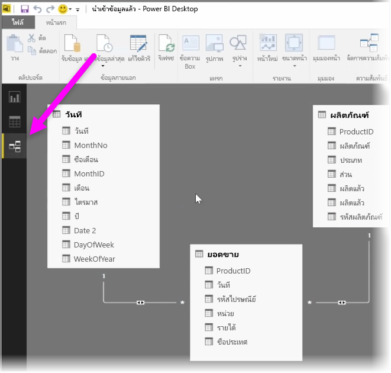
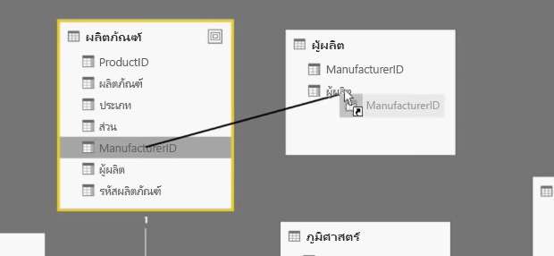
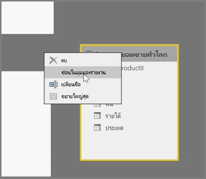
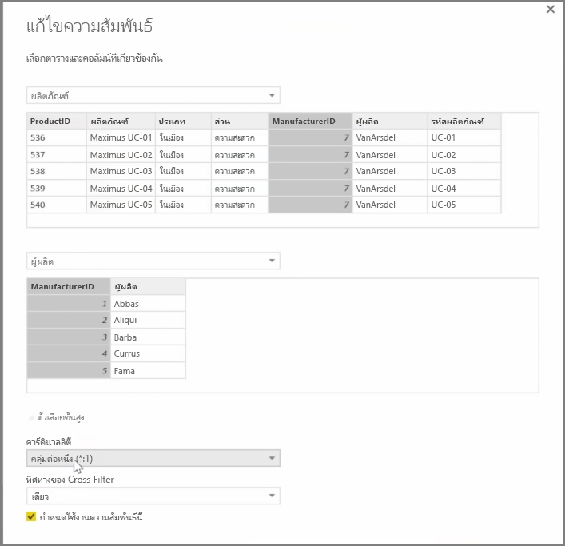

Power BI ช่วยให้คุณสามารถตั้งค่าความสัมพันธ์ที่มองเห็นได้ระหว่างตารางและองค์ประกอบPower BI allows you to visually set the relationship between tables or elements. เมื่อต้องการดูมุมมองแผนผังของข้อมูลของคุณ ให้ใช้ **มุมมองความสัมพันธ์** ที่อยู่ทางด้านซ้ายสุดของหน้าจอ ถัดจากพื้นที่ทำงานของรายงานTo see a diagrammatic view of your data, use the **Relationship view**, found on the far left side of the screen next to the Report canvas.

จากมุมมอง**ความสัมพันธ์** คุณจะเห็นบล็อกที่แสดงแทนแต่ละตารางและคอลัมน์ และเส้นที่แสดงความสัมพันธ์From the **Relationships** view, you can see a block that represents each table and its columns, and lines between them to represent relationships.

การเพิ่มและการลบความสัมพันธ์สามารถทำได้ง่ายAdding and removing relationships is simple. เมื่อต้องการลบความสัมพันธ์ ให้คลิกขวา แล้วเลือก **ลบ**To remove a relationship, right-click on it and select **Delete**. เมื่อต้องการสร้างความสัมพันธ์ ให้ลากแล้วปล่อยเขตข้อมูลที่คุณต้องการเชื่อมโยงระหว่างตารางTo create a relationship, drag and drop the fields that you want to link between tables.

เมื่อต้องการซ่อนตารางหรือคอลัมน์จากรายงานของคุณ ให้คลิกขวาในมุมมองความสัมพันธ์ แล้วเลือก **ซ่อนในมุมมองรายงาน**To hide a table or individual column from your report, right-click on it in the Relationship view and select **Hide in Report View**.

สำหรับมุมมองโดยละเอียดของความสัมพันธ์ของข้อมูลของคุณ ให้เลือก **จัดการความสัมพันธ์** ในแท็บ **หน้าแรก** กล่องโต้ตอบ **จัดการความสัมพันธ์** จะเปิดขึ้น และแสดงความสัมพันธ์เป็นรายการแทนที่จะเป็นแผนผังรูปภาพFor a more detailed view of your data relationships, select **Manage Relationships** in the **Home** tab. This will open the **Manage Relationships** dialog, which displays your relationships as a list instead of a visual diagram. จากที่นี่ คุณสามารถเลือก **ตรวจหาโดยอัตโนมัติ** เพื่อค้นหาความสัมพันธ์ในข้อมูลใหม่หรือข้อมูลที่มีการอัปเดตFrom here you can select **Autodetect** to find relationships in new or updated data. เลือก **แก้ไข** ในกล่องโต้ตอบ **จัดการความสัมพันธ์** เพื่อแก้ไขความสัมพันธ์ของคุณด้วยตนเองSelect **Edit** in the **Manage Relationships** dialog to manually edit your relationships. นอกจากนี้ คุณจะพบตัวเลือกขั้นสูงเพื่อตั้งค่า*คาร์ดินาลลิตี้* และทิศทาง*ข้ามตัวกรอง*ของความสัมพันธ์ของคุณThis is also where you can find advanced options to set the *Cardinality* and *Cross-filter* direction of your relationships.

ตัวเลือกของคุณสำหรับ คาร์ดินาลลิตี้ คือ *กลุ่มต่อหนึ่ง* และ *หนึ่งต่อหนึ่ง*Your options for Cardinality are *Many to One*, and *One to One*. *กลุ่มต่อหนึ่ง* คือข้อเท็จจริงของความสัมพันธ์ชนิดขนาด ตัวอย่างเช่น ตารางยอดขายที่มีหลายแถวต่อหนึ่งผลิตภัณฑ์ที่จับคู่กับผลิตภัณฑ์รายการในตารางในแถวที่ไม่ซ้ำกัน*Many to One* is the fact to dimension type relationship, for example a sales table with multiple rows per product being matched up with a table listing products in their own unique row. *หนึ่งต่อหนึ่ง* มักจะใช้สำหรับการเชื่อมต่อรายการเดียวในตารางอ้างอิง*One to One* is used often for linking single entries in reference tables.

ตามค่าเริ่มต้น ความสัมพันธ์จะถูกตั้งค่าให้ข้ามตัวกรองในทั้งสองทิศทางBy default, relationships will be set to cross-filter in both directions. การข้ามตัวกรองเพียงทิศทางเดียวจะจำกัดความสามารถการวางรูปแบบบางอย่างในความสัมพันธ์Cross-filtering in just one direction limited some of the modeling capabilities in a relationship.

การตั้งค่าความสัมพันธ์ที่แม่นยำระหว่างข้อมูลของคุณจะช่วยให้คุณสามารถสร้างการคำนวณที่ซับซ้อนในหลายองค์ประกอบข้อมูลได้Setting accurate relationships between your data allows you to create complex calculations across multiple data elements.

