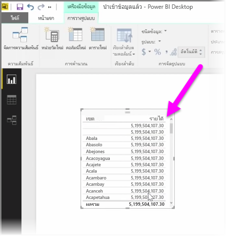
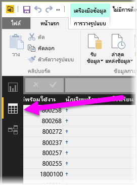
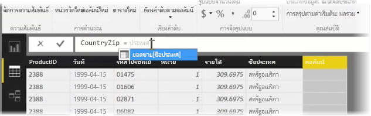
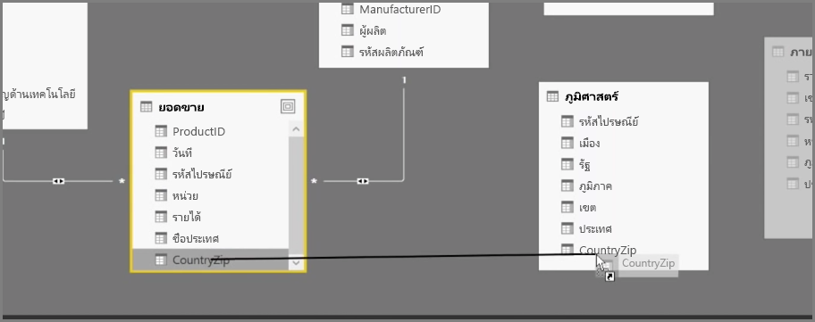
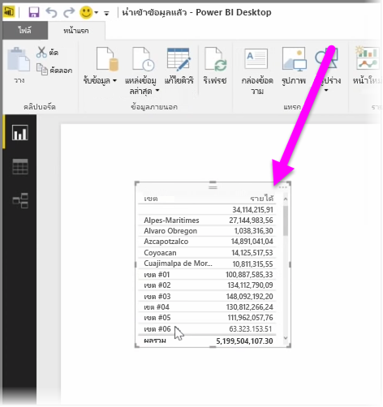

การสร้างคอลัมน์จากการคำนวณคือวิธีง่ายๆ ในการส่งเสริมและเพิ่มประสิทธิภาพของข้อมูลของคุณCreating calculated columns is a simple way to enrich and enhance your data. **คอลัมน์จากการคำนวณ**คือ คอลัมน์ใหม่ที่คุณสร้างขึ้นโดยการกำหนดการคำนวณที่แปลงหรือรวมสององค์ประกอบหรือมากกว่าของข้อมูลที่มีอยู่A **calculated column** is a new column that you create by defining a calculation that transforms or combines two or more elements of existing data. ตัวอย่างเช่น คุณสามารถสร้างคอลัมน์ใหม่โดยการรวมสองคอลัมน์ให้เป็นคอลัมน์เดียวFor example, you can create a new column by combining two columns into one.

สาเหตุหนึ่งข้อที่เป็นประโยชน์สำหรับการสร้างคอลัมน์จากการคำนวณคือเพื่อสร้างความสัมพันธ์ระหว่างตาราง เมื่อไม่มีเขตข้อมูลที่ไม่ซ้ำกันที่คุณสามารถใช้เพื่อสร้างความสัมพันธ์One useful reason for creating a calculated column is to establish a relationship between tables, when no unique fields exist that can be used to establish a relationship. การขาดความสัมพันธ์จะปรากฏอย่างชัดเจนเมื่อคุณสร้างการแสดงข้อมูลตารางง่ายๆ ใน Power BI Desktop และคุณจะได้รับค่าเดียวกับสำหรับรายการทั้งหมด แม้ว่าคุณจะทราบว่าข้อมูลย่อยต่างกันThe lack of a relationship becomes apparent when you create a simple table visual in Power BI Desktop, and you get the same value for all entries, yet you know the underlying data is different.

เมื่อต้องการสร้างความสัมพันธ์ด้วยเขตข้อมูลที่ไม่ซ้ำกันในข้อมูล คุณสามารถสร้างคอลัมน์จากการคำนวณใหม่สำหรับ “หมายเลขโทรศัพท์แบบเต็ม” โดยการผสมค่าจากคอลัมน์ “รหัสพื้นที่” และ “หมายเลขท้องถิ่น” เมื่อมีค่าเหล่านั้นอยู่ในข้อมูลของคุณTo create a relationship with unique fields in data, you can, for example, create a new calculated column for "Full Phone Number" by combining the values from the "Area Code" and "Local Number" columns when those values exist in your data. คอลัมน์จากการคำนวณคือ เครื่องมือที่มีประโยชน์สำหรับการสร้างแบบจำลองและการจัดรูปแบบการแสดงข้อมูลอย่างรวดเร็วCalculated columns are a useful tool for quickly creating models and visualizations.

เมื่อต้องการสร้างคอลัมน์จากการคำนวณ ให้เลือก **มุมมองข้อมูล** ใน Power BI Desktop จากด้านซ้ายของพื้นที่ทำงานของรายงานTo create a calculated column, select the **Data view** in Power BI Desktop from the left side of the report canvas.

จากแท็บ การวางรูปแบบ ให้เลือก **คอลัมน์ใหม่**From the Modeling tab, select **New Column**. การทำเช่นนี้จะเปิดใช้งานแถบสูตรที่คุณสามารถใส่การคำนวณโดยใช้ภาษา DAX (นิพจน์วิเคราะห์ข้อมูล)This will enable the formula bar where you can enter calculations using DAX (Data Analysis Expressions) language. DAX คือ ภาษาสูตรที่มีประสิทธิภาพ ที่ใช้ใน Excel ที่ช่วยให้คุณสามารถสร้างการคำนวณที่ซับซ้อนได้DAX is a powerful formula language, also found in Excel, that lets you build robust calculations. เมื่อคุณพิมพ์สูตร Power BI Desktop จะแสดงสูตรหรือองค์ประกอบข้อมูลที่ตรงกัน เพื่อช่วยเหลือและเร่งความเร็วในการสร้างสูตรของคุณAs you type a formula, Power BI Desktop displays matching formulas or data elements to assist and accelerate the creation of your formula.

แถบสูตรของ Power BI จะแนะนำฟังก์ชัน DAX เฉพาะและคอลัมน์ข้อมูลที่เกี่ยวข้องเมื่อคุณใส่นิพจน์ของคุณThe Power BI formula bar will suggest specific DAX functions and related data columns as you enter your expression.

เมื่อคอลัมน์จากการคำนวณถูกสร้างขึ้นในแต่ละตารางแล้ว จะสามารถใช้เป็นคีย์ที่ไม่ซ้ำกันเพื่อสร้างความสัมพันธ์ระหว่างตารางได้Once the calculated columns are created in each table, they can be used as a unique key to establish a relationship between them. เมื่อไปที่มุมมอง**ความสัมพันธ์** คุณจะสามารถลากเขตข้อมูลจากตารางหนึ่งไปยังอีกตารางหนึ่งได้เพื่อสร้างความสัมพันธ์Going to **Relationship** view, you can then drag the field from one table to the other to create the relationship.

เมื่อย้อนกลับไปที่มุมมอง**รายงาน** คุณจะเห็นค่าต่างๆ สำหรับแต่ละเขตReturning to **Report** view, you now see a different value for each district.

ยังมีสิ่งอื่นๆ อีกมากมายที่คุณสามารถทำได้โดยการสร้างคอลัมน์จากการคำนวณThere are all sorts of other things you can do by creating calculated columns, too.

