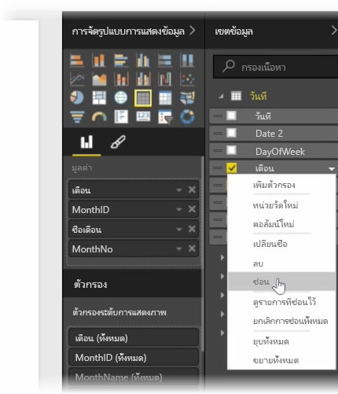
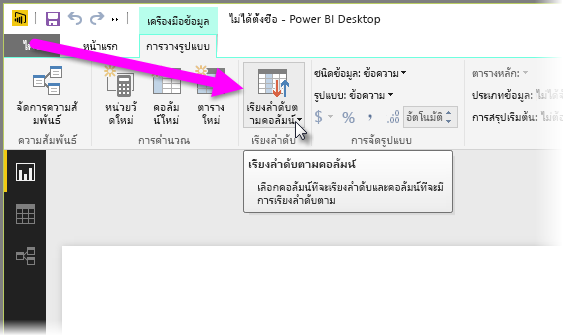
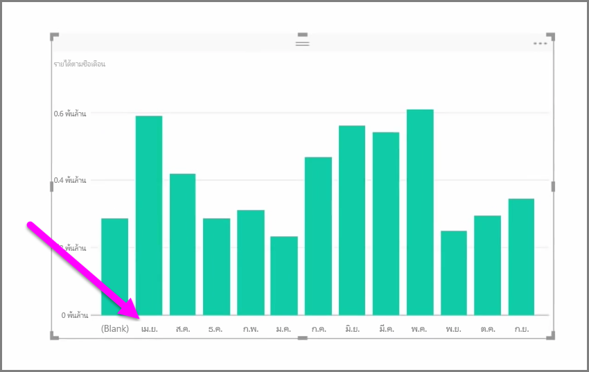
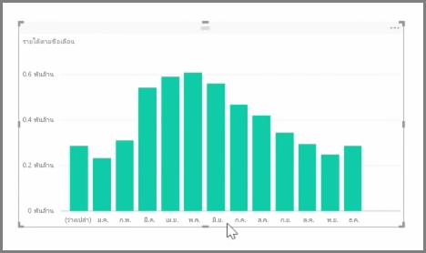

ข้อมูลที่นำเข้ามักจะมีเขตข้อมูลที่คุณไม่ต้องการสำหรับงานการรายงานและการจัดรูปแบบการแสดงข้อมูลของคุณ เนื่องจากอาจมีข้อมูลมากเกินไป หรือเนื่องจากข้อมูลนั้นอยู่ในคอลัมน์อื่นอยู่แล้วImported data often contains fields that you don't actually need for your reporting and visualization tasks, either because it's extra information, or because that data is already available in another column. Power BI Desktop มีเครื่องมือในการใช้ข้อมูลของคุณให้เกิดประโยชน์สูงสุด และทำให้สามารถนำไปใช้สร้างรายงานและการแสดงข้อมูล และสำหรับการดูรายงานที่แชร์ของคุณPower BI Desktop has tools to optimize your data, and make it more usable for you to create reports and visuals, and for viewing your shared reports.

## การซ่อนเขตข้อมูลHiding fields
เมื่อต้องการซ่อนคอลัมน์ในบานหน้าต่าง **เขตข้อมูล** ของ Power BI Desktop ให้คลิกขวา แล้วเลือก **ซ่อน**To hide a column in the **Fields** pane of Power BI Desktop, right-click on it and select **Hide**. โปรดทราบว่าคอลัมน์ที่ซ่อนอยู่ของคุณไม่ได้ถูกลบ ถ้าคุณใช้เขตข้อมูลนั้นในการจัดรูปแบบการแสดงข้อมูลที่มีอยู่ ข้อมูลจะยังคงอยู่ในการแสดงข้อมูลนั้น และคุณยังคงสามารถใช้ข้อมูลนั้นในการจัดรูปแบบการแสดงข้อมูลอื่นๆ เช่นกัน แต่เขตข้อมูลที่ซ่อนอยู่จะไม่แสดงในบานหน้าต่าง **เขตข้อมูล**Note that your hidden columns are not deleted; if you've used that field in existing visualizations, the data is still in that visual, and you can still use that data in other visualizations too, the hidden field just isn't displayed in the **Fields** pane.

ถ้าคุณดูตารางในมุมมอง**ความสัมพันธ์** เขตข้อมูลที่ซ่อนอยู่จะเป็นสีเทา ข้อมูลเหล่านั้นยังคงพร้อมใช้งานและเป็นส่วนหนึ่งของแบบจำลอง แต่เพียงถูกซ่อนจากมุมมองเท่านั้นIf you view tables in the **Relationships** view, hidden fields are indicated by being grayed out. Again, their data is still available and is still part of the model, they're just hidden from view. คุณสามารถยกเลิกการซ่อนเขตข้อมูลใดก็ตามที่ซ่อนอยู่ได้ตลอดเวลาโดยการคลิกขวาที่เขตข้อมูล แล้วเลือก **ยกเลิกการซ่อน**You can always unhide any field that has been hidden by right-clicking the field, and selecting **unhide**.

## การเรียงลำดับข้อมูลการจัดรูปแบบการแสดงข้อมูลตามเขตข้อมูลอื่นSorting visualization data by another field
เครื่องมือ **เรียงลำดับตามคอลัมน์** ที่พร้อมใช้งานในแท็บ **การวางรูปแบบ** มีประโยชน์อย่างมากในการทำให้มั่นใจว่าข้อมูลของคุณจะถูกแสดงตามลำดับที่คุณต้องการThe **Sort by Column** tool, available in the **Modeling** tab, is very useful to ensure that your data is displayed in the order you intended.

ในตัวอย่างทั่วไป ข้อมูลที่มีชื่อเดือนจะถูกเรียงลำดับตามตัวอักษรตามค่าเริ่มต้น เช่น “August” จะปรากฏอยู่ก่อน “February”As a common example, data that includes the name of the month is sorted alphabetically by default, so for example, "August"  appears before "February".

ในกรณี การเลือกเขตข้อมูลในรายการเขตข้อมูล เลือก **เรียงลำดับตามคอลัมน์** จากแท็บ **การวางรูปแบบ** แล้วเลือกเขตข้อมูลที่จะเรียงลำดับตามสามารถแก้ไขปัญหาได้In this case, selecting the field in the Fields list, then selecting **Sort By Column** from the **Modeling** tab and then choosing a field to sort by can remedy the problem. ในกรณีนี้ ตัวเลือกเรียงลำดับประเภท “MonthNo” จะเรียงลำดับเดือนตามที่คุณต้องการIn this case, the "MonthNo" category sort option orders the months as intended.

การตั้งค่าชนิดข้อมูลสำหรับเขตข้อมูลเป็นอีกวิธีหนึ่งในการปรับข้อมูลของคุณให้เหมาะสม เพื่อให้ใช้งานได้อย่างถูกต้องSetting the data type for a field is another way to optimize your information so it's handled correctly. เมื่อต้องการเปลี่ยนชนิดข้อมูลจากพื้นที่ทำงานของรายงาน ให้เลือกคอลัมน์ในบานหน้าต่าง **เขตข้อมูล** แล้วใช้เมนูดรอปดาวน์ **รูปแบบ** เพื่อเลือกหนึ่งในตัวเลือกการจัดรูปแบบTo change a data type from the report canvas, select the column in the **Fields** pane, and then use the **Format** drop-down menu to select one of the formatting options. การแสดงผลด้วยภาพใดก็ตามที่คุณสร้างขึ้นที่แสดงเขตข้อมูลนั้นจะได้รับการอัปเดตโดยอัตโนมัติAny visuals you've created that display that field are updated automatically.

