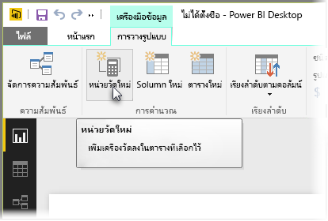
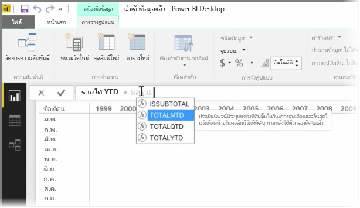
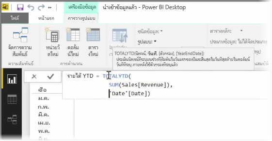
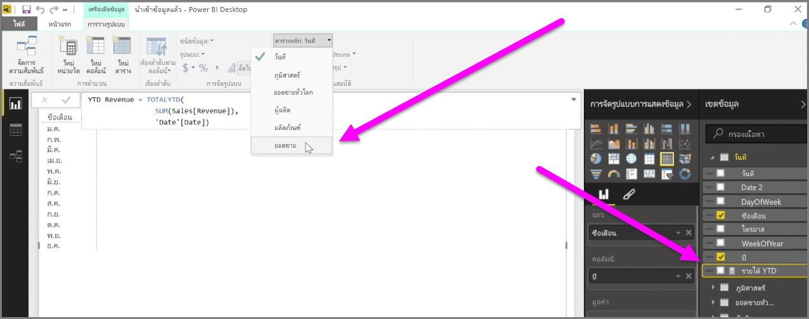

*หน่วยวัด*คือการคำนวณที่มีอยู่ในแบบจำลองข้อมูล Power BI ของคุณA *measure* is a calculation that exists in your Power BI data model. เมื่อต้องการสร้างหน่วยวัด ในมุมมอง**รายงาน** ให้เลือก **หน่วยวัดใหม่** จากแท็บ **การวางรูปแบบ**To create a measure, in **Report** view select **New Measure** from the **Modeling** tab.

หนึ่งในสิ่งที่ยอดเยี่ยมเกี่ยวกับ DAX ที่เป็นภาษานิพจน์วิเคราะห์ข้อมูลใน Power BI คือ มีฟังก์ชันที่เป็นประโยชน์จำนวนมาก โดยเฉพาะเกี่ยวกับการคำนวณตามเวลา เช่น *เริ่มต้นปีจนถึงปัจจุบัน* หรือ *ปีปัจจุบันกับปีที่ผ่านมา*One of the great things about DAX, the Data Analysis Expression language in Power BI, is that it has lots of useful functions, particularly around time-based calculations such as *Year to Date* or *Year Over Year*. เมื่อใช้ DAX คุณจะสามารถกำหนดหน่วยวัดเวลา แล้วแบ่งตามจำนวนเขตข้อมูลต่างๆ ที่คุณต้องการจากแบบจำลองข้อมูลของคุณWith DAX you can define a measure of time once, and then slice it by as many different fields as you want from your data model.

ใน Power BI การคำนวณที่กำหนดไว้จะเรียกว่า*หน่วยวัด*In Power BI, a defined calculation is called a *measure*. เมื่อต้องการสร้าง*หน่วยวัด* ให้เลือก **หน่วยวัดใหม่** จากแท็บ **หน้าแรก** การทำเช่นนี้จะเปิดแถบสูตรที่คุณสามารถใส่นิพจน์ DAX ที่กำหนดหน่วยวัดของคุณTo create a *measure*, select **New Measure** from the **Home** tab. This opens the Formula bar where you can enter the DAX expression that defines your measure. เมื่อคุณพิมพ์ Power BI จะแนะนำฟังก์ชัน DAX และเขตข้อมูลที่เกี่ยวข้องเมื่อคุณใส่การคำนวณของคุณ และคุณยังจะได้รับคำแนะนำเครื่องมือที่อธิบายพารามิเตอร์ไวยากรณ์และฟังก์ชันบางอย่างอีกด้วยAs you type, Power BI suggests relevant DAX functions and data fields as you enter your calculation, and you'll also get a tooltip explaining some of the syntax and function parameters.

ถ้าการคำนวณของคุณมีความยาวมาก คุณสามารถเพิ่มตัวแบ่งบรรทัดในตัวแก้ไขนิพจน์ได้โดยการพิมพ์ **ALT-Enter**If your calculation is particularly long, you can add extra line breaks in the Expression Editor by typing **ALT-Enter**.

เมื่อคุณสร้างหน่วยวัดใหม่ จะปรากฏในหนึ่งในตารางบนบานหน้าต่าง **เขตข้อมูล** ที่อยู่ทางด้านขวาของหน้าจอOnce you've created a new measure, it will appear in one of the tables on the **Fields** pane, found on the right side of the screen. Power BI จะแทรกหน่วยวัดใหม่ลงในตารางใดก็ตามที่คุณเลือกอยู่ และไม่ว่าหน่วยวัดจะอยู่ที่ไหนในข้อมูลของคุณ คุณสามารถย้ายได้อย่างง่ายดายโดยการเลือกหน่วยวัดและใช้เมนูดรอปดาวน์ **ตารางหลัก**Power BI inserts the new measure into whichever table you have currently selected, and while it doesn't matter exactly where the measure is in your data, you can easily move it by selecting the measure and using the **Home Table** drop-down menu.

คุณสามารถใช้หน่วยวัดด้วยวิธีที่คล้ายกับคอลัมน์ตารางอื่นๆ คือ เพียงลากแล้วปล่อยลงในพื้นที่ทำงานของรายงานหรือเขตข้อมูลการจัดรูปแบบการแสดงข้อมูลYou can use a measure like any other table column: just drag and drop it onto the report canvas or visualization fields. หน่วยวัดยังรวมกับตัวแบ่งส่วนข้อมูล การแบ่งส่วนข้อมูลของคุณระหว่างเดินทางได้อย่างราบรื่น ซึ่งหมายความว่าคุณสามารถกำหนดหน่วยวัดหนึ่งครั้ง และใช้ในการจัดรูปแบบการแสดงข้อมูลต่างๆ ได้หลายครั้งMeasures also integrate seamlessly with slicers, segmenting your data on the fly, which means you can define a measure once, and use it in many different visualizations.

ฟังก์ชัน **คำนวณ** ของ DAX คือฟังก์ชันที่มีประสิทธิภาพที่สามารถทำการคำนวณที่เป็นประโยชน์ได้ทุกรูปแบบ โดยเฉพาะอย่างยิ่ง การทำรายงานและการแสดงข้อมูลด้านการเงินThe **Calculate** DAX function is a powerful function that enables all sorts of useful calculations, which is especially useful for financial reporting and visuals.

