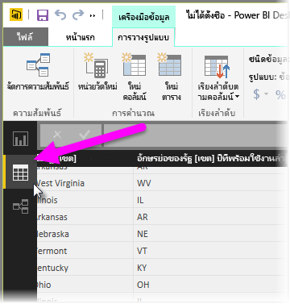
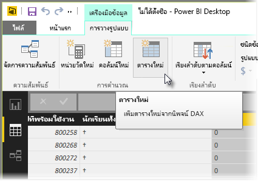
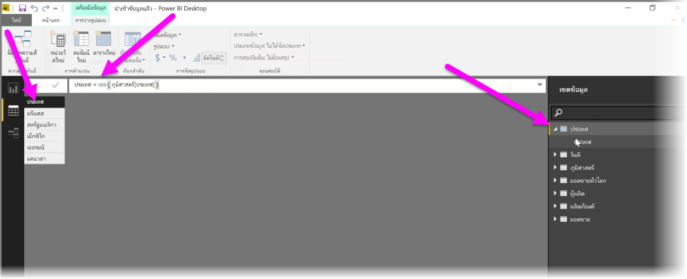

ตารางจากการคำนวณคือ ฟังก์ชันภายใน DAX ที่ช่วยให้คุณสามารถกำหนดช่วงทั้งหมดของความสามารถการวางรูปแบบใหม่Calculated tables are a function within DAX that allows you to express a whole range of new modeling capabilities. ตัวอย่างเช่น ถ้าคุณต้องการทำการผสานชนิดต่างๆ หรือสร้างตารางใหม่ระหว่างเดินทางโดยยึดตามผลลัพธ์ของสูตรฟังก์ชัน ตารางจากการคำนวณคือวิธีที่ช่วยให้คุณทำเช่นนั้นได้For example, if you want to do different types of merge joins or create new tables on the fly based on the results of a functional formula, calculated tables are the way to accomplish that.

เมื่อต้องการสร้างตารางจากการคำนวณ ให้ไปที่ **มุมมองข้อมูล** ใน Power BI Desktop ที่คุณสามารถเปิดใช้งานได้จากด้านซ้ายของพื้นที่รายงานTo create a calculated table, go to **Data view** in Power BI Desktop, which you can activate from the left side of the report canvas.

เลือก **ตารางใหม่** จากแท็บการวางรูปแบบเพื่อเปิดแถบสูตรSelect **New Table** from the Modeling tab to open the formula bar.

พิมพ์ชื่อของตารางใหม่ของคุณทางด้านซ้ายของเครื่องหมายเท่ากับ และการคำนวณที่คุณต้องการใช้เพื่อสร้างตารางทางด้านขวาType the name of your new table on the left side of the equal sign, and the calculation that you want to use to form that table on the right. เมื่อคุณทำการคำนวณเสร็จเรียบร้อยแล้ว ตารางใหม่จะปรากฏขึ้นในบานหน้าต่างเขตข้อมูลในแบบจำลองของคุณWhen you're finished your calculation, the new table appears in the Fields pane in your model.

เมื่อสร้างขึ้นแล้ว คุณสามารถใช้ตารางจากการคำนวณของคุณได้ตามที่คุณต้องการในความสัมพันธ์ สูตร และรายงานOnce created, you can use your calculated table as you would any other table in relationships, formulas, and reports.

