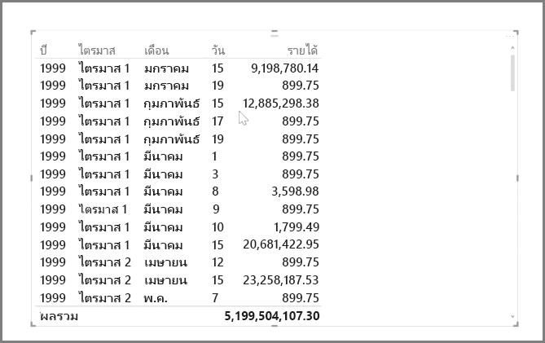
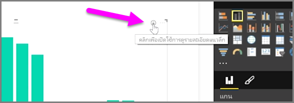
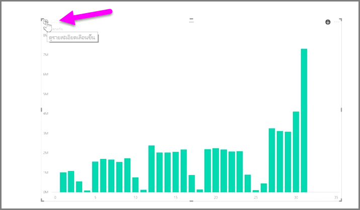
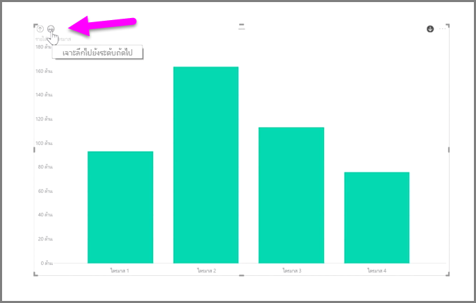
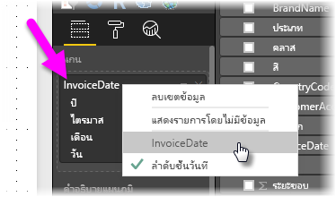

การวิเคราะห์ข้อมูลตามเวลาด้วย Power BI เป็นเรื่องง่ายIt's easy to analyze time-based data with Power BI. เครื่องมือการวางรูปแบบใน Power BI Desktop จะใส่เขตข้อมูลที่สร้างขึ้นโดยอัตโนมัติ ซึ่งช่วยให้คุณสามารถดูรายละเอียดแนวลึกของปี ไตรมาส เดือน และวันได้ด้วยการคลิกเพียงครั้งเดียวThe modeling tools in Power BI Desktop automatically include generated fields that let you drill down through years, quarters, months, and days with a single click.  

เมื่อคุณสร้างการจัดรูปแบบการแสดงข้อมูลตารางในรายงานของคุณโดยใช้เขตข้อมูลวันที่ Power BI Desktop จะใส่การแบ่งตามช่วงเวลาโดยอัตโนมัติWhen you create a table visualization in your report using a date field, Power BI Desktop automatically includes breakdowns by time period. ตัวอย่างเช่น เขตข้อมูลวันที่เดียวในตาราง **วันที่** จะถูกแบ่งเป็นปี ไตรมาส เดือน และวันโดยอัตโนมัติด้วย Power BI ตามที่แสดงในรูปภาพต่อไปนี้For example, the single date field in the **Date** table was automatically separated into Year, Quarter, Month and Day by Power BI, as shown in the following image.

การจัดรูปแบบการแสดงข้อมูลจะแสดงข้อมูลที่ระดับ*ปี*ตามค่าเริ่มต้น แต่คุณสามารถเปลี่ยนได้โดยการเปิด **ดูรายละเอียดแนวลึก** ที่มุมขวาบนของการแสดงข้อมูลVisualizations display data at the *year* level by default, but you can change that by turning on **Drill Down** in the top right-hand corner of the visual.

ในตอนนี้ เมื่อคุณคลิกที่แถบหรือเส้นในแผนภูมิจะดูรายละเอียดแนวลึกลงในระดับถัดไปของลำดับชั้นเวลา ตัวอย่างเช่น จาก*ปี*เป็น*ไตรมาส*Now when you click on the bars or lines in your chart, it drills down to the next level of time hierarchy, for example from *years* to *quarters*. คุณสามารถดูรายละเอียดแนวลึกได้อย่างต่อเนื่องจนกว่าจะถึงระดับที่เล็กที่สุดของลำดับชั้น ซึ่งในตัวอย่างนี้คือ*วัน*You can continue to drill down until you reach the most granular level of the hierarchy, which in this example is *days*. เมื่อต้องการย้อนกลับผ่านลำดับชั้นเวลา ให้คลิก **เลื่อนขึ้น** ที่มุมซ้ายบนของการแสดงข้อมูลTo move back up through the time hierarchy, click on **Drill Up** in the top left-hand corner of the visual.

แทนที่จะดูรายละเอียดแนวลึกเฉพาะช่วงเวลาที่เลือก คุณยังสามารถเจาะลึกผ่านข้อมูลทั้งหมดที่แสดงบนการแสดงข้อมูลได้โดยใช้ไอคอนลูกศรคู่ **เจาะลึกทั้งหมด** ที่มุมขวาบนของการแสดงข้อมูลYou can also drill down through all of the data shown on the visual, rather than one selected period, by using the **Drill All** double-arrow icon, also in the top right-hand corner of the visual.

ตราบใดที่แบบจำลองของคุณมีเขตข้อมูลวันที่ Power BI จะสร้างมุมมองต่างๆ สำหรับลำดับชั้นเวลาโดยอัตโนมัติAs long as your model has a date field, Power BI will automatically generate different views for different time hierarchies.

เมื่อต้องการย้อนกลับไปยังวันที่แต่ละวันแทนที่จะใช้ลำดับชั้นวันที่ ให้คลิกขวาที่ชื่อคอลัมน์ใน **เขตข้อมูล** (ในรูปภาพต่อไปนี้ ชื่อของคอลัมน์จะเป็น *InvoiceDate*) แล้วเลือกชื่อคอลัมน์จากเมนูที่ปรากฏขึ้น แทนที่จะเลือก **ลำดับชั้นวันที่**To get back to individual dates rather than using the date hierarchy, simply right-click the column name in the **Fields** well (in the following image, the name of the column is *InvoiceDate*), then select the column name from the menu that appears, rather than **Date Hierarchy**. การแสดงข้อมูลของคุณจะแสดงข้อมูลโดยยึดตามข้อมูลคอลัมน์โดยไม่ใช้ลำดับชั้นวันที่Your visual then shows the data based on that column data, without using the date hierarchy. ต้องการย้อนกลับไปใช้ลำดับชั้นวันที่ใช่ไหมNeed to go back to using the date hierarchy? ไม่มีปัญหา เพียงคลิกขวาอีกครั้ง แล้วเลือก **ลำดับชั้นวันที่** จากเมนูNo problem - just right-click again and select **Date Hierarchy** from the menu.

## ขั้นตอนถัดไปNext steps
**ยินดีด้วย!****Congratulations!** คุณได้สำเร็จส่วนนี้ของหลักสูตร **การเรียนรู้พร้อมคำแนะนำ** สำหรับ Power BI แล้วYou've completed this section of the **Guided Learning** course for Power BI. ในตอนนี้ คุณทราบเกี่ยวกับข้อมูล*การวางรูปแบบ*แล้ว คุณพร้อมที่จะเรียนรู้เกี่ยวกับสิ่งที่น่าสนุกที่กำลังรอคุณอยู่ในส่วนถัดไป:  **การจัดรูปแบบการแสดงข้อมูล**Now that you know about *modeling* data, you're ready to learn about the fun stuff waiting in the next section: **Visualizations**.

ตามที่เราเคยกล่าวไว้ก่อนหน้านี้ หลักสูตรนี้จะสร้างความรู้โดยการทำตามขั้นตอนการทำงานทั่วไปใน Power BI:As mentioned before, this course builds your knowledge by following the common flow of work in Power BI:

* นำข้อมูลเข้าสู่ **Power BI Desktop** แล้วสร้างรายงานBring data into **Power BI Desktop**, and create a report.
* เผยแพร่ไปยังบริการของ Power BI ที่คุณสามารถสร้าง**การจัดรูปแบบการแสดงข้อมูล**ใหม่ได้ และสร้างแดชบอร์ดPublish to the Power BI service, where you create new **visualizations** and build dashboards
* **แชร์**แดชบอร์ดของคุณกับผู้อื่น โดยเฉพาะผู้ที่กำลังเดินทาง**Share** your dashboards with others, especially people who are on the go
* ดูและโต้ตอบกับแดชบอร์ดและรายงานที่แชร์ในแอป **Power BI บนมือถือ**View and interact with shared dashboards and reports in **Power BI Mobile** apps

แม้ว่าคุณอาจไม่ต้องทำงานทั้งหมดด้วยตนเอง คุณต้อง*ทำความเข้าใจ*วิธีการสร้างแดชบอร์ดเหล่านั้น และวิธีการเชื่อมต่อกับข้อมูล... และเมื่อคุณสำเร็จหลักสูตรนี้แล้ว คุณจะสามารถสร้างแดชบอร์ดของคุณเองได้While you might not do all that work yourself, you'll *understand* how those dashboards were created, and how they connected to the data... and when you're done with this course, you'll be able to create one of your own.

เจอกันในส่วนถัดไป!See you in the next section!

