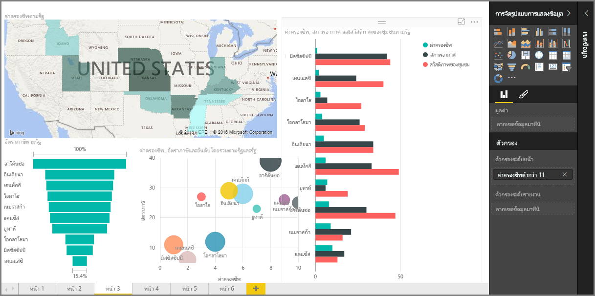

ยินดีต้อนรับสู่ส่วน **การจัดรูปแบบการแสดงข้อมูล** ของหลักสูตร **การเรียนรู้พร้อมคำแนะนำ** สำหรับ Power BIWelcome to the **Visualizations** section of the **Guided Learning** course for Power BI. เตรียมพบกับความสนุก ความน่าสนใจ และการแนะนำที่จะอธิบายการจัดรูปแบบการแสดงข้อมูลมากมายที่ Power BI นำเสนอGet ready for a fun, interesting, and enlightening tour of the many, many visualizations Power BI has to offer. และนี่ยังไม่ใช่ทั้งหมด ยังมีการจัดรูปแบบการแสดงข้อมูลอื่นๆ เข้ามาเพิ่มตลอดเวลา!And this isn't all of them - there are more visualizations coming all the time!

แน่นอน การแสดงผลด้วยภาพคือผลลัพธ์สุดท้ายของการทำงานอัจฉริยะทางธุรกิจ... เราต้องการใช้ข้อมูล แสดงข้อมูลด้วยวิธีที่น่าสนใจและเจาะลึกรายละเอียด และ*แสดง*ข้อมูลที่โดดเด่น และ Power Bi มีการแสดงข้อมูลที่น่าสนใจทุกประเภท และวิธีการปรับแต่งที่แทบจะเรียกได้ว่าไม่มีที่สิ้นสุด ดังนั้น ส่วนนี้จึงเป็นส่วนที่สำคัญOf course, visuals are the end-result of any business intelligence undertaking... we want to take data, present it in a compelling and insightful way, and *show* what stands out. And Power BI has all sorts of compelling visuals - and a nearly limitless way to customize them - so this is an important section!

อาจดูเหมือนว่ามีหลายหัวข้อในส่วนนี้ แต่ไม่ต้องกังวล แต่ละหัวข้อนั้นสั้นและเต็มไปด้วย (คุณสามารถคาดเดาได้) การแสดงผลด้วยภาพ และง่ายต่อการทำความเข้าใจIt might seem like there are lots of topics in this section, but don't worry: each topic is short, filled with (you guessed it) visuals, and easy to absorb. คุณจะรู้สึกเหมือนว่าตนเองผ่านส่วนนี้ไปอย่างรวดเร็ว และจินตนาการวิธีการใช้การแสดงผลด้วยภาพเหล่านี้ในการแสดงข้อมูลของคุณเองYou'll likely find yourself cruising through this section, and imagining how you'll make these visuals present your own data.

เราจะเริ่มต้นที่หลักสำคัญของการจัดรูปแบบการแสดงข้อมูล การแสดงข้อมูลง่ายๆ ที่เราคุ้นเคย และมั่นใจว่าคุณทราบวิธีการใช้งานWe'll start with the mainstays of visualizations - the simple visuals we're all familiar with - and make sure you know the ins and outs. จากนั้น เราจะไปยังระดับที่สูงขึ้น หรือมีการนำไปใช้งานที่น้อยลง และเติมกล่องเครื่องการสร้างรายงานของคุณThen we'll get more advanced, or at least a little less common, and fill up your report-creating toolbox.

ขอให้สนุก มีอะไรมากมายให้เรียนรู้ที่นี่!Have fun - there's a lot to learn here!

## แนะนำการแสดงผลด้วยภาพใน Power BIIntroduction to visuals in Power BI
การแสดงข้อมูลคือหนึ่งในส่วนหลักของ Power BI ซึ่งเป็นโครงสร้างพื้นฐานตามที่เราได้อธิบายไว้ก่อนหน้าในหลักสูตรนี้ และการสร้างการแสดงข้อมูลคือวิธีที่ง่ายที่สุดในการค้นหาและแชร์ข้อมูลเชิงลึกของคุณVisualizing data is one of the core parts of Power BI - a basic building block as we defined it earlier in this course - and creating visuals is the easiest way to find and share your insights.

Power BI คือการจัดรูปแบบการแสดงข้อมูลที่หลากหลายที่พร้อมใช้งานตามค่าเริ่มต้น ตั้งค่าแผนภูมิแท่งไปจนถึงแผนภูมิวงกลมและแผนที่ พร้อมกับข้อเสนอที่น้อยคนจะรู้จัก เช่น วอเตอร์ฟอล กรวย มาตรวัด และอื่นๆPower BI has a whole range of visualizations available by default, from simple bar charts to pie charts to maps, and even more esoteric offerings like waterfalls, funnels, gauges, and more. Power BI Desktop ยังเสนอเครื่องมือการจัดรูปแบบที่หลากหลาย เช่น รูปร่างและรูปภาพ ที่ช่วยปลุกชีวิตรายงานของคุณPower BI Desktop also offers extensive page formatting tools, such as shapes and images, that help bring your report to life.

