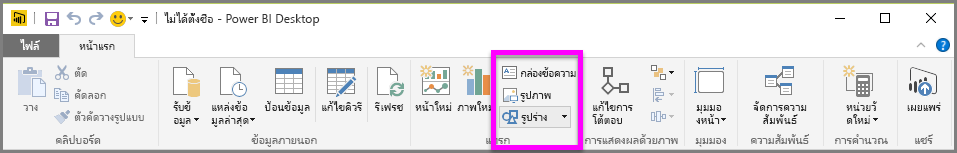
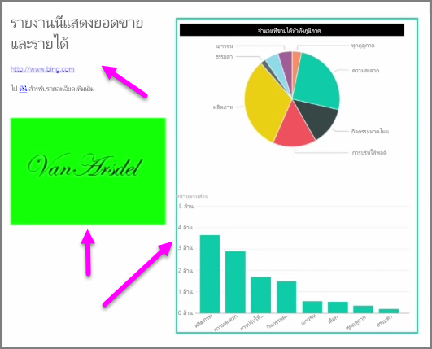

พร้อมกับการแสดงภาพที่ผูกกับข้อมูล คุณยังสามารถเพิ่มองค์ประกอบคงที่ เช่น กล่องข้อความ รูปภาพ และรูปร่างเพื่อปรับปรุงการออกแบบการแสดงข้อมูลของรายงานของคุณAlong with data-bound visuals, you can also add static elements such as text boxes, images, and shapes to improve the visual design of your reports. เมื่อต้องการเพิ่มองค์ประกอบการแสดงข้อมูล ให้เลือก **กล่องข้อความ** **รูปภาพ** หรือ **รูปร่าง** จากแท็บ **หน้าแรก**To add a visual element, select **Text Box**, **Image**, or **Shapes** from the **Home** tab.

**กล่องข้อความ**คือวิธีที่ดีในการแสดงชื่อเรื่องขนาดใหญ่ คำบรรยาย หรือย่อหน้าสั้นๆ ของข้อมูลพร้อมกับการจัดรูปแบบการแสดงข้อมูลของคุณ**Text boxes** are an ideal way to display large titles, captions, or short paragraphs of information along with your visualizations. กล่องข้อความสามารถมีลิงก์ ไม่ว่าจะเป็น URL ที่เขียนหรือการเน้นวลีจุดยึดและการเลือกสัญลักษณ์ลิงก์บนแถบตัวเลือกกล่องข้อความText boxes can include links, either through a written URL or by highlighting an anchor phrase and selecting the link symbol on the text box options bar. คุณสามารถใส่ URL ในกล่องข้อความ และ Power BI จะตรวจหาลิงก์และทำให้ใช้งานได้โดยอัตโนมัติYou can include URLs in text boxes, and Power BI automatically detects the link, and makes it live.

การเลือก **รูปภาพ** จะเปิดตัวเรียกดูไฟล์ที่คุณสามารถเลือกรูปภาพจากคอมพิวเตอร์ของคุณหรือแหล่งข้อมูลบนเครือข่ายอื่นๆSelecting **Image** will open a file browser where you can select the image from your computer or other networked source. ตามค่าเริ่มต้น การปรับขนาดรูปภาพในรายงานของคุณจะรักษาอัตราส่วนไว้ แต่อาจถูกปิดใช้งานในตัวเลือกการจัดรูปแบบการแสดงข้อมูลBy default, resizing an image in your report will maintain its aspect ratio, but this can be disabled in the visual formatting options.

**รูปร่าง**มีตัวเลือกที่ต่างกันห้าตัวเลือกสำหรับแบบฟอร์ม รวมถึง สี่เหลี่ยมผืนผ้าและลูกศร**Shapes** have five different options for form, including rectangles and arrows. รูปร่างอาจทึบแสง หรือโปร่งแสงด้วยเส้นขอบสีShapes can be opaque, or transparent with a colored border. (รูปร่างโปร่งแสงจะมีประโยชน์สำหรับการสร้างเส้นขอบรอบๆ กลุ่มการจัดรูปแบบการแสดงข้อมูล)(The latter is useful for creating borders around groups of visualizations.)

