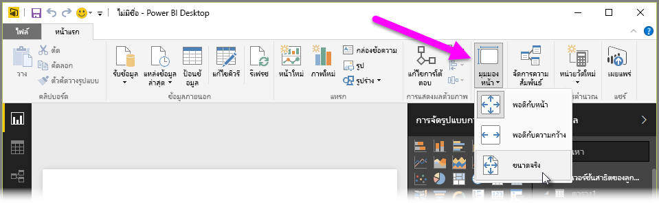
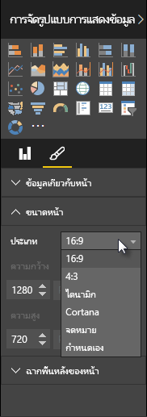

Power BI Desktop มีความสามารถในการควบคุมเค้าโครงและการจัดรูปแบบของหน้ารายงานของคุณ เช่น ขนาดและการวางแนวPower BI Desktop gives you the ability to control the layout and formatting of your report pages, such as size and orientation.

ใช้เมนู **มุมมองหน้า** จากแท็บหน้าแรกเพื่อเปลี่ยนอัตราส่วนของหน้ารายงานของคุณUse the **Page View** menu from the Home tab to change the way your report pages scale. ตัวเลือกที่พร้อมใช้งาน ได้แก่ **พอดีกับหน้า** (ค่าเริ่มต้น) **พอดีกับความกว้าง** และ **ขนาดจริง**The available options include **Fit To Page** (default), **Fit To Width**, and **Actual Size**.

คุณยังสามารถเปลี่ยนขนาดหน้าได้อีกด้วยYou can also change the pages size itself. ตามค่าเริ่มต้น หน้ารายงานคือ 16:9By default, report pages are 16:9. เมื่อต้องการเปลี่ยนขนาดหน้า ให้ตรวจสอบให้แน่ใจว่าไม่ได้เลือกการแสดงผลด้วยภาพไว้ แล้วเลือกไอคอนพู่กันในบานหน้าต่างการจัดรูปแบบการแสดงข้อมูล แล้วเลือก **ขนาดหน้า** เพื่อขยายส่วนนั้นTo change the page size, make sure no visuals are selected, then select the paintbrush icon in the Visualizations pane, then select **Page Size** to expand that section.

ตัวเลือกสำหรับขนาดหน้า รวมถึง 4x3 (อัตราส่วนที่เป็นสี่เหลี่ยมจัตุรัสมากขึ้น) และไดนามิก (หน้าจะถูกยืดเพื่อเติมพื้นที่ที่พร้อมใช้งาน)Options for page size include 4x3 (more square aspect ratio), and Dynamic (the page will stretch to fill the available space). มีขนาดจดหมายมาตรฐานสำหรับรายงานเช่นกันThere's a standard letter size for reports as well. โปรดจำไว้ว่าคุณอาจต้องปรับขนาดการแสดงข้อมูลของคุณหลังจากเปลี่ยนขนาดกระดาษเพื่อให้มั่นใจว่าอยู่บนพื้นที่วาดรูปทั้งหมดKeep in mind that you may need to resize your visuals after changing the page size to ensure that they're completely on the canvas.

คุณยังสามารถระบุขนาดหน้าแบบกำหนดเอง ตั้งค่าขนาดเป็นนิ้วหรือพิกเซล และเปลี่ยนสีพื้นหลังของทั้งรายงานYou can also specify a custom page size, setting the size by inches or pixels, and change the background color of the entire report.

ตัวเลือกอื่นคือเลือก Cortana ที่จะปรับรายงานให้สามารถใช้เป็นผลลัพธ์สำหรับการค้นหาโดยใช้ Cortana ได้Another option is to select Cortana, which sizes the report so that it can be used as a result for searches using Cortana.

