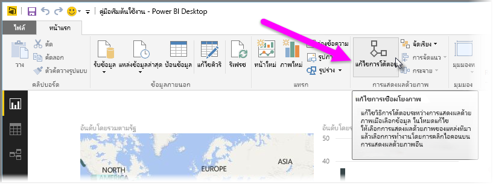
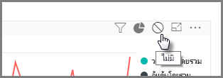
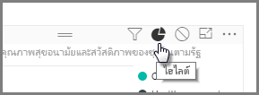
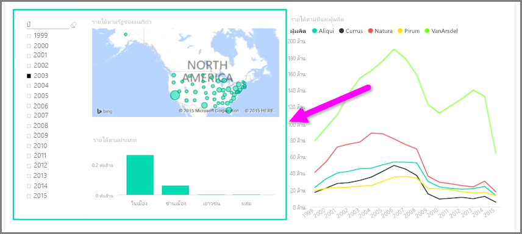

เมื่อคุณมีการจัดรูปแบบการแสดงข้อมูลหลายรายการอยู่บนหน้ารายงานเดียวกัน การเลือกส่วนเฉพาะโดยการคลิกหรือการใช้ตัวแบ่งส่วนข้อมูลจะส่งผลต่อการแสดงข้อมูลทั้งหมดบนหน้านั้นWhen you have multiple visualizations on the same report page, selecting a particular segment by clicking or using a slicer will affect all the visuals on that page. ในบางกรณี คุณอาจต้องการแบ่งส่วนการแสดงผลด้วยภาพเฉพาะIn some cases, though, you may want to slice only specific visuals. โดยเฉพาะอย่างยิ่งเมื่อใช้องค์ประกอบ เช่น แผนภูมิการลงจุดกระจาย ที่การจำกัดข้อมูลให้อยู่ในเฉพาะส่วนจะนำความหมายที่สำคัญออกThis is particularly true when using elements such as scatter plots, where limiting the data to a specific segment will remove crucial meaning. โชคดีที่ Power BI Desktop ช่วยให้คุณสามารถควบคุมการโต้ตอบระหว่างการแสดงข้อมูลได้Fortunately, Power BI Desktop lets you control how interactions flow between visuals.

เมื่อต้องการเปลี่ยนการโต้ตอบระหว่างการจัดรูปแบบการแสดงข้อมูลของคุณ ให้เลือก **แก้ไข** จากส่วนการแสดงข้อมูลของ Ribbon **หน้าแรก** เพื่อเปิด **โหมดแก้ไข**To change the interaction between your visualizations, select **Edit** from the Visuals section of the **Home** ribbon to toggle **Edit Mode** on.

>[!NOTE]
>ไอคอน **แก้ไขการโต้ตอบ** ใน Power BI Desktop มีการเปลี่ยนแปลงตั้งแต่ตอนบันทึกวิดีโอThe **Edit Interactions** icon in Power BI Desktop has changed since the video was recorded.
> 
> 

ในตอนนี้ เมื่อคุณเลือกการแสดงข้อมูลบนพื้นที่รายงานของคุณ คุณจะเห็นไอคอน*ตัวกรอง*ทึบแสงขนาดเล็กที่มุมขวาบนของการแสดงข้อมูลอื่นทั้งหมดที่ได้รับผลกระทบNow when you select a visual on your report canvas, you'll see a small opaque *filter* icon in the top right-hand corner of every other visual it will affect. เมื่อต้องการยกเว้นการแสดงผลด้วยภาพจากการโต้ตอบ ให้คลิกสัญลักษณ์ *ไม่มี* ที่มุมขวาบน ใกล้กับไอคอน*ตัวกรอง*To exclude a visual from the interaction, click the *None* symbol in the upper right corner, near the *filter* icon.

ในบางอินสแตนซ์ คุณสามารถปรับชนิดของการโต้ตอบตัวกรองที่เกิดขึ้นระหว่างการแสดงข้อมูลIn some instances you can adjust the type of filter interaction that happens between visuals. เมื่อ**โหมดแก้ไข**เปิดอยู่ ให้เลือกการแสดงผลด้วยภาพที่คุณใช้ในการกรองWith **Edit Mode** toggled on, select the visual you use to filter. ถ้าคุณเปลี่ยนชนิดของการโต้ตอบบนการแสดงข้อมูลอื่น ไอคอน*แผนภูมิวงกลม*จะปรากฏอยู่ถัดจากไอคอนตัวกรองที่มุมขวาบนIf you can change the type of interaction on another visual, a *pie chart* icon will appear next to the filter icon in the top right-hand corner.

คลิกไอคอน*แผนภูมิวงกลม*เพื่อเน้นข้อมูลที่แบ่งส่วนแล้วClick the *pie chart* icon to highlight the segmented data. มิฉะนั้น ข้อมูลจะถูกกรองOtherwise, the data will be filtered. เหมือนกับก่อนหน้านี้ คุณสามารถคลิกไอคอน *ไม่มี* เพื่อนำการโต้ตอบทั้งหมดออกAs before, you can click the *None* icon to remove all interaction.

เคล็ดลับการออกแบบที่เป็นประโยชน์คือให้วาดรูปร่างโปร่งแสงรอบๆ การแสดงข้อมูลที่โต้ตอบกันและกัน ดังนั้น ผู้ใช้จึงเห็นได้อย่างชัดเจนว่ามีความสัมพันธ์การโต้ตอบA useful design tip is to draw a transparent shape around visuals that interact with each other, so it's clear to the user that they have an interactive relationship.

