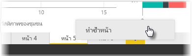

แต่ละหน้าของรายงานอาจค่อนข้างซับซ้อน ด้วยการจัดรูปแบบการแสดงข้อมูลแบบหลายรายการที่โต้ตอบในลักษณะเฉพาะและมีการจัดรูปแบบที่แม่นยำIndividual pages of a report can be quite complex, with multiple visualizations that interact in specific ways and have precise formatting. ในบางครั้งคุณอาจต้องใช้การแสดงผลด้วยภาพและเค้าโครงเดียวกันสำหรับหัวข้อของหน้าที่แตกต่างกันสองหน้าเมื่อสร้างรายงานOccasionally when building a report, you may want to use the same visuals and layouts for two different page topics. ตัวอย่างเช่น ถ้าคุณเพิ่งรวบรวมหน้ารายงานรายได้รวม คุณอาจต้องการหน้าที่แทบจะเหมือนกันทุกประการเกี่ยวกับรายได้สุทธิFor example, if you've just put together a report page on gross revenue, you may want an almost identical page on net revenue.

การทำงานซ้ำทั้งหมดอีกครั้งเป็นเรื่องยุ่งยาก แต่ด้วย Power BI Desktop คุณสามารถทำสำเนาหน้ารายงานได้Recreating all of your work would be difficult, but with Power BI Desktop you can just duplicate a report page.

เพียงคลิกขวาบนแท็บที่คุณต้องการทำสำเนาและเลือก **ทำซ้ำหน้า**Right-click on the tab you want to copy, and select **Duplicate Page**.

แล้วคุณจึงจะสามารถเปลี่ยนชื่อแท็บหน้าใหม่ให้เหมาะสม อัปเดตชื่อข้อความถ้ามี แล้วจึงอัปเดตเขตข้อมูลใหม่ที่คุณต้องการติดตามในการแสดงผลด้วยภาพของคุณYou can then rename the new page tab as appropriate, update the text title if you have one, and then update your visuals with the new field you want to track.

