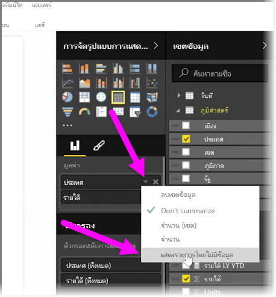
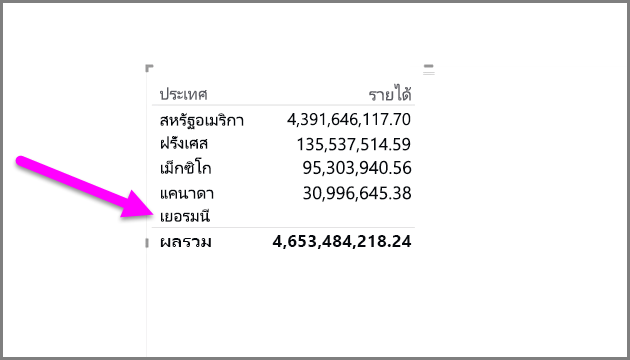
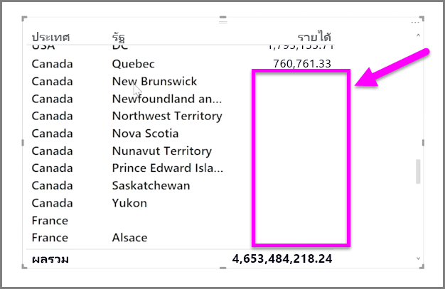

ตามค่าเริ่มต้นแล้ว ส่วนหัวของคอลัมน์จะแสดงในรายงานของคุณก็ต่อเมื่อคอลัมน์เหล่านั้นมีข้อมูลBy default, column headings are only displayed in your reports if they contain data. ตัวอย่างเช่น ถ้าคุณกำลังแสดงรายได้ตามประเทศและไม่มียอดขายในประเทศนอร์เวย์ คอลัมน์ประเทศนอร์เวย์ก็จะไม่ปรากฏในการจัดรูปแบบการแสดงข้อมูลของคุณFor example, if you were displaying revenue by country and had no sales in Norway, then Norway would not appear anywhere in your visualization.

เมื่อต้องการแสดงประเภทที่ว่างเปล่า ให้คลิกลูกศรชี้ลงในเขตข้อมูลที่คุณต้องเปลี่ยนในบานหน้าต่าง **การจัดรูปแบบการแสดงข้อมูล** และเลือก **แสดงรายการที่ไม่มีข้อมูล**To display empty categories, click on the down-arrow in the field you want to change in the  **Visualizations** pane, and select **Show items with no data**.

แล้วคอลัมน์ที่ว่างเปล่าทุกคอลัมน์จะแสดงในการแสดงผลด้วยภาพของคุณพร้อมค่าว่างAny empty columns now appear in your visual with blank values.

เมื่อคุณเลือก **แสดงรายการที่ไม่มีข้อมูล** สำหรับทุกเขตข้อมูลในบานหน้าต่าง **การจัดรูปแบบการแสดงข้อมูล** การตั้งค่านี้จะถูกนำไปใช้กับทุกเขตข้อมูลที่แสดงในบานหน้าต่างการจัดรูปแบบการแสดงข้อมูลOnce you select **Show items with no data** for any field in the **Visualizations** pane, it applies to all fields displayed in the Visualizations pane. ดังนั้นถ้าคุณเพิ่มเขตข้อมูลใหม่ รายการที่ไม่มีข้อมูลจะแสดงด้วยโดยไม่ต้องเข้าไปทีเมนูดรอปดาวน์อีกครั้งSo if you add another field, any items that have no data will also be shown, without having to revisit the drop-down menu.

