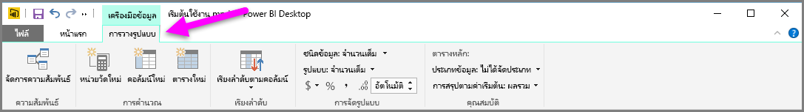
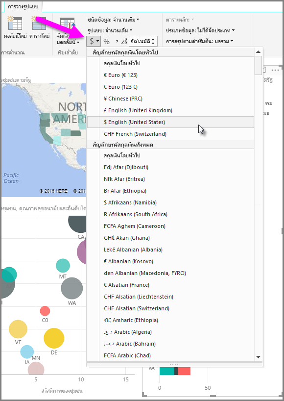
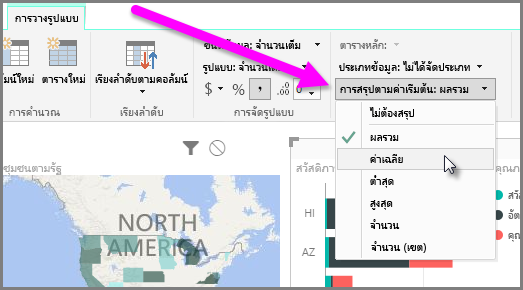
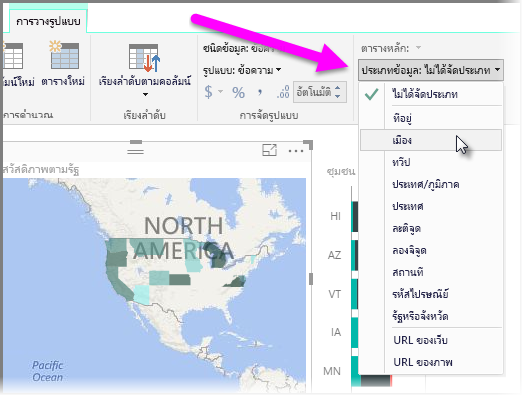

Power BI มีคุณสมบัติที่คุณสามารถกำหนดให้กับเขตข้อมูลในรูปแบบของคุณ ซึ่งสามารถช่วยรายงานและแสดงภาพ และนำเสนอข้อมูลในแบบที่ชัดเจนมากขึ้นPower BI has properties that you can assign for fields in your model, which can help report and visualize and present data in ways that provide more clarity. ตัวอย่างเช่น บางครั้งคุณต้องการเฉลี่ยรายการของกลุ่มตัวเลข แต่ Power BI รวมผลรวมของรายการนั้นโดยอัตโนมัติFor example, sometimes you want to average a list of numbers, but Power BI automatically sums the list. ด้วย Power BI คุณสามารถปรับแต่งวิธีสรุปรายการตัวเลขเหล่านั้นได้With Power BI, you can adjust how those lists of numbers are summarized.

## การควบคุมตัวเลขในการสรุปNumeric control over summarization
มาลองแสดงตัวอย่างและสาธิตวิธีควบคุมการสรุปเขตข้อมูลตัวเลขของ Power BILet's take an example, and demonstrate how to control the way Power BI summarizes numeric data fields.

เลือกการแสดงผลด้วยภาพบนพื้นที่ทำงานของรายงานของคุณแล้วจึงเลือกเขตข้อมูลในบานหน้าต่าง **เขตข้อมูล**Select a visual on your report canvas, and then select a field in the **Fields** pane. แท็บ **การวางรูปแบบ** ปรากฏใน Ribbon และแสดงตัวเลือกสำหรับการจัดรูปแบบข้อมูลและคุณสมบัติข้อมูลThe **Modeling** tab appears in the ribbon and displays options for formatting data, and data properties.

คุณสามารถเลือกชนิดของสัญลักษณ์สกุลเงินที่ใช้โดยการเลือกดรอปดาวน์สัญลักษณ์สกุลเงินที่แสดงในรูปภาพต่อไปนี้You can select the type of currency symbol used, by selecting the currency symbol drop down, which is shown in the following image.

มีตัวเลือกมากมายแตกต่างกันไปสำหรับการจัดรูปแบบเขตข้อมูลThere are many different options for formatting fields. ตัวอย่างเช่น คุณสามารถเปลี่ยนรูปแบบจากสกุลเงินเป็นเปอร์เซ็นต์ได้For example, you can change the format from currency to percentage.

คุณสามารถเปลี่ยนวิธีที่ Power BI สรุปข้อมูลได้ด้วยเช่นกันYou can change how Power BI summarizes the data, too. เลือกไอคอน **การสรุปตามค่าเริ่มต้น** เพื่อเปลี่ยนแปลงวิธีสรุปเขตข้อมูล รวมถึงการแสดงผลรวม จำนวน หรือค่าเฉลี่ยSelect the **Default Summarization** icon to change how a field is summarized, including displaying a sum, a count, or an average.

## จัดการและทำให้ข้อมูลตำแหน่งที่ตั้งของคุณเข้าใจง่ายManage and clarify your location data
คุณสามารถเปลี่ยนแปลงสิ่งที่คล้ายกันได้เมื่อลงตำแหน่งบนแผนที่You can make similar changes when plotting locations on a map. เลือกแผนที่ของคุณ แล้วจึงเลือกเขตข้อมูลในบานหน้าต่าง **เขตข้อมูล** ที่คุณใช้สำหรับค่า *ตำแหน่งที่ตั้ง*Select your map, and then select the field in the **Fields** pane that you use for the *Location* value. ในแท็บ **การวางรูปแบบ** ให้เลือก **ประเภทข้อมูล** จากนั้นเลือกประเภทที่แสดงข้อมูลตำแหน่งที่ตั้งของคุณจากเมนูดรอปดาวน์On the **Modeling** tab, select **Data Category** and then choose the category that represents your location data from the drop-down menu. ตัวอย่างเช่น เลือกรัฐ เขตปกครอง หรือเมืองFor example, select state, county, or city.

