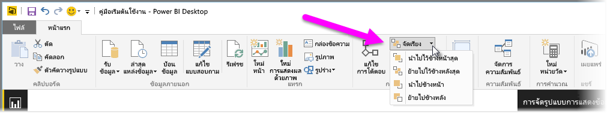
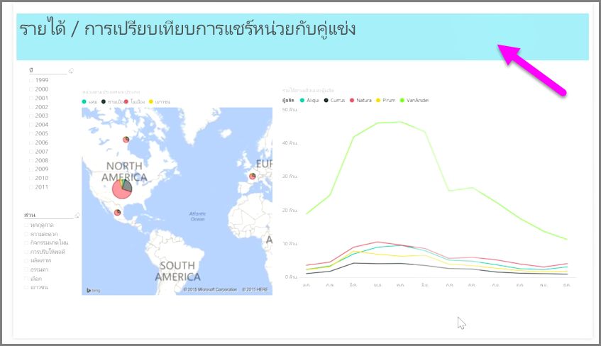

เมื่อคุณมีองค์ประกอบมากมายในรายงาน Power BI จะช่วยให้คุณสามารถจัดการวิธีทับซ้อนองค์ประกอบได้When you have lots of elements on a report, Power BI lets you manage how they overlap with each other. วิธีการจัดชั้นหรือจัดให้องค์ประกอบหนึ่งอยู่ด้านบนของอีกองค์ประกอบหนึ่งมักเรียกว่าการจัดลำดับแบบ zHow items are layered, or arranged on top of one another, is often referred to as the z-order.

เมื่อต้องการจัดลำดับแบบ z ขององค์ประกอบในรายงาน ให้เลือกองค์ประกอบแล้วใช้ปุ่ม **จัดเรียง** บนแท็บ **หน้าแรก** ของ Ribbon เพื่อเปลี่ยนลำดับแบบ z ขององค์ประกอบTo manage the z-order of elements in a report, select an element, and use the **Arrange** button on the **Home** tab of the ribbon to change its z-order.

ด้วยการใช้ตัวเลือกในเมนูปุ่ม **จัดเรียง** คุณสามารถจัดลำดับองค์ประกอบในรายงานของคุณในแบบที่คุณต้องการBy using the options in the **Arrange** button menu, you can get the ordering of elements on your report just the way you want it. คุณสามารถย้ายการแสดงผลด้วยภาพหนึ่งเลเยอร์ไปข้างหน้าหรือข้างหลัง หรือส่งไปหน้าสุดของด้านหลังลำดับYou can move a visual one layer forward or backward, or send it all the way to the front of the back of the order.

การใช้ปุ่มจัดเรียงจะมีประโยชน์อย่างยิ่งเมื่อใช้รูปร่างเป็นพื้นหลังตกแต่งหรือเส้นขอบ หรือเพื่อเน้นส่วนใดส่วนหนึ่งของแต่ละแผนภูมิหรือกราฟUsing the Arrange button is particularly useful when using shapes as decorative backgrounds or borders, or to highlight particular sections of an individual chart or graph. คุณยังสามารถใช้เพื่อสร้างพื้นหลัง อย่างเช่น สี่เหลี่ยมผืนผ้าสีฟ้าต่อไปนี้ที่ใช้เป็นพื้นหลังของรายงานYou can also use them to create a background, such as the following light-blue rectangle being used for a report title background.

