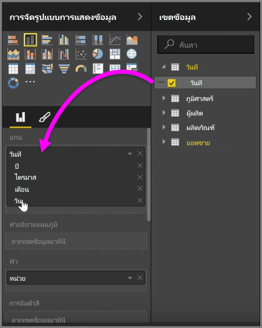
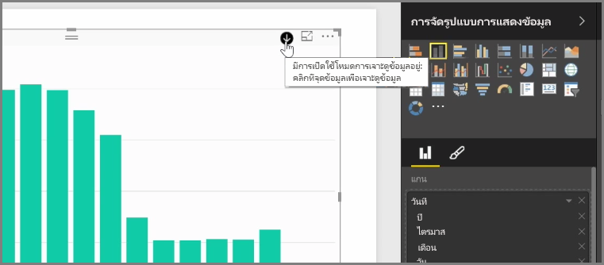
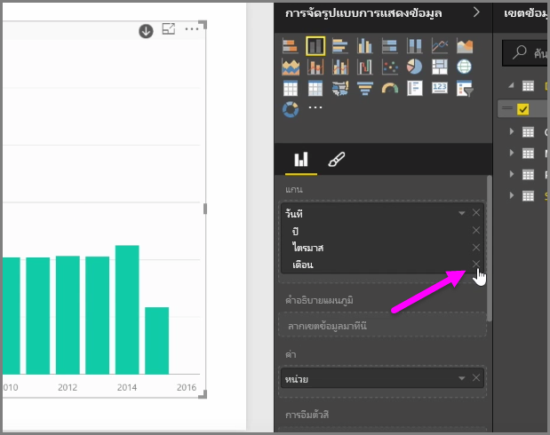
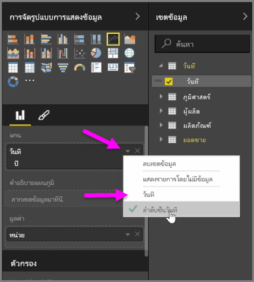
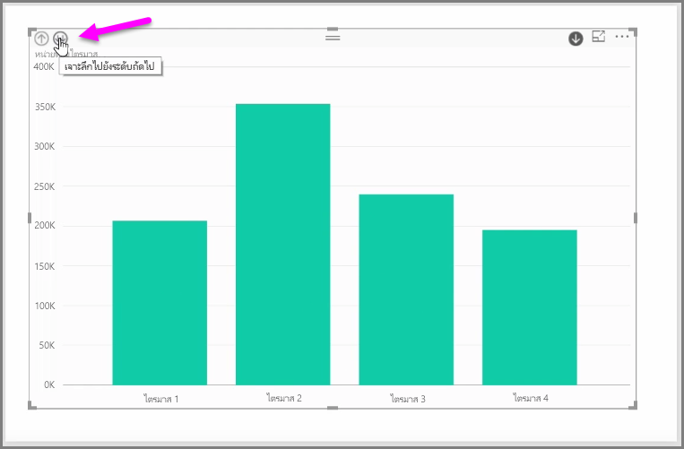

เมื่อคุณเพิ่มเขตข้อมูล*วันที่*ไปยังการแสดงผลด้วยภาพในบักเก็ตเขตข้อมูล*แกน* Power BI จะเพิ่มลำดับชั้นเวลาที่รวมถึง*ปี* *ไตรมาส* *เดือน* และ*วัน* โดยอัตโนมัติWhen you add a *date* field to a visual in the *Axis* field bucket, Power BI automatically adds a time hierarchy that includes *Year*, *Quarter*, *Month* and *Day*. ด้วยการทำเช่นนี้ Power BI จะช่วยให้การแสดงผลด้วยภาพของคุณมีปฏิสัมพันธ์ตามเวลากับผู้ที่ดูรายงานของคุณ โดยให้ผู้ใช้ดูรายละเอียดแนวลึกผ่านระดับเวลาที่ต่างกันBy doing this, Power BI allows your visuals to have time-based interaction with those viewing your reports, by letting users drill-down through those different time levels.

ด้วยลำดับชั้นที่พร้อมแล้ว คุณสามารถเริ่มดูรายละเอียดแนวลึกผ่านลำดับชั้นของเวลาได้With a hierarchy in place, you can begin drilling down through the time hierarchy. ตัวอย่างเช่น การคลิกปีในแผนภูมิจะดูรายละเอียดแนวลึกไปยังระดับถัดไปในลำดับชั้น ซึ่งในกรณีนี้คือ*ไตรมาส*ที่จะแสดงในการแสดงผลด้วยภาพFor example, clicking a year in the chart drills down to the next level in the hierarchy, in this case *Quarters*, which are then displayed in the visual.

ในลำดับชั้นที่สร้างขึ้นโดยอัตโนมัติ คุณยังสามารถจัดการว่ารายงานที่แชร์อนุญาตให้ผู้อื่นสามารถดูรายละเอียดแนวลึกได้ถึงระดับใดIn that automatically created hierarchy, you can also manage to which level your shared report allows people to drill. เมื่อต้องการทำเช่นนี้ เพียงคลิก X ข้างลำดับชั้นที่คุณต้องการนำออกในบานหน้าต่างการจัดรูปแบบการแสดงข้อมูลTo do this, in the Visualizations pane, simply click the X beside the hierarchy that you want to remove. ระดับที่ถูกลบจะถูกนำออกจากรายงานและการดูรายละเอียดแนวลึกจะไม่แสดงระดับดังกล่าวอีกต่อไปThe deleted level is removed from the report, and drilling no longer displays that level.

ถ้าคุณต้องการนำระดับของลำดับชั้นนั้นกลับมา เพียงนำเขตข้อมูล*วันที่* ออก จากนั้นเพิ่มเข้าไปอีกครั้งจากบานหน้าต่าง**เขตข้อมูล** แล้วลำดับชั้นจะสร้างขึ้นให้คุณโดยอัตโนมัติIf you need to get that level of the hierarchy back, just remove the *date* field, and then add it again from the **Fields** pane, and the hierarchy is once again created for you automatically.

บางครั้งคุณอาจไม่ต้องการใช้ลำดับชั้นสำหรับการแสดงผลด้วยภาพThere may be times when you don't want the hierarchy to be used for a visual. คุณสามารถควบคุมได้โดยปุ่มลูกศรชี้ลงข้างเขตข้อมูล*วันที่* (เมื่อคุณได้เพิ่มเขตข้อมูลไปยังการแสดงผลด้วยภาพแล้ว) และเลือก**วันที่** แทนที่จะเป็น**ลำดับชั้นวันที่**You can control that by selecting the down-arrow button beside the *Date* field (once you've added it to a visual), and select **Date** rather than **Date Hierarchy**. ซึ่งจะพร้อมท์ให้ Power BI แสดงค่าวันที่ดิบในการแสดงผลด้วยภาพThat prompts Power BI to show the raw date values in the visual.

นอกจากนี้คุณยังสามารถขยายองค์ประกอบข้อมูลทั้งหมดที่มองเห็นอยู่ได้ในครั้งเดียวแทนการเลือกไตรมาสเดียวหรือปีเดียวYou can also expand all data elements currently visible at once, rather than selecting a single quarter, or a single year. เมื่อต้องการทำเช่นนั้น ให้เลือกไอคอน *ดูรายละเอียดแนวลึกทั้งหมด* ที่ด้านซ้ายบนของการแสดงผลด้วยภาพที่เป็นไอคอนลูกศรชี้ลงสองอันTo do that, select the *Drill all* icon in the top left of the visual, which is a double-down arrow icon.

