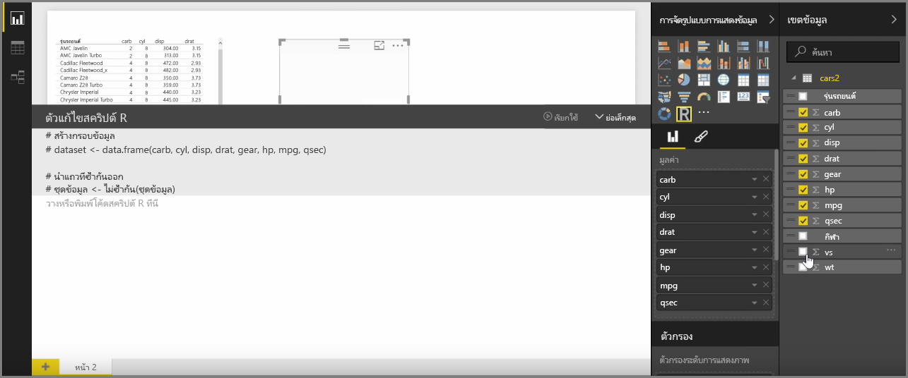
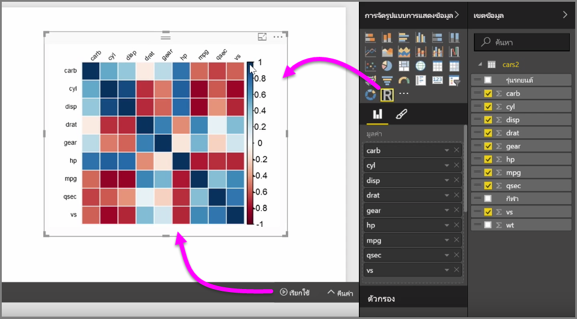
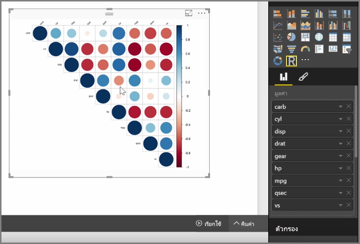

ด้วย Power BI Desktop คุณสามารถวิเคราะห์เชิงวิเคราะห์และวิเคราะห์เชิงสถิติและสร้างการแสดงผลด้วยภาพที่น่าสนใจโดยผสานรวมกับ R คุณสามารถโฮสต์การจัดรูปแบบการแสดงข้อมูลแบบ R เหล่านั้นภายในรายงาน Power BI DesktopWith Power BI Desktop, you can perform analytical and statistical analysis and create compelling visuals by integrating with R. You can host those R visualizations within the Power BI Desktop report.

เมื่อคุณเลือกไอคอน **การแสดงผลด้วยภาพแบบ R** จากบานหน้าต่าง **การจัดรูปแบบการแสดงข้อมูล** Power BI จะสร้างตัวแทนบนพื้นที่ทำงานเพื่อโฮสต์การแสดงผลด้วยภาพแบบ R ของคุณ แล้วจึงแสดงตัวแก้ไขสคริปต์ R ให้คุณใช้บนพื้นที่ทำงานได้โดยตรงWhen you select the **R visual** icon from the **Visualizations** pane, Power BI creates a placeholder on the canvas to host your R visual, and then presents an R script editor for you to use right on the canvas. เมื่อคุณเพิ่มเขตข้อมูลลงในการแสดงผลด้วยภาพแบบ R, Power BI Desktop จะเพิ่มเขตข้อมูลลงในบานหน้าต่างตัวแก้ไขสคริปต์ RAs you add fields to the R visual, Power BI Desktop adds them to the R script editor pane.

ภายใต้สิ่งที่ Power BI สร้างขึ้นใน ตัวแก้ไขสคริปต์ R คุณสามารถเริ่มต้นสร้างสคริปต์ R ของคุณเพื่อสร้างการแสดงผลด้วยภาพBelow what Power BI generates in the R script editor, you can begin creating your R script to generate the visual. เมื่อสคริปต์ของคุณเสร็จสมบูรณ์ ให้เลือก **เรียกใช้** แล้วเหตุการณ์ต่อไปนี้จะเกิดขึ้น:Once your script is complete, select **Run** and the following occurs:

1. ข้อมูลที่เพิ่มเข้าไปยังการแสดงผลด้วยภาพ (จากบานหน้าต่าง **เขตข้อมูล**) ส่งมาจาก Power BI Desktop เพื่อการติดตั้ง R ภายในเครื่องThe data added to the visual (from the **Fields** pane) is sent from Power BI Desktop to the local installation of R
2. สคริปต์ที่สร้างในตัวแก้ไขสคริปต์ R ของ Power BI Desktop ทำงานบนการติดตั้ง R ภายในเครื่องThe script created in the Power BI Desktop R script editor is run on that local installation of R
3. จากนั้น Power BI Desktop จะได้รับการแสดงผลด้วยภาพกลับมาจากการติดตั้ง R และแสดงบนพื้นที่ทำงานThen Power BI Desktop gets a visual back from the R installation, and displays it on the canvas

ทั้งหมดเกิดขึ้นค่อนข้างรวดเร็วและผลจะปรากฏในการจัดรูปแบบการแสดงข้อมูล**การแสดงผลด้วยภาพแบบ R** บนพื้นที่ทำงานIt all happens quite quickly, and the result appears in the **R visual** visualization on the canvas.

คุณสามารถเปลี่ยนแปลงการแสดงผลด้วยภาพแบบ R โดยการปรับสคริปต์ R แล้วจึงเลือก **เรียกใช้** อีกครั้งYou can change the R visual by adjusting the R script, and then selecting **Run** again. ในรูปต่อไปนี้ เราได้เปลี่ยนแปลงการแสดงผลด้วยภาพ เพื่อแสดงวงกลมแทนที่สี่เหลี่ยมIn the following image, we changed the visual to display circles instead of squares.

และเนื่องจากการแสดงผลด้วยภาพแบบ R นั้นเหมือนกันกับการแสดงผลด้วยภาพอื่นๆ ใน Power BI Desktop คุณสามารถโต้ตอบกับการแสดงผลด้วยภาพแบบ R และเชื่อมต่อกับการแสดงผลด้วยภาพอื่นๆ บนพื้นที่ทำงานได้ด้วยเช่นกันAnd since the R visual is just like any other visual in Power BI Desktop, you can interact with it and make connections with other visuals on the canvas as well. เมื่อคุณโต้ตอบกับการแสดงผลด้วยภาพอื่นๆ บนพื้นที่ทำงานผ่านตัวกรองหรือการเน้น การแสดงผลด้วยภาพแบบ R จะตอบสนองเหมือนการแสดงผลด้วยภาพ Power BI อื่นๆ โดยอัตโนมัติโดยไม่จำเป็นต้องปรับสคริปต์ RWhen you interact with other visuals on the canvas, through filtering or highlighting, the R visual automatically reacts just like any other Power BI visual, without needing to adjust the R script.

ซึ่งเป็นวิธีที่ยอดเยี่ยมในการใช้พลังของ R โดยตรงใน Power BI DesktopIt's a great way to use the power of R, right in Power BI Desktop.

## ขั้นตอนถัดไปNext steps
**ยินดีด้วย!****Congratulations!** คุณได้เรียนรู้ส่วน**การจัดรูปแบบการแสดงข้อมูล**ของหลักสูตร**การเรียนรู้ตามคำแนะนำ**สำหรับ Power BI เสร็จสมบูรณ์แล้วYou've completed this **Visualizations** section of the **Guided Learning** course for Power BI. คุณสามารถพิจารณาตัวเองว่ามีความรอบรู้ในการจัดรูปแบบการแสดงข้อมูลหลายแบบที่มีใน Power BI แล้ว และยังมีความรู้เกี่ยวกับวิธีการใช้ ปรับเปลี่ยน และกำหนดการจัดรูปแบบการแสดงข้อมูลด้วยตนเองอีกด้วยYou can consider yourself well-versed in the many visualizations offered in Power BI, and also knowledgeable about how to use, modify, and customize them. ข่าวดี: การจัดรูปแบบการแสดงข้อมูลมีพื้นฐานเหมือนกันใน Power BI Desktop และบริการของ Power BI ดังนั้นสิ่งที่คุณเรียนรู้สามารถนำไปใช้ได้กับทั้งคู่And good news: visualizations are essentially the same in Power BI Desktop and the Power BI service, so what you learned applies to both.

ตอนนี้คุณก็พร้อมแล้วที่จะไปยังระบบคลาวด์และจดจ่อกับบริการของ Power BI ที่คุณสามารถ**สำรวจข้อมูล**ได้You're now ready to head to the cloud and get immersed in the Power BI service, where you can **Explore Data**. ตามที่คุณทราบ โฟลว์ของงานมีลักษณะดังต่อไปนี้:As you know, the flow of work looks something like the following:

* นำข้อมูลเข้าไปยัง **Power BI Desktop** และสร้างรายงานBring data into **Power BI Desktop**, and create a report.
* เผยแพร่ไปยังบริการของ Power BI ที่คุณสามารถสร้าง**การจัดรูปแบบการแสดงข้อมูล**ใหม่ได้ และสร้างแดชบอร์ดPublish to the Power BI service, where you create new **visualizations** and build dashboards
* **แชร์**แดชบอร์ดของคุณกับผู้อื่น โดยเฉพาะผู้ที่กำลังเดินทาง**Share** your dashboards with others, especially people who are on the go
* ดูและโต้ตอบกับแดชบอร์ดและรายงานที่แชร์ในแอป **Power BI บนมือถือ**View and interact with shared dashboards and reports in **Power BI Mobile** apps

ไม่ว่าคุณจะสร้างรายงานหรือเพียงแค่ดูและโต้ตอบกับรายงาน ตอนนี้คุณก็ได้รู้วิธีการสร้างการแสดงผลด้วยภาพสุดเจ๋ง และวิธีการเชื่อมต่อการแสดงผลด้วยภาพเข้ากับข้อมูลWhether you create reports or just view and interact with them, you now know how all those cool visuals are created, and how they connected to the data. ถัดไปเราจะได้เห็นการแสดงผลด้วยภาพและรายงานในการดำเนินการNext we get to see those visuals and reports in action.

พบกันในส่วนถัดไป!See you in the next section!

