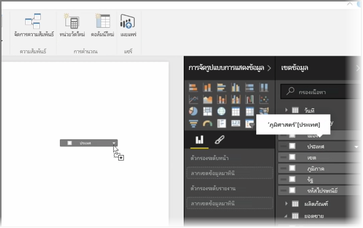
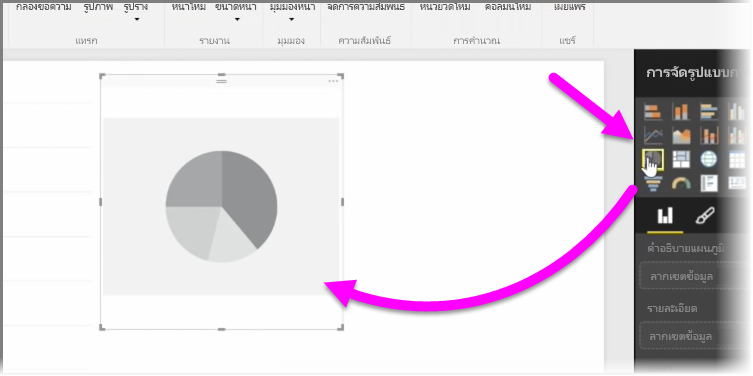
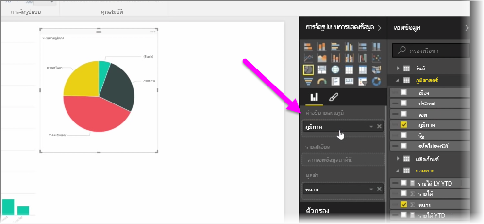
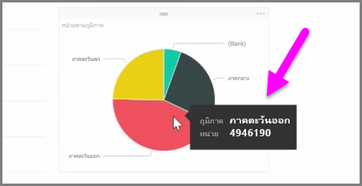
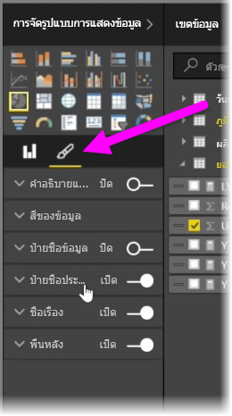

ในบทความนี้คุณจะได้เรียนรู้วิธีสร้างแผนภูมิแท่ง แผนภูมิวงกลม และแผนภูมิทรีแมป และการปรับแต่งแผนภูมิให้เหมาะสมกับรายงานของคุณIn this article you learn how to create new bar charts, pie charts, and treemaps, and customize them to suit your reports.

มีวิธีการสร้างการจัดรูปแบบการแสดงข้อมูลใหม่ใน Power BI Desktop สองวิธีคือ:There are two different ways to create a new visualization in Power BI Desktop:

* คุณสามารถลากชื่อเขตข้อมูลจากบานหน้าต่าง **เขตข้อมูล** และวางลงในพื้นที่ทำงานของรายงานYou can drag field names from the **Fields** pane, and drop them on the report canvas. ตามค่าเริ่มต้น การจัดรูปแบบการแสดงข้อมูลของคุณจะปรากฏเป็นตารางข้อมูลBy default your visualization appears as a table of data.
  
  
* คุณยังสามารถคลิกชนิดการจัดรูปแบบการแสดงข้อมูลที่คุณต้องการสร้างในบานหน้าต่าง **การจัดรูปแบบการแสดงข้อมูล**You can also click the type of visualization you want to create in the **Visualizations** pane. ด้วยวิธีนี้ ค่าเริ่มต้นของการแสดงผลด้วยภาพจะเป็นตัวแทนว่างเปล่าที่เหมือนกับชนิดของการแสดงผลด้วยภาพที่คุณเลือกWith this method, the default visual is a blank placeholder that resembles the type of visual you selected.
  
  

เมื่อคุณสร้างกราฟ แผนที่ หรือแผนภูมิของคุณ คุณสามารถเริ่มต้นลากเขตข้อมูลของข้อมูลไปยังส่วนของบานหน้าต่าง **การจัดรูปแบบการแสดงข้อมูล** เพื่อสร้างและจัดการการแสดงผลด้วยภาพของคุณOnce you create your graph, map, or chart, you can begin dragging data fields onto the bottom portion of the **Visualization** pane to build and organize your visual. เขตข้อมูลที่ใช้ได้จะเปลี่ยนตามชนิดของ การจัดรูปแบบการแสดงข้อมูลที่คุณเลือกThe available fields will change based on the type of visualization that you selected. เมื่อคุณลากและปล่อยเขตข้อมูลของข้อมูล การจัดรูปแบบการแสดงข้อมูลของคุณจะอัปเดตการเปลี่ยนแปลงโดยอัตโนมัติAs you drag and drop data fields, your visualization will automatically update to reflect changes.

คุณสามารถปรับขนาดการจัดรูปแบบการแสดงข้อมูลของคุณโดยการเลือกและลากตัวจัดการเข้าหรือออก คุณยังสามารถย้ายการจัดรูปแบบการแสดงข้อมูลของคุณไปได้ทุกที่บนพื้นที่ทำงานโดยการคลิกและลากYou can resize your visualization by selecting it and then dragging the handles in or out. You can also move your visualization anywhere on the canvas by clicking and then dragging it. ถ้าคุณต้องการแปลงชนิดการจัดรูปแบบการแสดงข้อมูลเป็นชนิดอื่น ให้เลือกการแสดงผลด้วยภาพที่คุณต้องการเปลี่ยนแปลง และเลือกการแสดงผลด้วยภาพอื่นจากไอคอนในบานหน้าต่าง **การจัดรูปแบบการแสดงข้อมูล**If you want to convert between different types of visualizations, select the visual you want to change and simply select a different visual from the icons in the **Visualization** pane. Power BI จะพยายามแปลงเขตข้อมูลที่คุณเลือกเป็นการแสดงผลด้วยภาพชนิดใหม่ที่ใกล้เคียงที่สุดเท่าที่จะเป็นไปได้Power BI attempts to convert your selected fields to the new visual type as closely as possible.

เมื่อคุณโฮเวอร์เหนือส่วนการจัดรูปแบบการแสดงข้อมูลของคุณ คุณจะได้รับคำแนะนำเครื่องมือที่มีรายละเอียดเกี่ยวกับส่วนนั้น เช่น ป้ายกำกับและค่าทั้งหมดAs you hover over parts of your visualizations, you'll get a tooltip that contains details about that segment, such as labels and total value.

เลือกไอคอน **พู่กัน** บนบานหน้าต่าง **การจัดรูปแบบการแสดงข้อมูล** เพื่อเปลี่ยนแปลงลักษณะการแสดงผลด้วยภาพของคุณ เช่น การจัดแนวพื้นหลัง ข้อความหัวข้อ และสีข้อมูลSelect the **paintbrush** icon on the **Visualizations** pane to make cosmetic changes to your visual, such as background alignment, title text, and data colors.

ตัวเลือกการเปลี่ยนแปลงลักษณะการแสดงผลด้วยภาพที่พร้อมใช้งานขึ้นอยู่กับชนิดการแสดงผลด้วยภาพที่คุณเลือกThe available options for cosmetic changes to your visual vary depending on the type of visual you have selected.

