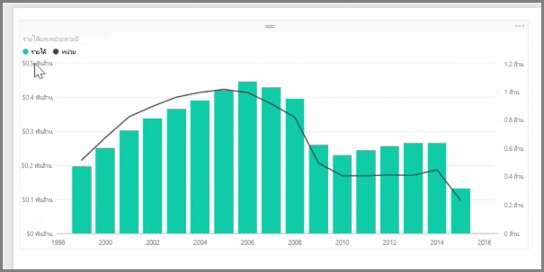
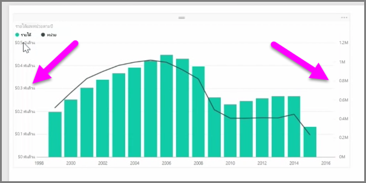
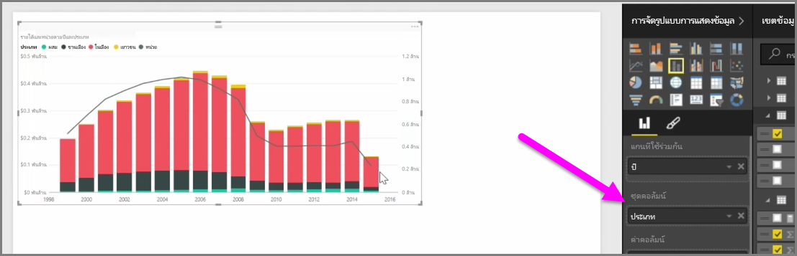

เมื่อคุณต้องการแสดงภาพสองหน่วยวัดที่มีมาตราส่วนแตกต่างกันมาก เช่น รายได้และหน่วย **แผนภูมิผสม** ที่แสดงเส้นและแท่งด้วยมาตราส่วนแกนที่แตกต่างกันจะมีประโยชน์มากWhen you want to visualize two measures that have very different scales, such as revenue and units, a **combination chart** that shows a line and a bar with different axis scales is very useful. Power BI รองรับแผนภูมิผสมหลายชนิดแตกต่างกันตามค่าเริ่มต้น รวมถึงแผนภูมิ**เส้น**และแผนภูมิ**คอลัมน์แบบเรียงซ้อน**Power BI supports many different types of combination charts by default, including the popular **Line** and **Stacked Columns** charts.

เมื่อคุณสร้างแผนภูมิผสมคุณจะเห็นเขตข้อมูลสำหรับ**แกนที่ใช้ร่วมกัน** (แกน X) และค่าสำหรับเขตข้อมูลสองเขตข้อมูลของคุณซึ่งในกรณีนี้เป็นคอลัมน์และเส้นWhen you create a combination chart, you're presented with a field for **Shared Axis** (the X-axis), and then values for your two fields, in this case a column and a line. คำอธิบายแผนภูมิแกน Y สองรายการจะปรากฏที่ข้างใดข้างหนึ่งของการจัดรูปแบบการแสดงข้อมูลThe two Y-axis legends appear on either side of the visualization.

คุณยังสามารถแยกคอลัมน์ตามประเภทโดยการลากประเภทลงในเขตข้อมูลชุดคอลัมน์ในบานหน้าต่างการจัดรูปแบบการแสดงข้อมูลYou can also split each column by category, by dragging a category into the Column Series field in the Visualizations pane. เมื่อทำเช่นนั้น แต่ละแท่งจะมีสีตามสัดส่วนตามค่าภายในแต่ละประเภทWhen you do so, each bar is proportionately colored based on the values within each category.

แผนภูมิผสมเป็นวิธีที่มีประสิทธิภาพในการแสดงภาพแบบหลายหน่วยวัดที่มีมาตราส่วนแตกต่างกันมากในการจัดรูปแบบการแสดงข้อมูลเดียวCombination charts are an effective way to visualize multiple measures that have very different scales in a single visualization.

