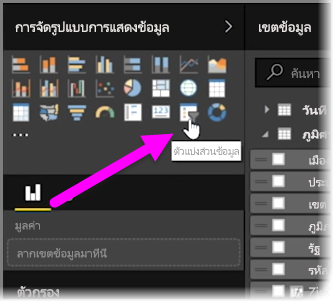
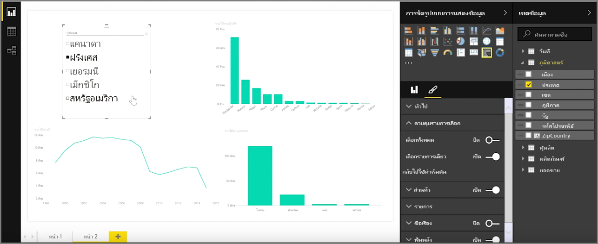
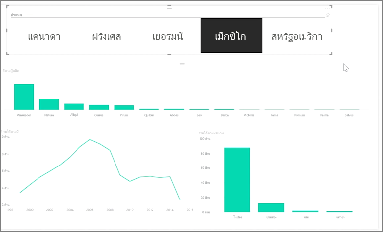

ตัวแบ่งส่วนข้อมูลเป็นหนึ่งในชนิดการจัดรูปแบบการแสดงข้อมูลที่มีประสิทธิภาพมากที่สุดโดยเฉพาะอย่างยิ่งเมื่อเป็นส่วนหนึ่งของรายงานที่ซับซ้อนSlicers are one of the most powerful types of visualizations, particularly as part of a busy report. **ตัวแบ่งส่วนข้อมูล**เป็นตัวกรองการแสดงผลด้วยภาพบนพื้นที่ทำงานใน **Power BI Desktop** ที่ช่วยให้ทุกคนสามารถดูรายงาน ในส่วนของข้อมูลตามค่าที่เฉพาะเจาะจง เช่น ตามปีหรือตามตำแหน่งที่ตั้งทางภูมิศาสตร์A **slicer** is an on-canvas visual filter in **Power BI Desktop** that lets anyone looking at a report segment the data by a particular value, such as by year or by geographical location.

เมื่อต้องการเพิ่มตัวแบ่งส่วนข้อมูลไปยังรายงานของคุณ ให้เลือก **ตัวแบ่งส่วนข้อมูล** จากบานหน้าต่าง **การจัดรูปแบบการแสดงข้อมูล**To add a slicer to your report, select **Slicer** from the **Visualizations** pane.

ลากเขตข้อมูลที่คุณต้องการแบ่งและวางเขตข้อมูลนั้นด้านบนของตัวแทนตัวแบ่งส่วนข้อมูลDrag the field by which you want to slice and drop it top of the slicer placeholder. การจัดรูปแบบการแสดงข้อมูลจะเปลี่ยนเป็นรายการองค์ประกอบที่มีกล่องกาเครื่องหมายThe visualization turns into a list of elements with checkboxes. องค์ประกอบเหล่านี้คือตัวกรองของคุณ - เลือกกล่องถัดจากส่วนหนึ่ง แล้วการจัดรูปแบบการแสดงข้อมูลส่วนอื่นทั้งหมดในหน้ารายงานเดียวกันจะถูกกรอง หรือ*แบ่ง*ตามการเลือกของคุณThese elements are your filters - select the box next to one to segment, and all other visualizations on the same report page are filtered, or *sliced*, by your selection.

มีตัวเลือกอื่นๆ เล็กน้อยสำหรับการจัดรูปแบบตัวแบ่งส่วนข้อมูลของคุณThere are a few different options available to format your slicer. คุณสามารถตั้งค่าให้ตัวแบ่งส่วนข้อมูลยอมรับการป้อนหลายข้อมูลในครั้งเดียว หรือสลับเป็นโหมด **เลือกรายการเดียว** เพื่อใช้การป้อนข้อมูลครั้งละหนึ่งรายการYou can set it to accept multiple inputs at once, or toggle **Single Select** mode to use one at a time. คุณยังสามารถเพิ่มตัวเลือก **เลือกทั้งหมด** ไปยังองค์ประกอบตัวแบ่งส่วนข้อมูลของคุณซึ่งจะเป็นประโยชน์เมื่อคุณมีรายการที่ยาวเป็นพิเศษYou can also add a **Select All** option to your slicer elements, which is helpful when you have a particularly long list. เปลี่ยนการวางแนวตัวแบ่งของคุณจากค่าเริ่มต้นแนวตั้งเป็นแนวนอน แล้วตัวแบ่งจะกลายเป็นแถบการเลือกแทนที่รายการตรวจสอบChange the orientation of your slicer from the vertical default to horizontal, and it becomes a selection bar rather than a checklist.

