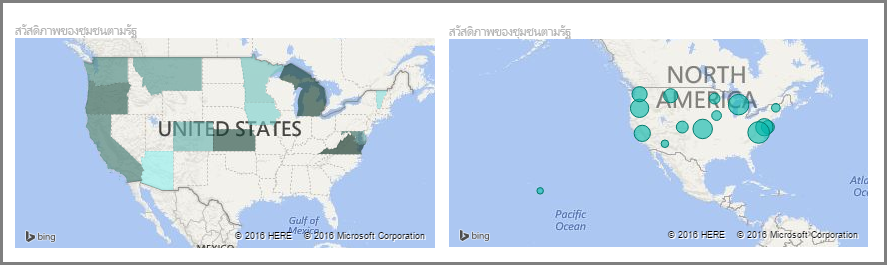
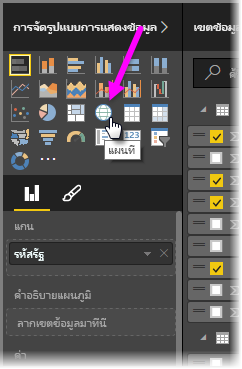
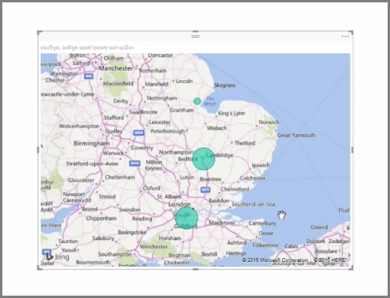
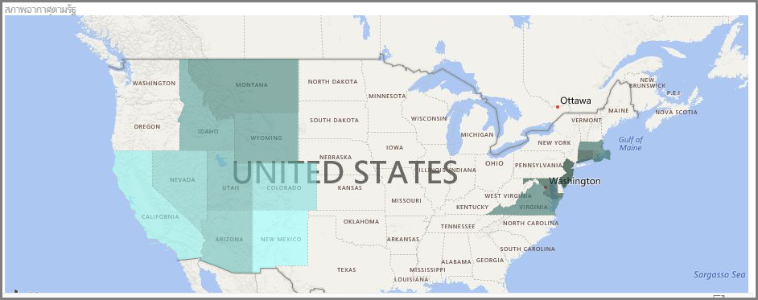
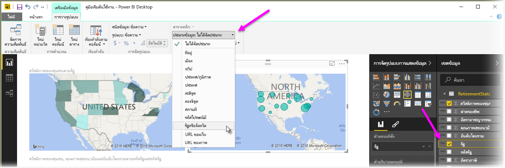

Power BI มีการจัดรูปแบบการแสดงข้อมูลแผนที่ที่แตกต่างกันอยู่สองชนิดคือ: แผนที่แบบฟองที่วางฟองเหนือจุดทางภูมิศาสตร์ และแผนที่รูปร่างที่แสดงเค้าร่างของพื้นที่ที่คุณต้องการแสดงภาพPower BI has two different types of map visualizations: a bubble map that places a bubble over a geographic point, and a shape map that actually shows the outline of area you want to visualize.

> [!NOTE]
> เมื่อทำงานกับประเทศหรือภูมิภาค ให้ใช้ตัวย่อสามตัวเพื่อให้แน่ใจว่าการเข้ารหัสทางภูมิศาสตร์ทำงานได้อย่างถูกต้องในการจัดรูปแบบการแสดงข้อมูลแผนที่When working with countries or regions, use the three-letter abbreviation to ensure that geocoding works properly in map visualizations. *อย่า*ใช้ตัวย่อสองตัวอักษร เนื่องจากอาจไม่รู้จักบางประเทศหรือบางภูมิภาคDo *not* use two-letter abbreviations, as some countries or regions may not be properly recognized.
> ถ้าคุณมีเพียงตัวย่อสองตัว ให้ดู[บล็อกโพสต์ภายนอกนี้](https://blog.ailon.org/how-to-display-2-letter-country-data-on-a-power-bi-map-85fc738497d6#.yudauacxp)สำหรับขั้นตอนวิธีการเชื่อมโยงตัวย่อประเทศ/ภูมิภาคแบบสองตัวของคุณเข้ากับตัวย่อประเทศ/ภูมิภาคแบบสามตัวIf you only have two-letter abbreviations, check out [this external blog post](https://blog.ailon.org/how-to-display-2-letter-country-data-on-a-power-bi-map-85fc738497d6#.yudauacxp) for steps on how to associate your two-letter country/region abbreviations with three-letter country/region abbreviations.
> 
> 

## สร้างแผนที่แบบฟองCreate bubble maps
เมื่อต้องการสร้างแผนที่แบบฟอง ให้เลือกตัวตัวเลือก **แผนที่** ในบานหน้าต่าง **การจัดรูปแบบการแสดงข้อมูล**To create a bubble map, select the **Map** option in the **Visualization** pane. คุณต้องเพิ่มค่าไปยังบักเก็ต *ตำแหน่งที่ตั้ง* ในตัวเลือก **การจัดรูปแบบการแสดงข้อมูล** เพื่อใช้การแสดงผลด้วยภาพแผนที่You must add a value to the *Location* bucket in the **Visualizations** options to use a map visual.

Power BI มีความยืดหยุ่นเกี่ยวกับชนิดของค่าตำแหน่งที่ตั้งที่ยอมรับ ตั้งแต่รายละเอียดเพิ่มเติม เช่น ชื่อเมืองหรือรหัสสนามบินลงไป จนถึงข้อมูลละติจูดและลองจิจูดที่เฉพาะเจาะจงอย่างมากPower BI is flexible about what type of location value it accepts, from more general details like city name or airport code, down to very specific latitude and longitude data. เพิ่มเขตข้อมูลไปยังบักเก็ต **ขนาด** เพื่อเปลี่ยนขนาดของฟองตามแต่ละตำแหน่งที่ตั้งของแผนที่Add a field to the **Size** bucket to change the size of the bubble accordingly for each map location.

## สร้างแผนที่รูปร่างCreate shape maps
เมื่อต้องการสร้างแผนที่รูปร่าง ให้เลือกตัวเลือก **แผนที่แถบสี** ในบานหน้าต่างการจัดรูปแบบการแสดงข้อมูลTo create a shape map, select the **Filled Map** option in the Visualization pane. เช่นเดียวกับแผนที่แบบฟอง คุณต้องเพิ่มค่าให้กับบักเก็ตตำแหน่งที่ตั้งเพื่อใช้การแสดงผลด้วยภาพนี้As with bubble maps, you must add some kind of value to the Location bucket to use this visual. เพิ่มเขตข้อมูลลงในบักเก็ตขนาดเพื่อเปลี่ยนความเข้มของสีเติมโดยสอดคล้องกันAdd a field to the Size bucket to change the intensity of the fill color accordingly.

ไอคอนคำเตือนในมุมบนซ้ายของการแสดงผลด้วยภาพของคุณระบุว่า แผนที่จำเป็นต้องมีข้อมูลตำแหน่งที่ตั้งเพิ่มเติมเพื่อให้ลงค่าได้อย่างแม่นยำA warning icon in the top left corner of your visual indicates that the map needs more location data to accurately plot values. ซึ่งเป็นปัญหาที่พบบ่อยเมื่อข้อมูลในเขตข้อมูลตำแหน่งที่ตั้งของคุณไม่ชัดเจน เช่น ใช้ชื่อพื้นที่อย่าง *วอชิงตัน* ที่อาจหมายถึงรัฐหรือเขตThis is a particularly common problem when the data in your location field is ambiguous, such as using an area name like *Washington* that could indicate a state or a district. วิธีหนึ่งในการแก้ไขปัญหานี้คือการเปลี่ยนชื่อคอลัมน์ของคุณให้เจาะจงมากขึ้นเช่น *รัฐ*One way to resolve this problem is to rename your column to be more specific, such as *State*. อีกวิธีหนึ่งในการแก้ปัญหาคือการรีเซ็ตประเภทข้อมูลด้วยตนเองโดยการเลือก **ประเภทข้อมูล** ในแท็บการวางรูปแบบ จากนั้นคุณสามารถกำหนดประเภทให้กับข้อมูลของคุณเช่น "รัฐ" หรือ "เมือง"Another way to resolve it is to manually reset the data category by selecting **Data Category** in the Modeling tab. From there you can assign a category to your data such as "State" or "City".

