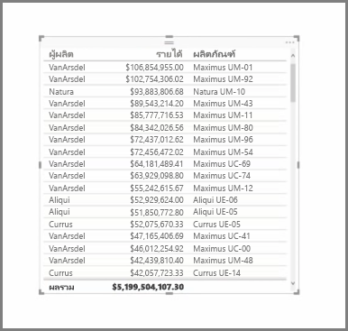
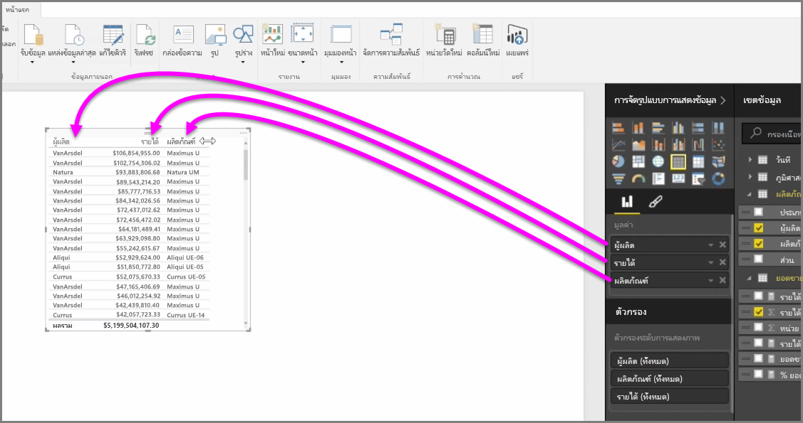
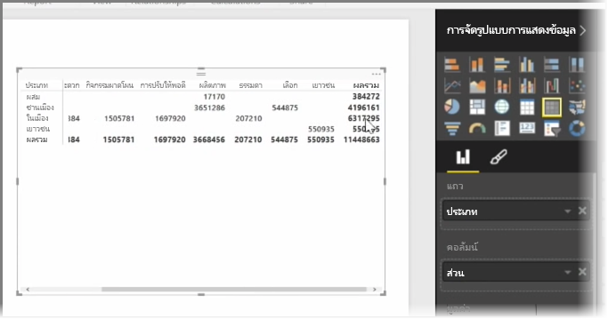

นอกจากแผนภูมิที่มากมายแล้ว Power BI Desktop ยังสนับสนุนการจัดรูปแบบการแสดงข้อมูลแบบตารางเพิ่มเติมอีกด้วยIn addition to an abundance of charts, Power BI Desktop also supports more tabular visualizations. ที่จริงแล้ว เมื่อคุณจับเขตข้อมูลประเภทหรือเขตข้อมูลข้อความแล้วลากลงบนพื้นที่ทำงานของรายงาน คุณจะได้รับตารางผลลัพธ์ตามค่าเริ่มต้นIn fact, when you grab a categorical field or text field and drag it onto the report canvas, you get a table of results by default. คุณสามารถเลื่อนขึ้นและลงผ่านตารางได้ และตารางจะเรียงลำดับตามตัวอักษรในตอนแรกYou can scroll up and down through the table, and initially it will be sorted alphabetically.

หากคุณมีข้อมูลตัวเลขในตาราง เช่น รายได้ ยอดรวมจะปรากฏที่ด้านล่างIf you have numerical information in a table, such as revenue, a total sum will appear at the bottom. คุณสามารถเรียงลำดับตามแต่ละคอลัมน์ด้วยตนเอง โดยคลิกที่ส่วนหัวเพื่อสลับลำดับแบบเรียงจากน้อยไปมาก หรือเรียงจากมากไปน้อยYou can manually sort by each column by clicking on its header to toggle ascending or descending order. ถ้าคอลัมน์ไม่กว้างพอที่จะแสดงเนื้อหาทั้งหมด ให้คลิกและลากส่วนหัวไปทางด้านข้างเพื่อขยายIf a column is not wide enough to display all of its contents, click and drag the header sideways to expand it.

ลำดับของเขตข้อมูลในบักเก็ต *ค่า* ในบานหน้าต่าง **การจัดรูปแบบการแสดงข้อมูล** จะกำหนดลำดับที่ปรากฏในตารางของคุณThe order of the fields in the *Values* bucket in the **Visualizations** pane determines the order in which they appear in your table.

**เมทริกซ์** มีลักษณะคล้ายกับตาราง แต่มีส่วนหัวของประเภทที่แตกต่างบนคอลัมน์และแถวA **matrix** is similar to a table, but it has different category headers on the columns and rows. เช่นเดียวกับตาราง ข้อมูลตัวเลขจะถูกรวมโดยอัตโนมัติที่ด้านล่างและด้านขวาของเมทริกซ์As with tables, numerical information will be automatically totaled along the bottom and right side of the matrix.

มีตัวเลือกลักษณะจำนวนมากสำหรับเมทริกซ์ เช่น การกำหนดขนาดคอลัมน์อัตโนมัติ การสลับยอดรวมระหว่างแถวและคอลัมน์ การตั้งค่าสี และอื่นๆThere are many cosmetic options available for matrixes, such as auto-sizing columns, toggling row and column totals, setting colors, and more. เมื่อสร้างเมทริกซ์ให้ตรวจสอบว่าข้อมูลประเภทของคุณ (ข้อมูลที่ไม่ใช่ตัวเลข) อยู่ทางด้านซ้ายของเมทริกซ์และไฟล์ตัวเลขอยู่ทางด้านขวา เพื่อให้แน่ใจว่าแถบเลื่อนแนวนอนจะปรากฏขึ้นและการเลื่อนจะทำงานอย่างถูกต้องWhen creating a matrix, make sure your categorical data (the non-number data) is on the left of the matrix, and the numeric files on the right to ensure the horizontal scroll bar appears, and to make sure that scrolling behavior works properly.

