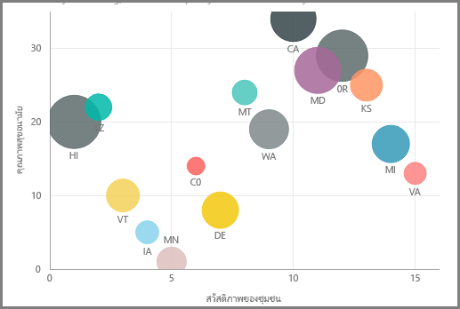
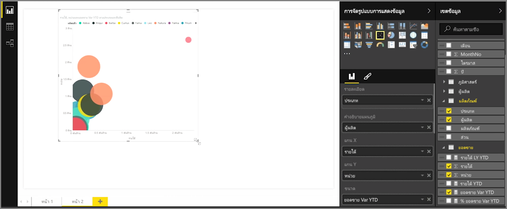
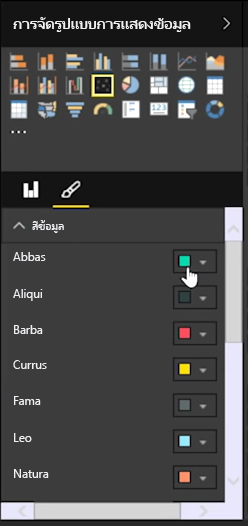
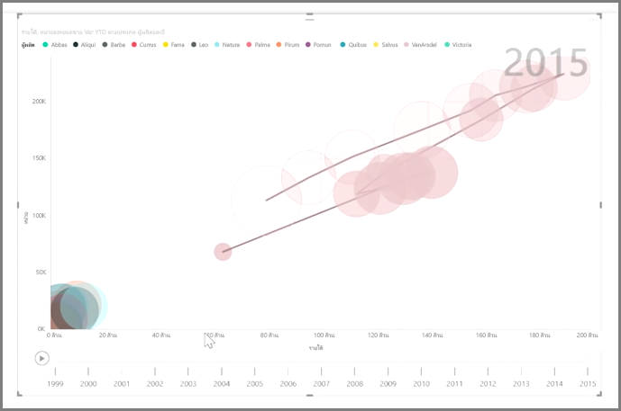

ถ้าคุณต้องการเปรียบเทียบสองหน่วยวัดที่แตกต่างกัน เช่น ยอดขายเป็นหน่วยต่อรายได้ การจัดรูปแบบการแสดงข้อมูลทั่วไปที่จะใช้ได้คือ แผนภูมิกระจายIf you want to compare two different measures, such as unit sales verses revenue, a common visualization to use is a scatter chart.

เมื่อต้องการสร้างแผนภูมิว่างเปล่า ให้เลือก **แผนภูมิกระจาย** จากบานหน้าต่าง **การจัดรูปแบบการแสดงข้อมูล**To create a blank chart, select **Scatter chart** from the **Visualizations** pane. ลากและปล่อยสองเขตข้อมูลที่คุณต้องการเปรียบเทียบจากบานหน้าต่าง **เขตข้อมูล** ไปยังบักเก็ตตัวเลือก *แกน X* และ *แกน Y*Drag and drop the two fields you want to compare from the **Fields** pane to the *X Axis* and *Y Axis* options buckets. ในตอนนี้แผนภูมิกระจายของคุณอาจมีฟองเล็กๆ อยู่ตรงกลางของการแสดงผลด้วยภาพ - คุณต้องเพิ่มหน่วยวัดไปยังบักเก็ต *รายละเอียด* เพื่อระบุวิธีที่คุณต้องการแยกส่วนข้อมูลของคุณAt this point, your scatter chart probably just has a small bubble in the center of the visual - you need to add a measure to the *Details* bucket to indicate how you would like to segment your data. ตัวอย่างเช่น ถ้าเปรียบเทียบยอดขายของรายการและรายได้ คุณอาจต้องการแบ่งข้อมูลตามประเภท หรือตามผู้ผลิต หรือตามเดือนที่ขายFor example, if are comparing item sales and revenue, perhaps you want to split the data by category, or manufacturer, or month of sale.

การเพิ่มเขตข้อมูลเพิ่มเติมไปยังบักเก็ต *คำอธิบายแผนภูมิ* จะเป็นการให้รหัสสีแก่ฟองของคุณตามค่าของเขตข้อมูลAdding an additional field to the *Legend* bucket color-codes your bubbles according to the field's value. นอกจากนี้คุณยังสามารถเพิ่มเขตข้อมูลไปยังบักเก็ต *ขนาด* เพื่อปรับขนาดฟองตามค่านั้นYou can also add a field to the *Size* bucket to alter the bubble size according to that value.

แผนภูมิกระจายมีตัวเลือกการจัดรูปแบบการแสดงผลด้วยภาพมากมายเช่นกัน อย่างเช่นการเปิดเค้าร่างสำหรับแต่ละฟองสี และการสลับป้ายกำกับแต่ละป้ายScatter charts have many visual formatting options as well, such as turning on an outline for each colored bubble and toggling individual labels. คุณสามารถเปลี่ยนสีของข้อมูลสำหรับชนิดแผนภูมิอื่นได้เช่นกันYou can change the data colors for other chart types, as well.

คุณสามารถสร้างภาพเคลื่อนไหวของการเปลี่ยนแปลงแผนภูมิฟองของคุณเมื่อเวลาผ่านไปได้ โดยการเพิ่มเขตข้อมูลตามเวลาไปยังบักเก็ต *แกนเคลื่อนไหว*You can create an animation of your bubble chart's changes over time by adding a time-based field to the *Play Axis* bucket. คลิกที่ฟองระหว่างการเคลื่อนไหว เพื่อดูร่องรอยของเส้นทางClick on a bubble during an animation to see a trace of its path.

>[!NOTE]
>อย่าลืมว่า ถ้าคุณเห็นฟองเพียงฟองเดียวในแผนภูมิกระจาย นั่นเป็นเพราะ Power BI กำลังรวบรวมข้อมูลของคุณ ซึ่งเป็นลักษณะการทำงานเริ่มต้นRemember, if you only see one bubble in your scatter chart, it's because Power BI is aggregating your data, which is the default behavior. เพิ่มประเภทไปยังบักเก็ต *รายละเอียด* ในบานหน้าต่าง **การจัดรูปแบบการแสดงข้อมูล** เพื่อเพิ่มจำนวนฟองAdd a category to the *Details* bucket, in the **Visualizations** pane, to get more bubbles.
> 
> 

