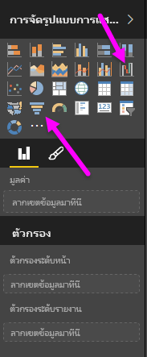
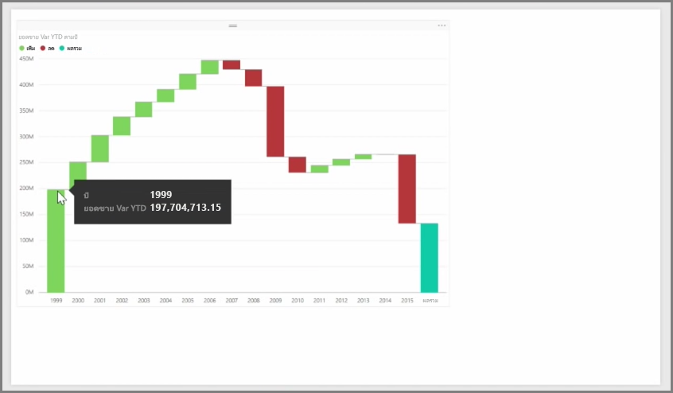
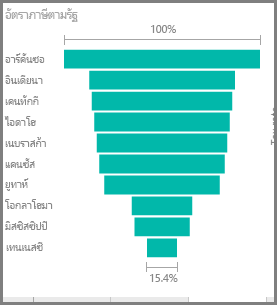

แผนภูมิวอเตอร์ฟอลและแผนภูมิกรวยเป็นการจัดรูปแบบการแสดงข้อมูลมาตรฐานสองประเภทที่น่าสนใจกว่า (และอาจเรียกได้ว่าพิเศษ) ที่รวมอยู่ใน Power BIWaterfall and funnel charts are two of the more interesting (and perhaps uncommon) standard visualizations that are included in Power BI. เมื่อต้องการสร้างแผนภูมิว่างเปล่าประเภทใดก็ตาม ให้เลือกไอคอนจากบานหน้าต่าง **การจัดรูปแบบการแสดงข้อมูล**To create a blank chart of either type, select its icon from the **Visualizations** pane.

**แผนภูมิวอเตอร์ฟอล**มักใช้เพื่อแสดงการเปลี่ยนแปลงในค่าเฉพาะเมื่อเวลาผ่านไป**Waterfall charts** are typically used to show changes in a particular value over time.

แผนภูมิวอเตอร์ฟอลมีตัวเลือกบักเก็ตเพียงสองตัวเลือกคือ: *ประเภท*และ*แกน Y*Waterfalls only have two bucket options: *Category* and *Y Axis*. ลากเขตข้อมูลตามเวลา เช่น *ปี* ไปยังบักเก็ต*ประเภท* และลากค่าที่คุณต้องการติดตามไปยังบักเก็ต*แกน Y*Drag a time-based field such as *year* to the *Category* bucket, and the value you want to track to the *Y Axis* bucket. ช่วงเวลาที่มีการเพิ่มค่าจะแสดงเป็นสีเขียวตามค่าเริ่มต้น ในขณะที่ช่วงที่มีการลดค่าจะแสดงเป็นสีแดงTime periods where there was an increase in value are displayed in green by default, while periods with a decrease in value are displayed in red.

**แผนภูมิกรวย**มักใช้เพื่อแสดงการเปลี่ยนแปลงในกระบวนการเฉพาะ อย่างเช่นขั้นตอนการขายหรือความพยายามในการเก็บรักษาเว็บไซต์**Funnel charts** are typically used to show changes over a particular process, such as a sales pipeline or website retention efforts.

ทั้ง**แผนภูมิวอเตอร์ฟอล**และ**แผนภูมิกรวย**สามารถแบ่งและปรับแต่งเองได้Both **Waterfall** and **Funnel** charts can be sliced and visually customized.

