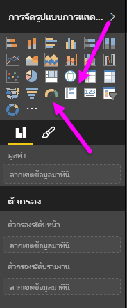
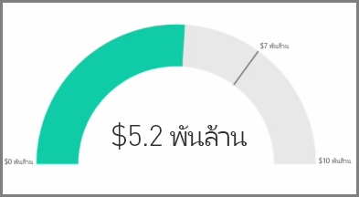
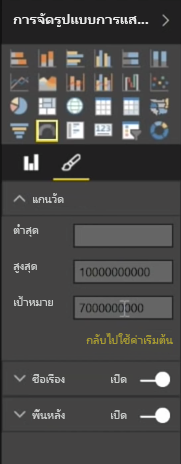
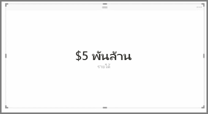
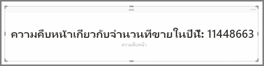

โดยทั่วไปการจัดรูปแบบการแสดงข้อมูลจะใช้เพื่อเปรียบเทียบค่าที่แตกต่างกันอย่างน้อยสองค่าGenerally, visualizations are used to compare two or more different values. อย่างไรก็ตาม บางครั้งเมื่อสร้างรายงาน คุณอาจต้องการติดตามดัชนีชี้วัดผลการปฏิบัติงานหลัก (KPI) หรือเมตริกเพียงรายการเดียวเมื่อเวลาผ่านไปHowever, sometimes when building reports you may want to track a just single Key Performance Indicator (KPI) or metric over time. ซึ่งวิธีที่จะสามารถทำเช่นนี้ได้ใน Power BI Desktop คือติดตามด้วย**มาตรวัด**หรือการแสดงผลด้วยภาพแบบบัตร**เลขตัวเดียว**The way to do this in Power BI Desktop is with a **Gauge** or **single number** card visual. เมื่อต้องการสร้างแผนภูมิว่างเปล่าประเภทใดก็ตาม ให้เลือกไอคอนจากบานหน้าต่าง **การจัดรูปแบบการแสดงข้อมูล**To create a blank chart of either type, select its icon from the **Visualizations** pane.

มาตรวัดจะมีประโยชน์อย่างยิ่งเมื่อคุณกำลังสร้างหน้าแดชบอร์ดและต้องการแสดงความคืบหน้าไปสู่เป้าหมายที่เฉพาะเจาะจงGauges are particularly useful when you are building dashboards and want to show progress towards a particular target. เมื่อต้องการสร้างมาตรวัด ให้เลืกไอคอนมาตรวัดจากบานหน้าต่าง **การจัดรูปแบบการแสดงข้อมูล** แล้วลากเขตข้อมูลที่คุณต้องการติดตามไปในบักเก็ต *ค่า*To create a gauge, select its icon from the **Visualizations** pane, and drag the field you want to track into the *Value* bucket.

มาตรวัดจะปรากฏตามค่าเริ่มต้นที่ 50% หรือเป็นสองเท่าของ*ค่า* และมีสองวิธีในการปรับการตั้งค่านี้Gauges appear by default at 50%, or double the *Value*, and there are two ways to adjust this setting. เมื่อต้องการตั้งค่าแบบไดนามิก ให้ลากเขตข้อมูลไปยังบักเก็ตค่า*ต่ำสุด* ค่า*สูงสุด* และค่า*เป้าหมาย*To dynamically set the values, drag fields to the *Minimum*, *Maximum*, and *Target* Value buckets. อีกทางเลือกหนึ่งคือใช้ตัวเลือกการจัดรูปแบบการแสดงผลด้วยภาพเพื่อกำหนดช่วงมาตรวัดของคุณด้วยตัวเองAlternatively, use the visual formatting options to manually customize the range of your gauge.

การจัดรูปแบบการแสดงข้อมูลแบบบัตรจะแสดงเพียงการแสดงตัวเลขของเขตข้อมูลCard visualizations simply show a numeric representation of a field. ตามค่าเริ่มต้น การแสดงผลด้วยภาพแบบบัตรจะใช้หน่วยแสดงผลเพื่อให้ตัวเลขสั้นลง เช่น แสดง "$5bn" แทนที่จะเป็น "$5,000,000,000"By default card visuals use display units to keep the number short, for example displaying "$5bn" instead of "$5,000,000,000". ใช้ตัวเลือกการจัดรูปแบบการแสดงผลด้วยภาพเพื่อเปลี่ยนหน่วยที่ใช้อยู่หรือปิดใช้งานหน่วยอย่างสมบูรณ์Use the visual formatting options to change the unit being used, or disable it completely.

การใช้บัตรที่น่าสนใจอย่างหนึ่งคือให้บัตรแสดงหน่วยวัดแบบกำหนดเองที่คุณได้เชื่อมเข้ากับข้อความOne interesting application of cards is to have them display a custom measure that you've concatenated with text. เมื่อต้องการใช้ตัวอย่างก่อนหน้านี้ ด้วยหน่วยวัดแบบกำหนดเอง บัตรของคุณอาจมีฟังก์ชัน DAX ขั้นสูงและแสดงข้อมูลเช่น "รายได้รวมในปีนี้: $5bn" หรือ "ความคืบหน้าในการขายปีนี้" จากนั้นเพิ่มหมายเลขที่แสดงความคืบหน้าTo use the earlier example, with a custom measure your card could include advanced DAX functions and display something like, "Total revenue this year: $5bn" or "Progress on unit sales this year:" and then add the number that represents the progress.

