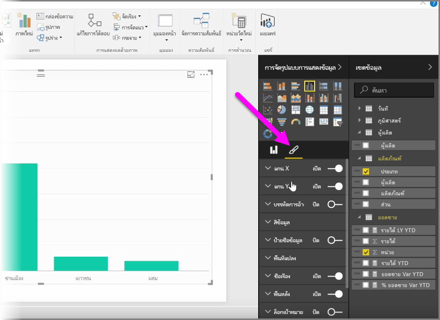
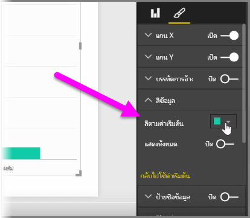
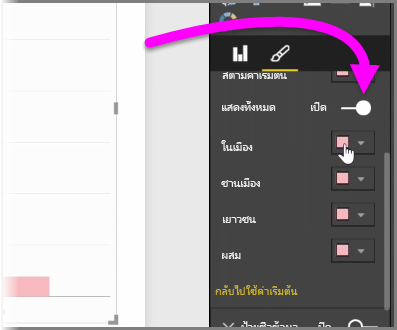
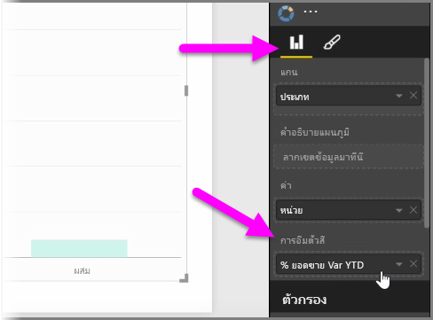
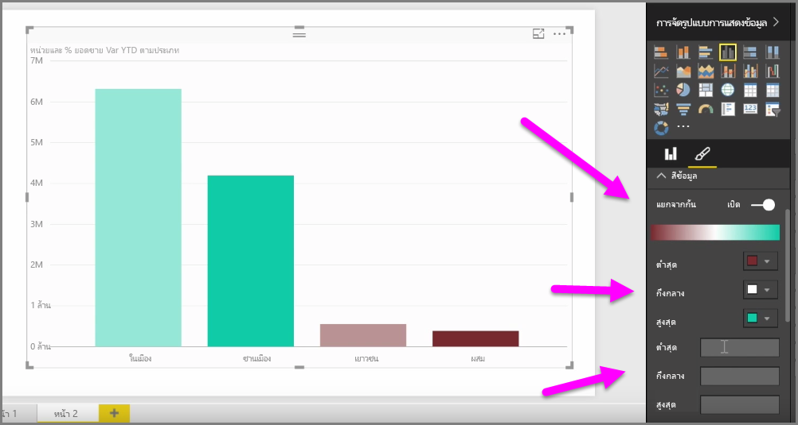
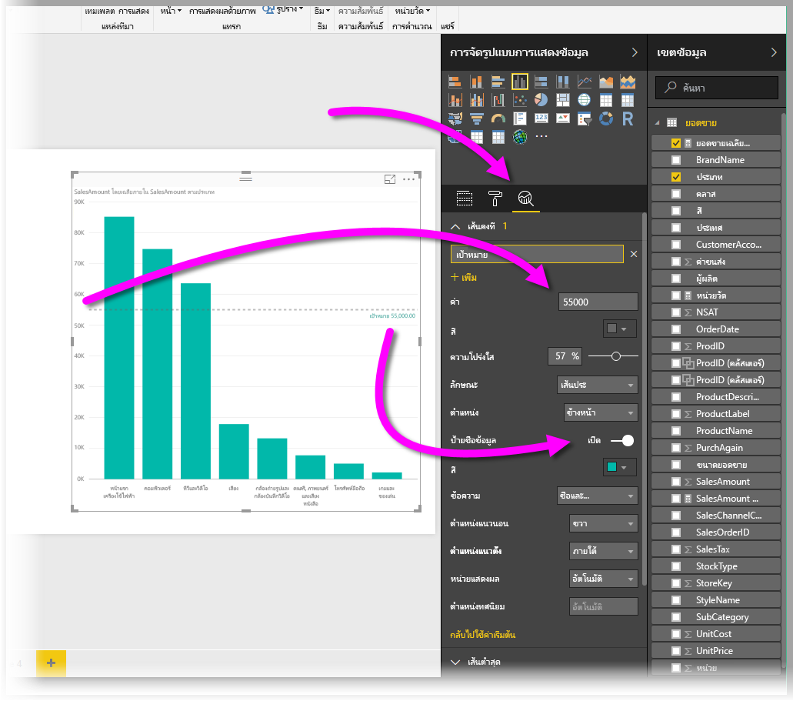
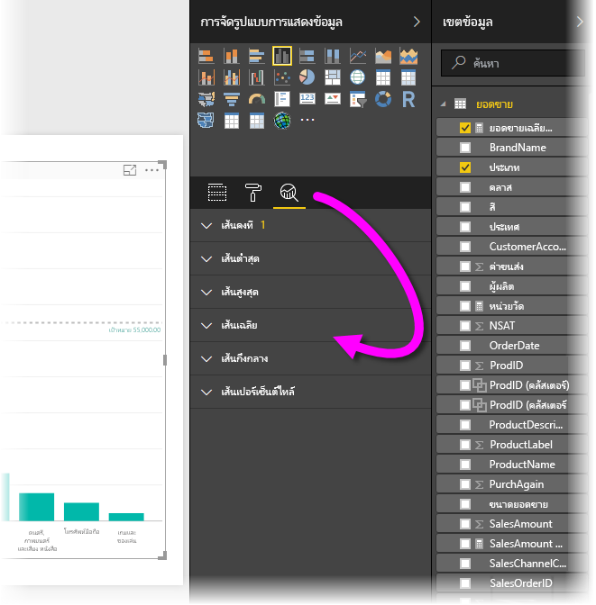

มีหลายครั้งที่คุณอาจต้องการปรับเปลี่ยนสีที่ใช้ในแผนภูมิหรือการแสดงผลด้วยภาพThere are many times when you might want to modify the colors used in charts or visuals. Power BI ให้คุณควบคุมการแสดงสีได้อย่างเต็มที่Power BI gives you lots of control over how colors are displayed. เมื่อต้องการเริ่มต้น ให้เลือกการแสดงผลด้วยภาพ จากนั้นในบานหน้าต่าง **การจัดรูปแบบการแสดงข้อมูล** ให้คลิกไอคอน **พู่กัน**To get started, select a visual then in the **Visualizations** pane, click the **paintbrush** icon.

มีตัวเลือกมากมายสำหรับการเปลี่ยนสีหรือการจัดรูปแบบของการแสดงผลด้วยภาพThere are many options for changing the colors or formatting of the visual. คุณสามารถเปลี่ยนสีแท่งของการแสดงผลด้วยภาพทั้งหมดโดยการเลือกตัวเลือกสีด้านข้าง**สีเริ่มต้น** จากนั้นเลือกสีที่คุณต้องการYou can change the color of all bars of a visual by selecting the color picker beside **Default color**, then selecting your color of choice.

คุณยังสามารถเปลี่ยนสีของแต่ละแท่ง (หรือองค์ประกอบอื่นโดยขึ้นอยู่กับชนิดของการแสดงผลด้วยภาพที่คุณเลือก) ด้วยการสลับแถบเลื่อน **แสดงทั้งหมด** ไปที่เปิดYou can also change the color of each bar (or other element, depending on the type of visual you selected) by toggling the **Show all** slider to on. เมื่อคุณสลับแถบเลื่อนดังกล่าว ตัวเลือกสีจะปรากฏขึ้นสำหรับแต่ละองค์ประกอบWhen you do, a color selector appears for each element.

คุณยังสามารถเปลี่ยนสีตามค่าหรือหน่วยวัดได้อีกด้วยYou can also change the color based on a value, or measure. เมื่อต้องการทำเช่นนั้น ให้ลากเขตข้อมูลไปในบักเก็ต **การอิ่มตัวสี** ในบานหน้าต่างการจัดรูปแบบการแสดงข้อมูล (โปรดทราบว่าเครื่องมือนี้มีให้ใช้ในส่วน **แหล่งเขตข้อมูล** ไม่ใช่ในส่วน **พู่กัน**)To do so, drag a field into the **Color saturation** bucket in the Visualizations pane (note that this is available in the **field well** section, not the **paintbrush** section).

นอกจากนี้คุณยังสามารถเปลี่ยนระดับและสีที่ใช้ในการเติมสีองค์ประกอบข้อมูลIn addition, you can change the scale and the colors that are used when filling data element colors. นอกจากนี้คุณยังสามารถเลือกระดับแบบแยกออกจากกันโดยการสลับแถบเลื่อน แบบแยกออกจากกัน ไปที่เปิด ซึ่งจะช่วยให้สีปรับระดับระหว่างสามสีYou can also select a diverging scale by toggling the Diverging slider to on, which lets the color scale between three colors. และคุณยังสามารถตั้งค่า*ต่ำสุด* ค่า*กลาง* และค่า*สูงสุด* ที่แสดงบนแผนภูมิของคุณได้And you can also set *Minimum*, *Center*, and *Maximum* values displayed on your chart.

นอกจากนี้คุณยังสามารถใช้ค่าเหล่านี้เพื่อสร้างกฎได้ ตัวอย่างเช่น ตั้งค่าที่มากกว่าศูนย์ให้เป็นสีหนึ่ง และตั้งค่าที่ต่ำกว่าศูนย์ให้เป็นอีกสีหนึ่งYou can also use those values to create rules, for example, to set values above zero a certain color, and values below to another color.

อีกหนึ่งเครื่องมือที่มีประโยชน์สำหรับการใช้สีคือ การตั้งค่า*เส้นคงที่* ซึ่งบางครั้งเรียกว่า*เส้นอ้างอิง*Another handy tool for using colors is setting a *constant line*, also sometimes referred to as a *reference line*. คุณสามารถกำหนดค่าของเส้นคงที่ กำหนดสี และติดป้ายกำกับให้กับเส้นอ้างอิงYou can set the value of the constant line, set its color, and even have the reference line contain a label. เมื่อต้องการสร้างเส้นคงที่ (และเส้นที่น่าสนใจอื่นๆ) ให้เลือก **บานหน้าต่างการวิเคราะห์** (ลักษณะเหมือนแว่นขยาย) แล้วจึงขยายส่วน **เส้นอ้างอิง**To create a constant line (and other interesting lines), select the **Analytics pane** (looks like a magnifying glass) then expand the **Reference Line** section.

มีเส้นอื่นๆ อีกมากมายที่คุณสามารถสร้างขึ้นสำหรับการแสดงผลด้วยภาพที่พบได้ใน **บานหน้าต่างการวิเคราะห์** เช่น เส้นต่ำสุด เส้นสูงสุด เส้นค่าเฉลี่ย เส้นค่ามัธยฐาน และเส้นค่าเปอร์เซ็นต์ไทล์There are many other lines you can create for a visual, also found in the **Analytics pane**, such as Min, Max, Average, Median, and Percentile lines.

สุดท้าย คุณสามารถสร้างเส้นขอบรอบแต่ละการจัดรูปแบบการแสดงข้อมูล และเช่นเดียวกับการควบคุมส่วนอื่น คุณสามารถระบุสีของเส้นขอบได้เช่นกันLastly, you can create a border around an individual visualization, and like other controls, you can specify the color of that border as well.

