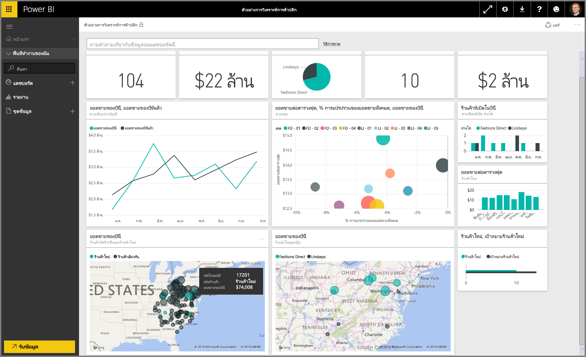
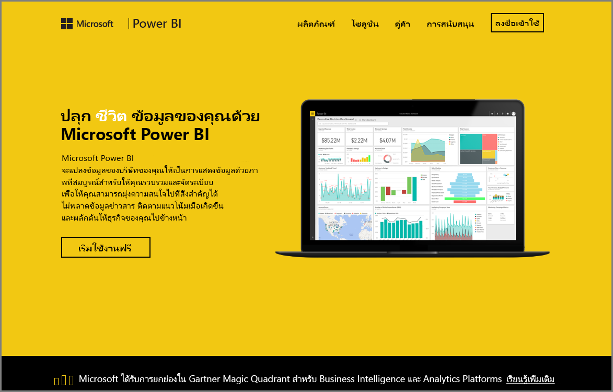

ยินดีต้อนรับสู่ส่วน **สำรวจข้อมูล** ของหลักสูตร **การเรียนรู้ตามคำแนะนำ** สำหรับ Power BIWelcome to the **Exploring Data** section of the **Guided Learning** course for Power BI. ตอนนี้คุณได้ทราบเกี่ยวกับ Power BI Desktop และวิธีการดูและแสดงข้อมูลแล้ว คุณก็พร้อมที่จะสำรวจข้อมูลในบริการของ BI Power แล้วNow that you know about Power BI Desktop, and how to get and visualize data, you're ready to explore data in the Power BI service.

มีหลายสิ่งหลายอย่างที่คุณจะได้เรียนรู้ในส่วนนี้ และการโต้ตอบพร้อมการใช้งานร่วมกันที่น่าสนใจของ Power BI จะโดดเด่นที่นี่There are all sorts of things to learn in this section, and the compelling  interactivity and sharing of Power BI really shines here. ดังนั้นเตรียมตัวให้พร้อมสำหรับส่วนที่น่าดึงดูดใจและน่าสนใจSo get ready for an engaging and interesting section.

## แนะนำบริการของ Power BIIntroduction to the Power BI service
*ดูสิ่งที่บริการของ Power BI สามารถทำให้กับองค์กรของคุณ**See what the Power BI service can do for your organization*

บริการของ Power BI เป็นส่วนขยายของ **Power BI Desktop** และมีฟีเจอร์ การอัปโหลดรายงาน การสร้างแดชบอร์ด และการถามคำถามเกี่ยวกับข้อมูลของคุณโดยใช้ภาษาที่เป็นธรรมชาติThe Power BI service is the natural extension of **Power BI Desktop**, and its features include uploading reports, creating dashboards, and asking questions of your data using natural language. คุณสามารถใช้บริการเพื่อตั้งเวลารีเฟรชข้อมูล แบ่งปันข้อมูลกับองค์กรของคุณ และสร้าง Service Pack ที่กำหนดเองYou can use the service to set data refresh times, share data with your organization, and create customized service packs.

ในหัวข้อต่อไปนี้ เราจะสำรวจบริการของ Power BI และแสดงให้คุณเห็นว่าจะช่วยเปลี่ยนข้อมูลอัจฉริยะของธุรกิจคุณให้เป็นข้อมูลเชิงลึกและสภาพแวดล้อมที่ขับเคลื่อนโดยการตัดสินใจร่วมกันได้อย่างไรIn the following topics, we'll explore the Power BI service, and show you how it can turn your business intelligence data into data insights and a collaborative decision-driving environment.

