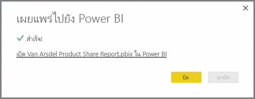
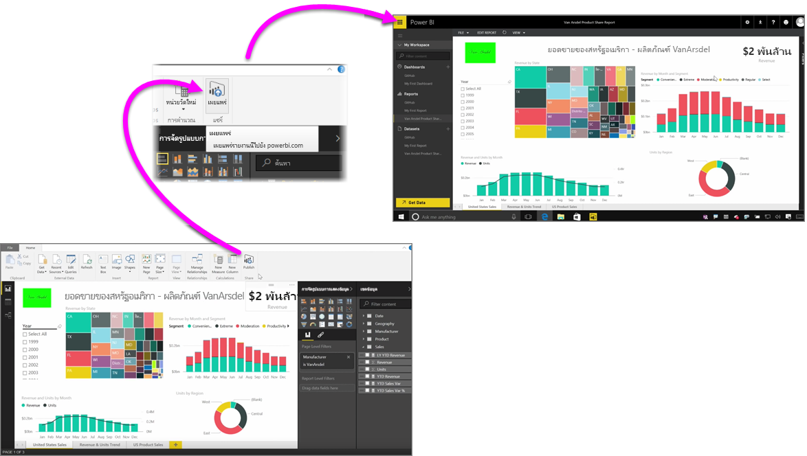

การเผยแพร่รายงานของคุณไปยังบริการของ Power BI นั้นเร็วและง่ายดายPublishing your reports to the Power BI service is fast and easy.

เมื่อคุณเสร็จสิ้นการสร้างรายงานของคุณใน **Power BI Desktop** เพียงเลือกปุ่ม **เผยแพร่** บนแท็บ **หน้าหลัก** ใน Power BI Desktop แล้วกระบวนการก็จะเริ่มต้นขึ้นOnce you've completed authoring your report in **Power BI Desktop**, just select the **Publish** button on the **Home** tab in Power BI Desktop, and the process begins.

รายงานและข้อมูลของคุณรวมถึงการจัดรูปแบบการแสดงข้อมูล คิวรี และหน่วยวัดแบบกำหนดเองจะรวมเข้าด้วยกัน และอัปโหลดไปยังบริการของ Power BIYour report and data, including visualizations, queries, and custom measures, are packaged together and uploaded to the Power BI service.

> [!NOTE]
> โดยปกติจะเรียกรายงาน Power BI Desktop ว่าไฟล์ **.pbix** ซึ่งเป็นสกุลไฟล์ที่ใช้ใน WindowsIt's common to refer to Power BI Desktop reports as **.pbix** files, which is the extension they're given in Windows.
> 

เมื่อการอัปโหลดเสร็จสิ้น กล่องโต้ตอบจะแจ้งคุณว่าการกระบวนการเผยแพร่เสร็จเรียบร้อยแล้วและลิงก์จะถูกเตรียมไว้ในกล่องโต้ตอบนั้นเพื่อพาคุณไปยังรายงานในบริการของ Power BI โดยตรงในเว็บเบราว์เซอร์Once the upload is complete, a dialog box tells you the publishing process succeeded and a link is provided in that dialog to take you directly to your report in the Power BI service, in a web browser.

เท่านี้ก็เรียบร้อย - การเผยแพร่รายงานจาก Power BI Desktop ไปยังบริการของ Power BI นั้นช่างง่ายดายAnd that's it - it's easy to publish reports from Power BI Desktop to the Power BI service.

