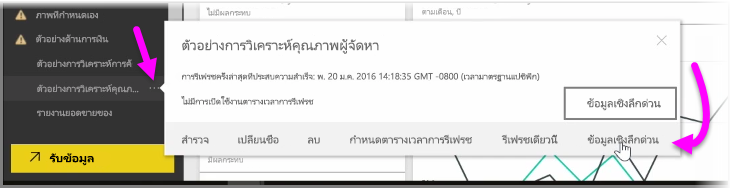
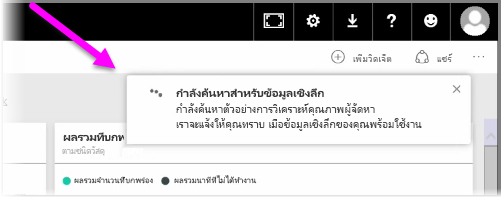
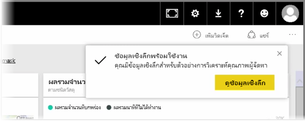
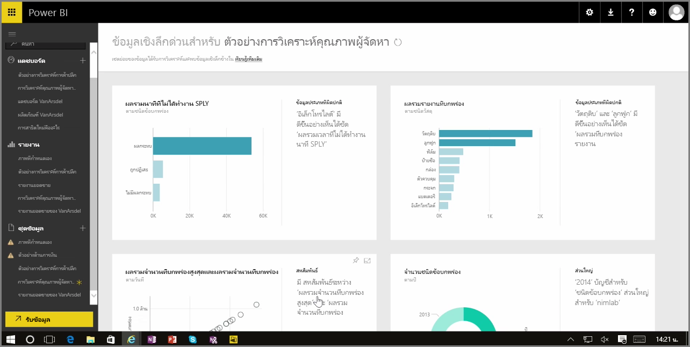

เมื่อคุณกำลังทำงานด้วยแดชบอร์ด รายงาน หรือชุดข้อมูลในบริการของ Power BI คุณสามารถใช้ Power BI ค้นหาข้อมูลเชิงลึกด่วนในข้อมูลได้When you're working with a dashboard, report, or dataset in the Power BI service, you can have Power BI look for quick insights into the data. ใน Power BI จากส่วน **ชุดข้อมูล** ในบานหน้าต่างด้านซ้าย ให้เลือก *จุดไข่ปลา* (จุดสามจุด) ที่อยุ่ด้านข้างชุดข้อมูลที่คุณสนใจIn Power BI, from the **Datasets** section in the left pane, select the *ellipses* (the three dots) beside the dataset you're interested in. เมนูตัวเลือกจะปรากฏขึ้น และทางด้านขวาคุณจะเห็นตัวเลือกที่เรียกว่า **ข้อมูลเชิงลึกด่วน**A menu of options appears, and on the far right you'll see an option called **Quick Insights**.

เมื่อคุณเลือกข้อมูลเชิงลึกด่วน Power BI จะดำเนินการการเรียนรู้ของเครื่องบางอย่างและค้นหาข้อมูลนั้น และนำมาวิเคราะห์เพื่อหาข้อมูลเชิงลึกด่วนWhen you select Quick Insights, Power BI performs some machine learning and searches the data, analyzing it to find quick insights. คุณจะเห็นการแจ้งเตือนที่ด้านบนขวาของบริการที่ระบุว่า Power BI กำลังทำงานเพื่อค้นหาข้อมูลเชิงลึกYou'll see a notification in the upper-right side of the service that indicated Power BI is working on finding insights.

หลังจากสิบห้าวินาทีหรือมากกว่านั้น การแจ้งเตือนจะเปลี่ยนไปเพื่อแจ้งให้คุณทราบว่า Power BI พบข้อมูลเชิงลึกบางอย่างAfter fifteen seconds or so, the notification changes to let you know that Power BI found some insights.

เมื่อคุณเลือกปุ่ม **ดูข้อมูลเชิงลึก** บนการแจ้งเตือน คุณจะเห็นหน้าการแสดงผลด้วยภาพที่แสดงข้อมูลเชิงลึกที่ Power BI พบ ซึ่งคล้ายกับสิ่งที่คุณเห็นในรูปต่อไปนี้When you select the **View insights** button on the notification, you're presented with a page of visuals that show the insights that Power BI found, similar to what you see in the following image. ในหน้าจะมีข้อมูลเชิงลึกจำนวนหนึ่ง ซึ่งคุณสามารถเลื่อนลงได้ตลอดทั้งหน้าเพื่อดูและพิจารณาThere are a bunch of insights, which you can scroll down through the page to view and consider.

เช่นเดียวกับการแสดงผลด้วยภาพอื่นๆ คุณสามารถโต้ตอบกับการแสดงผลด้วยภาพในหน้าข้อมูลเชิงลึกด่วนได้ และคุณยังสามารถปักหมุดรายการใดก็ได้ไว้กับแดชบอร์ดที่คุณอาจมี หรือกรองเพิ่มอย่างน้อยหนึ่งรายการ (หรือมากเท่าที่คุณต้องการ) เพื่อค้นหาข้อมูลเชิงลึกเพิ่มเติมที่อาจรอให้คุณค้นพบLike any other visual, you can interact with the visuals in the Quick Insights page, and you can also pin any of them to a dashboard that you might have, or further filter one or more of them (or as many as you like), to search for additional insights that might be waiting on your curiosity to uncover.

ด้วย **ข้อมูลเชิงลึกด่วน** คุณสามารถปล่อยให้ Power BI ระบุค่าผิดปกติและแนวโน้มในข้อมูลของคุณ แล้วใช้สิ่งที่พบเหล่านั้นในแดชบอร์ดของคุณ หรือปรับปรุงและกรองเพิ่มเติมเพื่อเข้าถึงข้อมูลเชิงลึกที่สำคัญที่สุดสำหรับคุณWith **Quick Insights**, you can let Power BI do the work to spot outliers and trends in your data, then use those findings in your dashboards, or further refine and filter them to get to the insights that are most important to you.

