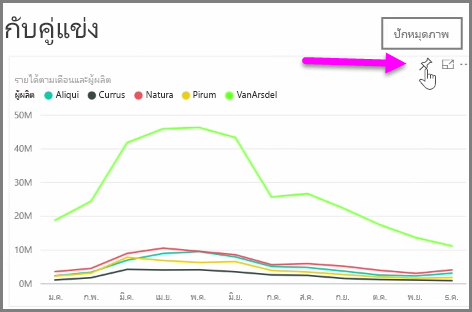
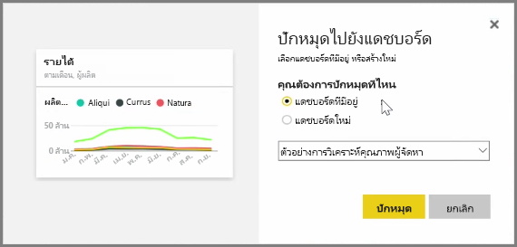
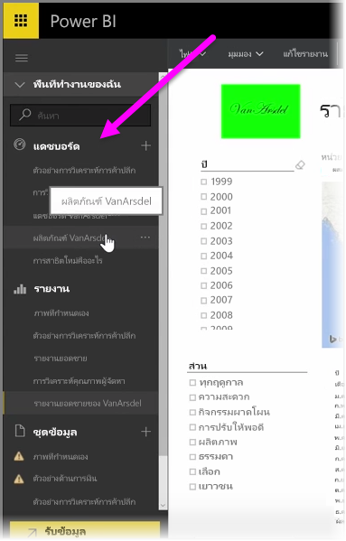
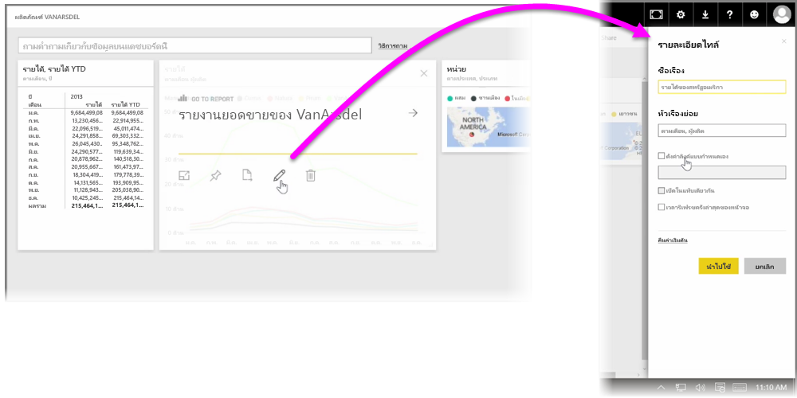

**แดชบอร์ด** ใน Power BI เป็นคอลเลกชันการจัดรูปแบบการแสดงข้อมูลแบบหน้าเดียวที่สร้างขึ้นจากภายในบริการของ Power BI**Dashboards** in Power BI are one-page collections of visualizations that are created from within the Power BI service. คุณสร้างแดชบอร์ดโดย **ปักหมุด** การจัดรูปแบบการแสดงข้อมูลจากรายงานที่คุณเขียนและเผยแพร่โดยใช้ Power BI Desktop หรือการจัดรูปแบบการแสดงข้อมูลที่คุณสร้างขึ้นภายในบริการของ Power BIYou create dashboards by **pinning** visualizations from reports that you authored and published using Power BI Desktop, or visualizations you created within the Power BI service itself. **การปักหมุด** การแสดงผลด้วยภาพไว้กับแดชบอร์ดก็เหมือนกับการปัดหมุดรูปภาพไว้กับกระดานไม้บนผนัง ซึ่งก็คือการติดการแสดงผลด้วยภาพไว้ตรงจุดเฉพาะเพื่อให้บุคคลอื่นมองเห็น**Pinning** a visual to a dashboard is a lot like pinning a picture to a corkboard on a wall - it sticks the visual there, in a particular spot, for others to see. เมื่อต้องการปักหมุดการแสดงผลด้วยภาพ ให้เปิดรายงานของการแสดงผลด้วยภาพในบริการ Power BTo pin a visual, open its report on the Power BI service. โฮเวอร์เหนือการแสดงผลด้วยภาพที่คุณต้องการปักหมุดและเลือกไอคอนรูป **เข็มหมุด**Hover over the visual you want to pin and select the **pin** icon.

กล่องโต้ตอบจะปรากฏขึ้นให้คุณเลือกแดชบอร์ดปลายทางสำหรับการแสดงผลด้วยภาพจากเมนูดรอปดาวน์ หรือคุณสามารถสร้างแดชบอร์ดใหม่ได้A dialog appears, where you select a destination dashboard for the visual from the drop-down menu, or you can create a new dashboard. คุณยังจะได้รับตัวอย่างลักษณะของการแสดงผลด้วยภาพที่ปักหมุดในแดชบอร์ดเช่นกันYou also get a preview of what the pinned visual will look like in the dashboard. คุณสามารถปักหมุดการจัดรูปแบบการแสดงข้อมูลจากหลายรายงานและหน้าไว้ในแดชบอร์ดเดียวกันได้ ซึ่งทำให้คุณสามารถรวมชุดข้อมูลและแหล่งต่างๆ ไว้ในข้อมูลเชิงลึกหน้าเดียวได้You can pin visualizations from multiple reports and pages to a single dashboard, allowing you to combine different datasets and sources into a single page of insights.

บน **แดชบอร์ด** คุณสามารถเพิ่มการจัดรูปแบบการแสดงผลข้อมูลทุกชนิด รวมถึง กราฟ แผนผัง รูปภาพ และรูปร่าง ได้โดย "ปักหมุด" เอาไว้On **Dashboards**, you can add any sort of visualization including graphs, maps, images, and shapes, by "pinning" them. เมื่อปักหมุดการแสดงผลด้วยภาพไว้ในแดชบอร์ดแล้ว สิ่งนั้นจะเรียกว่า **ไทล์**Once a visual is pinned to a dashboard, it's called a **tile**.

แดชบอร์ดของคุณรวมถึงแดชบอร์ดใหม่จะปรากฏในส่วน แดชบอร์ด ทางด้านซ้ายของบริการของ Power BIYour dashboards, including any new ones, appear in the Dashboards section on the left side of the Power BI service. เลือกแดชบอร์ดจากรายการเพื่อดูSelect a dashboard from the list to view it.

คุณสามารถเปลี่ยนเค้าโครงของการแสดงผลด้วยภาพบนแดชบอร์ดได้ตามที่คุณต้องการYou can change the layout of visuals on a dashboard however you'd like. เมื่อต้องการปรับขนาดไทล์ ให้ลากจุดจับเลื่อนเข้าหรือออก เมื่อต้องการย้ายไทล์ แค่คลิกและลากไปยังตำแหน่งที่ตั้งอื่นบนแดชบอร์ดTo resize a tile, drag its handles in or out. To move a tile, simply click and drag it to a different location on the dashboard. โฮเวอร์เหนือไทล์แล้วคลิกไอคอน **ดินสอ** เพื่อเปิด **รายละเอียดไทล์** ซึ่งคุณสามารถเปลี่ยน **ชื่อเรื่อง** หรือ **ชื่อเรื่องรอง**Hover over a tile and click the **pencil** icon to open the **Tile Details**, where you can change the **Title** or **Subtitle**.

คลิกที่ไทล์แดชบอร์ดเพื่อดูรายงานที่สร้างจากไทล์แดชบอร์ดClick on a dashboard tile to view the report from which it originated. ขั้นตอนนี้จะช่วยให้คุณดูข้อมูลเบื้องต้นภายใต้การแสดงผลด้วยภาพได้อย่างรวดเร็วThis lets you quickly view the underlying data beneath a visual. คุณยังสามารถเปลี่ยนลิงก์นั้นโดยใช้เขตข้อมูล **ตั้งค่าลิงก์แบบกำหนดเอง** ใน **รายละเอียดไทล์**You can also change that link by using the **Set custom link** field in **Tile Details**.

คุณสามารถปักหมุดไทล์จากแดชบอร์ดหนึ่งไว้ในอีกแดชบอร์ดหนึ่ง ตัวอย่างเช่น ถ้าคุณมีคอลเลกชันของแดชบอร์ดและต้องการสร้างบอร์ดข้อมูลสรุปแดชบอร์ดเดียวYou can pin tiles from one dashboard to another, for example if you have a collection of dashboards and want to create one summary board. กระบวนการก็จะเหมือนกัน ให้โฮเวอร์เหนือไทล์และเลือก **ไอคอนรูปเข็มหมุด**The process is the same: hover over the tile and select the **pin icon**. การสร้างและการเปลี่ยนแปลงแดชบอร์ดเป็นเรื่องง่ายDashboards are easy to create, and to change. และคุณสามารถกำหนดแดชบอร์ดได้เองเพื่อทำให้แดชบอร์ดแบบหน้าเดียวของคุณแสดงสิ่งที่ควรจะเป็นเท่านั้นAnd you can customize them to make your one-page dashboard show exactly what it should.

