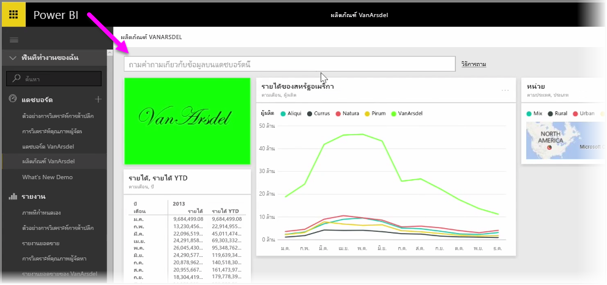
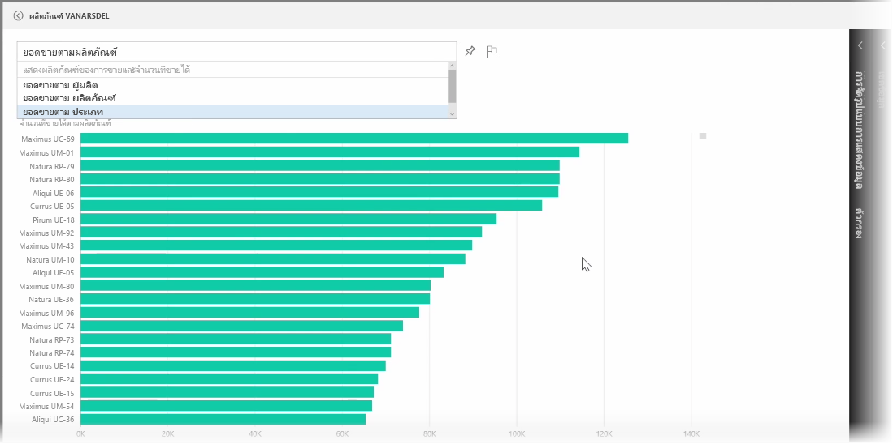
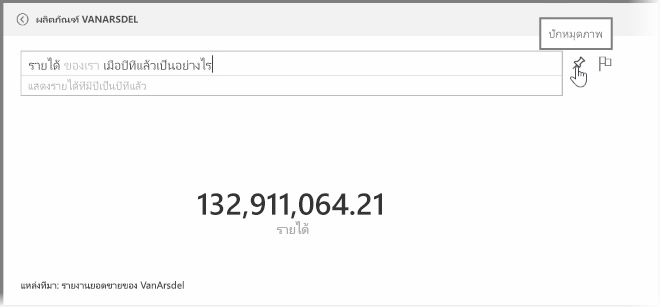
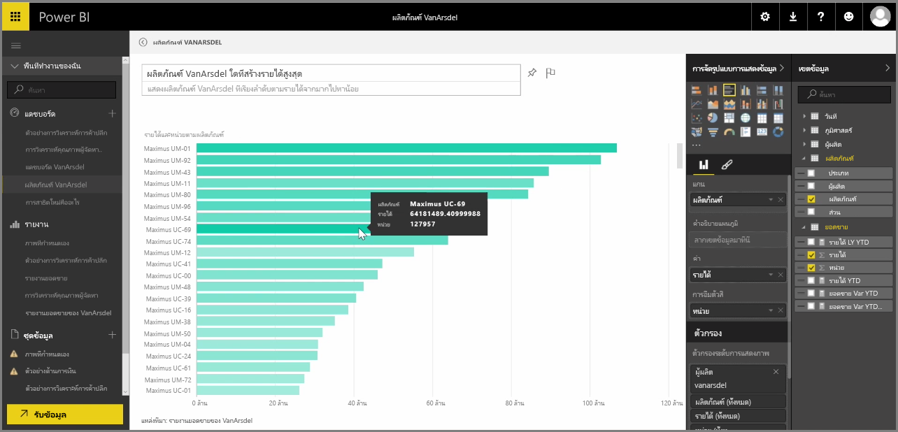

Power BI มาพร้อมกับกลไกการรู้จำภาษาที่มีประสิทธิภาพที่ช่วยให้คุณถามคำถามข้อมูลของคุณโดยใช้วลีและคำถามต่างๆ แบบในการสนทนาPower BI comes with a powerful language recognition engine that lets you ask questions of your data using conversational phrases and questions. นอกจากการสร้างรายงานและการจัดรูปแบบการแสดงข้อมูลด้วย Power BI คุณยังสามารถสร้างแผนภูมิและกราฟโดยแค่ถามคำถามง่ายๆSo along with building reports and visualizations with Power BI, you can create charts and graphs just by asking simple questions.

เมื่อต้องการถามคำถามจากข้อมูลของคุณ ให้เปิดแดชบอร์ดใน Power BI และที่ด้านบนของหน้าจอคุณจะเห็นกล่องป้อนค่าที่คุณสามารถถามคำถามเกี่ยวกับข้อมูลที่แสดงTo ask a question of your data, open a dashboard in Power BI and the top of the screen you'll see an input box, where you can ask questions about the displayed data. บางครั้ง ฟีเจอร์นี้เรียกว่า *คำถามและคำตอบ* หรือมักจะย่อว่า **Q&A**This feature is sometimes referred to as *Questions & Answers*, or more often, this feature is just referred to as **Q&A**.

เมื่อคุณคลิกในกล่อง Power BI จะแสดงพร้อมท์ที่มีคำที่แนะนำบางส่วนโดยอ้างอิงตามข้อมูลของคุณ เช่น "รายได้ YTD"When you click in the box, Power BI displays prompts with some suggested terms based on your data, such as "YTD revenue". คุณสามารถคลิกที่คำที่แนะนำเพื่อดูผลลัพธ์ ซึ่งมักจะแสดงเป็นตารางหรือบัตรทั่วไปYou can click on a suggested term to see the result, often displayed as a simple table or card. เมื่อคุณเลือกหนึ่งในวลีที่แนะนำ Power BI จะสร้างการแสดงผลด้วยภาพโดยยึดตามส่วนที่เลือกของคุณโดยอัตโนมัติในแบบเรียลไทม์When you select one of the suggested phrases, Power BI automatically creates a visual based on your selection, in real time.

คุณยังสามารถถามคำถามโดยใช้ภาษาทั่วไป เช่น "รายได้ของเราเมื่อปีที่แล้วเป็นอย่างไรบ้าง"You can also ask questions using natural language, such as "What was our revenue last year?" หรือ "ผลิตภัณฑ์ใดมียอดขายสูงที่สุดในเดือนมีนาคม 2014"or "What product had the highest sales in March 2014?". Power BI จะแสดงการแปลคำถามของคุณ และเลือกชนิดการแสดงผลด้วยภาพที่ดีที่สุดเพื่อแทนคำตอบPower BI displays its interpretation of your question, and chooses the best type of visual to represent the answer. และเช่นเดียวกับการแสดงผลด้วยภาพอื่นๆ ใน Power BI คุณสามารถ **ปักหมุด** การแสดงผลด้วยภาพนั้นไว้บนแดชบอร์ดที่คุณเลือกโดยเลือกไอคอนรูป **เข็มหมุด**And just like any other visual in Power BI, you can **pin** it to the dashboard of your choice by selecting the **pin** icon.

ไม่ว่าจะอยู่ที่ขั้นตอนใดในกระบวนการ คุณสามารถแก้ไขการแสดงผลด้วยภาพที่สร้างขึ้นจากคำถามหรือวลีแบบภาษาธรรมชาติของคุณAt any point along the way, you can edit the visual created by your natural language question or phrase. แค่ใช้บานหน้าต่าง **การจัดรูปแบบการแสดงข้อมูล** และ **เขตข้อมูล** ทางด้านขวาของหน้าจอJust use the **Visualizations** and **Fields** panes on the right side of the screen. เช่นเดียวกับการแสดงผลด้วยภาพอื่นใน Power BI คุณสามารถเลือกเค้าโครง ปรับตัวกรอง และเปลี่ยนการป้อนค่าเขตข้อมูลได้Like any other visual in Power BI, you can alter the layout, adjust filters, and change the field inputs.

เมื่อต้องการบันทึกการจัดรูปแบบการแสดงข้อมูลไปยังแดชบอร์ดหลังจากที่คุณสร้างการแสดงผลด้วยภาพที่สมบูรณ์แบบเสร็จแล้ว ให้เลือกไอคอน **เข็มหมุด** ที่อยู่ถัดจากกล่องป้อนคำถามTo save the visualization to a dashboard once you've created the perfect visual, just select the **pin** icon next to the question input box.

