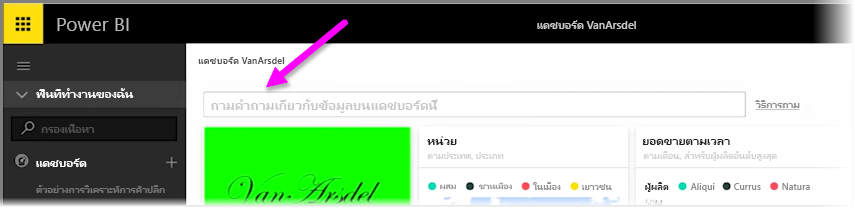
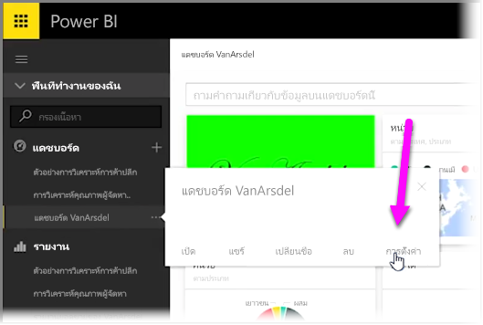
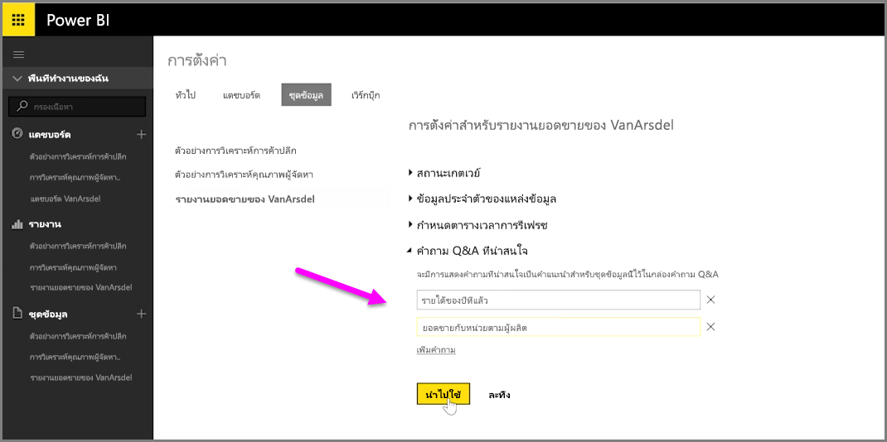

ด้วย Power BI คุณสามารถเพิ่มคำถามที่แนะนำของคุณเองสำหรับผู้ใช้รายอื่นที่ใช้กล่องคิวรีที่เป็นภาษาทั่วไปสำหรับแดชบอร์ดได้ ซึ่งมักจะเรียกว่ากล่อง **Q&A**With Power BI, you can add your own suggested questions for other users who use the natural language query box for a dashboard, frequently referred to as the **Q&A** box. คำถามที่แนะนำเหล่านี้คือสิ่งที่ผู้ใช้จะเห็นเมื่อคลิกที่กล่องป้อนค่าที่ด้านบนของแดชบอร์ดThese suggested questions are what users will see when they click on the input box at the top of a dashboard.

เมื่อต้องการเพิ่มคำถามของคุณเอง ให้เลือกจุดไข่ปลา (จุดสามจุด ...) ที่อยู่ถัดจากชื่อของแดชบอร์ดที่คุณต้องการใช้ แล้วเลือก **การตั้งค่า** จากเมนูTo add your own questions, select the ellipses (the three dots ...) next to the name of the dashboard you want to use, and select **Settings** from the menu.

 ขั้นตอนนี้จะเปิดหน้า **การตั้งค่า** สำหรับแดชบอร์ดและชุดข้อมูลหรือเวิร์กบุ๊กเบื้องต้นThis opens the **Settings** page for the dashboard and underlying datasets or workbooks. คุณสามารถปิดใช้งานกล่องป้อนคำค้นหา Q&A ได้จากส่วน **แดชบอร์ด** ของหน้า **การตั้งค่า** แต่เราต้องการเพิ่มคำถาม เราจึงเลือกส่วน **ชุดข้อมูล**You can disable the Q&A search input box completely from the **Dashboards** section of the **Settings** page, but we want to add questions, so we select the **Datasets** section.

ในส่วน **ชุดข้อมูล** ชุดข้อมูลทั้งหมดที่เกี่ยวข้องกับแดชบอร์ดจะแสดงขึ้นIn the **Datasets** section, all datasets associated with the Dashboard are displayed. เลือกชุดข้อมูลที่เกี่ยวข้องกับแดชบอร์ดของคุณจากรายการ เลือก **คำถาม Q&A ที่แนะนำ** แล้วเลือกลิงก์ **เพิ่มคำถาม**Select the dataset associated with your dashboard from the list,  select **Featured Q&A Questions**, then select the **Add a question** link. ใส่คำถามหรือพร้อมท์ของคุณลงในกล่องป้อนค่าแล้วเลือก **นำไปใช้**Enter your question or prompt into the input box and select **Apply**.

ในขณะนี้ ถ้ามีคนคลิกที่กล่องป้อนคำค้นหาบนแดชบอร์ดที่เลือก พวกเขาจะเห็นรายการที่แนะนำของคุณที่ด้านบนของรายการพร้อมท์ และการเลือกคำถามนั้นจะนำพวกเขาไปที่คำตอบของ Q&A ทันทีNow any time someone clicks on the search input box on the selected dashboard, they'll see your suggested entries at the top of the prompt list, and selecting that question will take them right through to the Q&A answer. นี่เป็นวิธีที่มีประโยชน์ในการทำให้ผู้ใช้แดชบอร์ดคิดถึงชนิดของข้อมูลที่มี และวิธีที่สามารถใช้งานได้ดีที่สุดThis is a valuable way to get dashboard users thinking about the type of data available, and how they can best use it.

