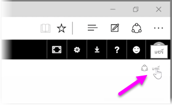
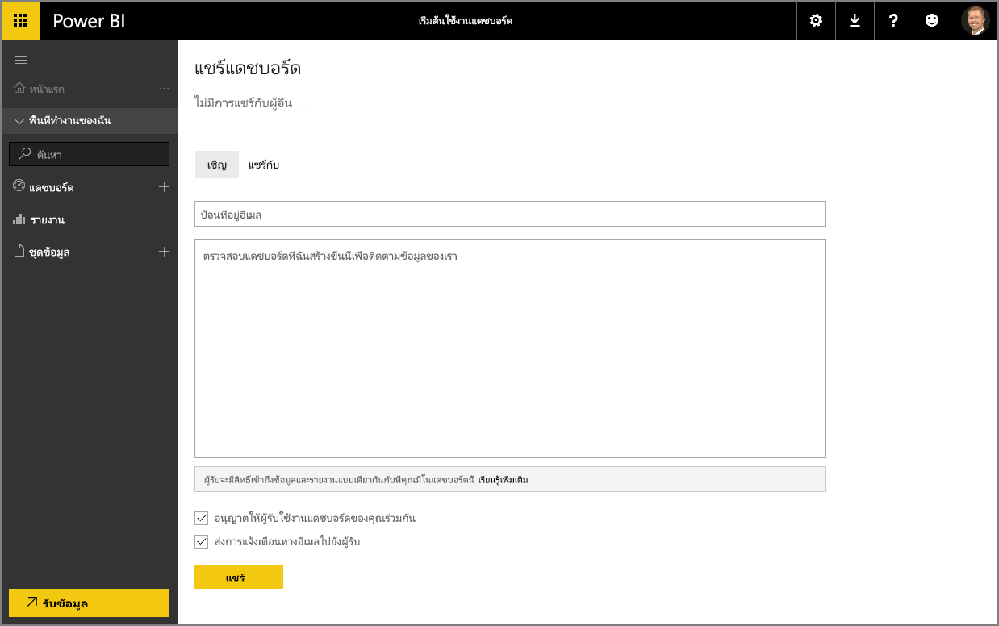

เราได้เห็นวิธีที่ Power BI ช่วยคุณค้นหาข้อมูล รวบรวมไว้ในรูปแบบข้อมูล และสร้างรายงานและการจัดรูปแบบการแสดงข้อมูลเกี่ยวกับการใช้งานข้อมูลนั้นไปแล้วWe've already seen how Power BI helps you find data, collect it in a data model, and build reports and visualizations on using that data. เรายังได้เห็นวิธีที่คุณเผยแพร่รายงานเหล่านั้นไปยังบริการของ Power BI และสร้างแดชบอร์ดที่จะช่วยคุณตรวจสอบข้อมูลของคุณตลอดเวลาWe've also seen how you can publish those reports to the Power BI service, and create dashboards that help you monitor your information over time. ฟีเจอร์ทั้งหมดนี้จะมีประสิทธิภาพมากยิ่งขึ้นเมื่อคุณแชร์ข้อมูลเชิงลึกของคุณกับบุคคลอื่นในองค์กรของคุณAll these features are even more powerful when you share your insights with others in your organization. โชคดีที่การแชร์แดชบอร์ดของคุณเป็นเรื่องง่ายFortunately, sharing your dashboards is easy.

เมื่อต้องการแชร์บอร์ดของคุณ ให้เปิดในบริการของ Power BI และเลือกลิงก์ **แชร์** ที่มุมบนขวาTo share a dashboard, open it in the Power BI service and select the **Share** link in the top right-hand corner.

หน้า **แชร์แดชบอร์ด** จะปรากฏขึ้น ซึ่งคุณสามารถเลือกตัวเลือก **เชิญ** และใส่บุคคลที่คุณต้องการให้เข้าถึงแดชบอร์ดของคุณลงในกล่องป้อนค่า **ที่อยู่อีเมล**The **Share Dashboard** page appears, where you can select the **Invite** section, then fill in the **Email address** input box with people you'd like to grant access to your dashboard. ขณะที่คุณพิมพ์ Power BI จะตรวจสอบที่อยู่อีเมลกับบัญชีในโดเมนของคุณและโดเมน Office 365 และดำเนินการให้เสร็จสิ้นโดยอัตโนมัติถ้าเป็นไปได้Power BI checks the email addresses as you type them with accounts in your domain and Office 365 domain, and auto-complete when possible. คุณยังสามารถคัดลอกและวางที่อยู่อีเมลลงในกล่องนี้ หรือใช้รายการการแจกจ่าย กลุ่มความปลอดภัย หรือกลุ่ม Office 365 เพื่อเข้าถึงหลายๆ คนพร้อมกันYou can also copy and paste email addresses into this box, or use a distribution list, security group, or Office 365 group to reach multiple people at once.

ถ้าคุณเลือกกล่องกาเครื่องหมาย (ที่อยู่ใกล้ด้านล่าง) เพื่อ *ส่งการแจ้งเตือนทางอีเมลถึงผู้รับ* ผู้รับของคุณจะได้รับอีเมลที่แจ้งให้พวกเขาทราบว่าคุณได้แชร์แดชบอร์ดกับพวกเขา พร้อมทั้งลิงก์ไปยังแดชบอร์ดIf you selected the checkbox (near the bottom) to *send email notification to recipients*, then your recipients will receive an email letting them know that you shared a dashboard with them, including a link with the dashboard. คุณสามารถเพิ่มบันทึกย่อลงในอีเมลที่พวกเขาจะได้รับ หรือส่งบันทึกย่อที่ Power BI สร้างขึ้นให้คุณ (ซึ่งอยู่ในกล่องด้านล่างตรงตำแหน่งที่คุณใส่ที่อยู่อีเมลของพวกเขา)You can add a note to the email they will receive, or send the note that Power BI created for you (it's in the box directly below where you enter their email addresses).

>[!NOTE]
>ผู้รับที่ไม่มีบัญชี Power BI จะถูกนำไปที่กระบวนการการลงทะเบียนก่อนที่จะดูแดชบอร์ดของคุณRecipients without an existing Power BI account will be taken through the sign-up process before viewing your dashboard.
> 
> 

ทุกคนที่คุณแชร์แดชบอร์ดให้สามารถดูและโต้ตอบกับแดชบอร์ดได้เหมือนที่คุณทำAnyone with whom you share a dashboard can see and interact with it exactly as you do. อย่างไรก็ตาม พวกเขามีการเข้าถึงรายงานเบื้องต้นแบบ *อ่านอย่างเดียว* และพวกเขา*ไม่มีการเข้าถึง*ชุดข้อมูลเบื้องต้นHowever, they have *read-only* access to the underlying reports, and they have *no access* to the underlying datasets.

คุณยังสามารถเลือกแท็บ **แชร์กับ** บนหน้าแชร์แดชบอร์ดเพื่อดูบุคคลที่คุณได้แชร์แดชบอร์ดนี้ด้วยก่อนหน้านี้You can also select the **Shared With** tab on the Share Dashboard page to see the people with whom you have previously shared this dashboard.

