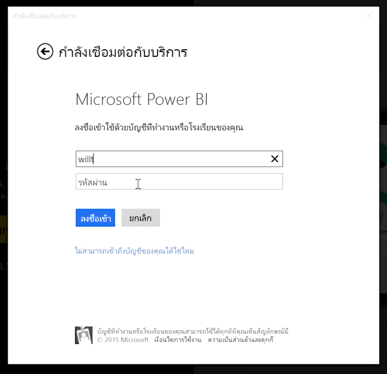
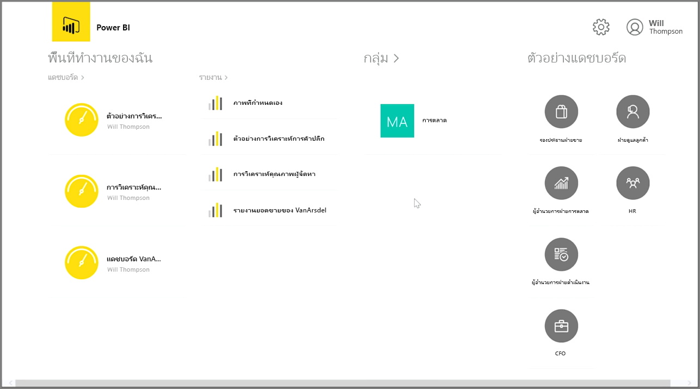
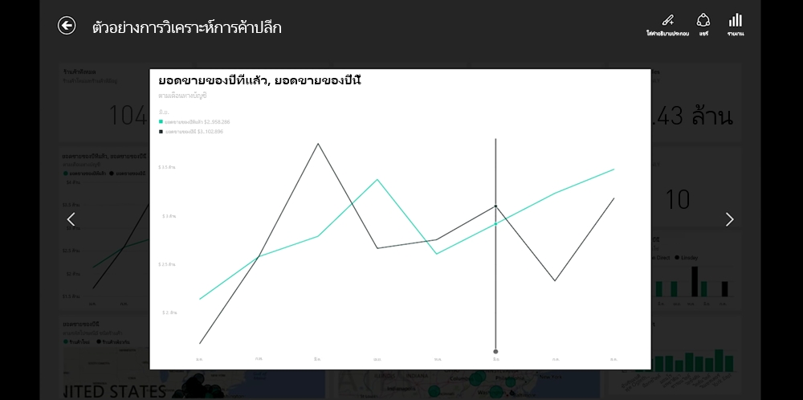
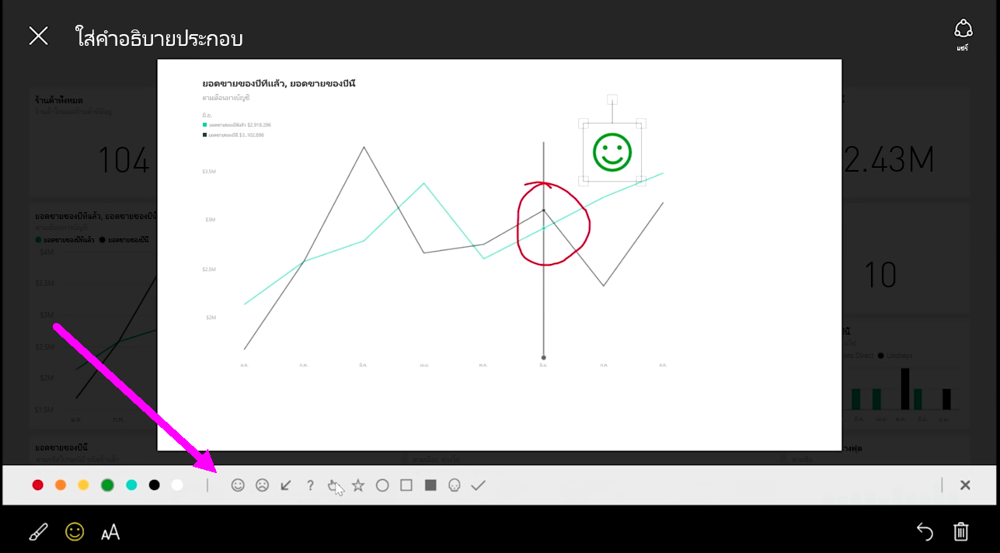

ถ้าคุณต้องการติดตามข้อมูลของคุณขณะที่คุณเดินทาง คุณสามารถใช้แอปพลิเคชันสำหรับอปุกรณ์เคลื่อนที่ของ Power BI สำหรับอุปกรณ์ iOS, Android และ Windows ได้If you want to keep track of your data while you're on the move, you can use one of Power BI's mobile applications for iOS, Android, and Windows devices.

เมื่อใช้แอป Power BI ก่อนอื่นให้ลงชื่อเข้าใช้บัญชีของคุณโดยใช้ข้อมูลบัญชีบริการของ Power BI ของคุณWhen using the Power BI app, first sign in to your account using your Power BI service account information. บนอุปกรณ์เคลื่อนที่ Windows (ในกรณีนี้คือแท็บเล็ต) การลงชื่อเข้าใช้จะเป็นดังต่อไปนี้On a Windows mobile device (in this case a tablet), the sign in looks like the following.

หน้าจอแรกที่คุณจะเห็นแสดงเนื้อหาทั้งหมดที่คุณมีการเข้าถึง รวมถึงรายงาน แดชบอร์ด และกลุ่มThe first screen that you'll see displays all of the content to which you have access, including reports, dashboards, and groups. ยังมีตัวอย่างแดชบอร์ดที่คุณสามารถใช้เป็นแรงบันดาลใจ หรือแค่ใช้เพื่อดูความสามารถของ Power BIThere are also sample dashboards you can use to get inspired, or just to see Power BI's capabilities. แอปนี้ออกแบบมาเพื่อใช้งานแบบสัมผัสได้ง่าย: แตะที่แดชบอร์ดหรือรายงานเพื่อดูแบบเต็มหน้าจอและเลื่อนผ่านโดยใช้นิ้วมือThe app is designed to be touch-friendly: tap on a dashboard or report to view it full-screen and scroll through them using your finger.

คุณสามารถเปิดแดชบอร์ดได้โดยการแตะYou can open any of the dashboards by tapping on them. ภายในแดชบอร์ด คุณสามารถแตะที่ไทล์แดชบอร์ดเพื่อโฟกัสไทล์ในมุมมองที่ใหญ่ขึ้นWithin a dashboard, you can tap on a dashboard tile to focus on it in a larger view.

คุณยังสามารถใส่คำอธิบายประกอบข้อมูลเชิงลึกใดๆ ที่คุณค้นพบโดยแตะปุ่ม **ใส่คำอธิบายประกอบ** ที่มุมบนขวาYou can also annotate any insights that you discover by tapping the **Annotate** button in the top right corner. ซึ่งจะทำให้คุณสามารถวาดบนไทล์ที่โฟกัสเพื่อไฮไลต์เฉพาะพื้นที่ที่สนใจThis allows you to draw on a focused tile to highlight particular areas of interest. พบเครื่องมือการใส่คำอธิบายประกอบได้ที่ด้านล่างของหน้าจอThe annotation tools are found along the bottom of the screen.

แชร์ไทล์ที่ใส่คำอธิบายประกอบโดยแตะลิงก์ **แชร์** ที่มุมบนขวาShare your annotated tile by tapping the **Share** link in the top right-hand corner.

แตะลิงก์ **รายงาน** ที่มุมบนขวาเพื่อดูรายงานเบื้องต้นสำหรับไทล์Tap the **Report** link in the top right-hand corner to view the underlying report for a tile. ซึ่งจะแสดงการจัดรูปแบบการแสดงข้อมูลแบบเดียวกันกับที่คุณจะเห็นในเว็บเราว์เซอร์หรือใน Power BI Desktop และยังมีความสามารถในการโต้ตอบกับรายงานโดยแตะที่แถบ ดูรายละเอียดแนวลึก หรือใช้ตัวแบ่งส่วนข้อมูลThis will display the exact same visualizations that you would see in a web browser or in Power BI Desktop, and also include the ability to interact with the report by tapping on bars, drilling down, or using slicers.

