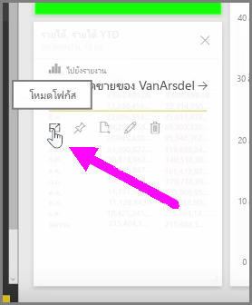
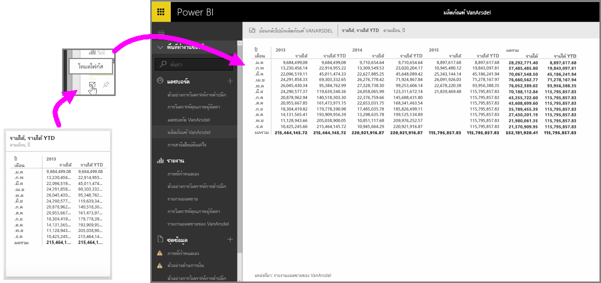

เมื่อคุณกำลังดูที่แดชบอร์ดหรือรายงานในบริการของ Power BI บางครั้งอาจเป็นประโยชน์ในการโฟกัสบนแผนผังรายบุคคลหรือการจัดรูปแบบการแสดงข้อมูลWhen you're looking at Power BI dashboards or reports in the service, it can sometimes be helpful to focus on an individual chart or visualization. คุณสามารถทำได้ในสองวิธีที่แตกต่างกันYou can do that in two different ways.

เมื่อคุณอยู่บนแดชบอร์ด ให้โฮเวอร์เหนือไทล์เพื่อดูตัวเลือกไอคอนที่แตกต่างกันสองสามรายการที่มุมบนขวาWhen you're on a dashboard, hover over a tile to see a few different icon options in the top right-hand corner. เมื่อคุณเลือกจุดไข่ปลา (จุดสามจุด) คุณจะเห็นคอลเลกชันของไอคอนที่แสดงถึงการดำเนินการที่คุณสามารถนำมาไว้บนไทล์ได้When you select the ellipses (the three dots) you see a collection of icons that represent actions you can take on the tile.

ไอคอนด้านซ้ายสุดที่มีป้ายชื่อ **โหมดโฟกัส**The left-most icon is labeled **Focus mode**. เลือกไอคอนนั้นเพื่อขยายไทล์ให้ครอบคลุมพื้นที่แดชบอร์ดทั้งหมดSelect that icon to expand the tile to encompass the full dashboard space.

**โหมดโฟกัส** ทำให้คุณสามารถดูรายละเอียดเพิ่มเติมเกี่ยวกับการแสดงผลด้วยภาพและคำอธิบายแผนภูมิของคุณ**Focus mode** allows you to see a lot more detail on your visuals and legends. ตัวอย่างเช่น เมื่อคุณปรับขนาดไทล์ใน Power BI บางคอลัมน์อาจไม่แสดงเนื่องจากพื้นที่ที่มีในไทล์ไม่เพียงพอFor example, when you resize a tile in Power BI, some of the columns may not be shown because of the space available in the tile.

ใน **โหมดโฟกัส** คุณสามารถดูข้อมูลทั้งหมดได้In **Focus mode**, you can see all the data. คุณยังสามารถปักหมุดการแสดงผลด้วยภาพได้โดยตรงจากโหมดโฟกัสไว้ในแดชบอร์ดอื่นโดยเลือกไอคอนรูป **เข็มหมุด**You can also pin the visual directly from Focus mode to a different dashboard by selecting the **Pin** icon. เมื่อต้องการออกจาก **โหมดโฟกัส** ให้เลือกไอคอน **กลับไปที่...** ที่มุมบนซ้ายของ **โหมดโฟกัส**To exit **Focus mode**, select the **Back to...** icon in the top-left corner of **Focus mode**.

กระบวนการจะคล้ายกับเมื่อดูรายงานThe process is similar when viewing a report. โฮเวอร์เหนือการแสดงผลด้วยภาพเพื่อดูไอคอนสามรายการที่มุมบนขวา และเลือกไอคอน **โหมดโฟกัส**Hover over a visual to see the three icons in the top-right corner, and select the **Focus mode** icon. การเลือกไอคอนนี้จะขยายการจัดรูปแบบการแสดงข้อมูลของคุณให้ครอบคลุมพื้นที่รายงานแบบเต็มSelecting this expands your visualization to encompass the full report canvas. การแสดงผลด้วยภาพยังคงโต้ตอบได้ในโหมดนี้ แม้ว่าคุณจะสูญเสียเอฟเฟ็กต์ตัวกรองระหว่างการจัดรูปแบบการแสดงข้อมูลไปชั่วคราวThe visual is still interactive in this mode, although you temporarily lose any cross-filter effect between visualizations.

โฮเวอร์เหนือไทล์หรือรายงานที่ขยาย แล้วเลือกไอคอนอักขระ ^ ซ้าย **กลับไปที่...** ที่มุมบนซ้ายเพื่อกลับไปที่มุมมองก่อนหน้าHover over an expanded tile or report and select the **Back to...** left-caret icon in the top-left corner to return to the previous view.

