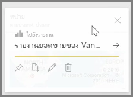
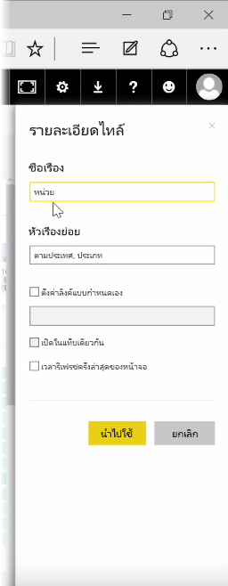
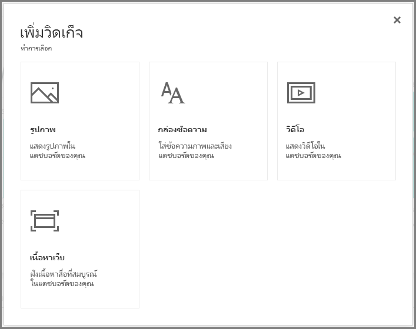
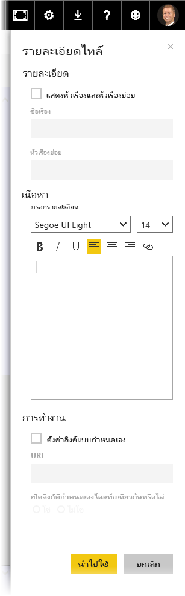

เมื่อคุณสร้างแดชบอร์ด คุณสามารถแก้ไข \**ไทล์* ในบริการของ Power BI เพื่อสร้างการเปลี่ยนแปลงการจัดรูปแบบสองสามรายการOnce you've built a dashboard, you can edit its \**Tiles* in the Power BI service to make a few formatting changes.

เมื่อต้องการเปลี่ยนแปลงไทล์ ให้โฮเวอร์เหนือไทล์และเลือกจุดไข่ปลา (จุดสามจุด) เพื่อแสดงคอลเลกชันไอคอนที่ช่วยคุณเปลี่ยนแปลงไทล์To make changes to a tile, hover over the tile and select the ellipses (three dots) to show a collection of icons that allow you to make changes to the tile.

เลือกไอคอน **ปากกา** เพื่อเปิดบานหน้าต่าง **รายละเอียดไทล์**Select the **pen** icon to open the **Tile Details** pane. จากตรงนี้ คุณสามารถเปลี่ยน **ชื่อเรื่อง** **คำบรรยาย** รวมถึงเวลาและวันที่รีเฟรชล่าสุด และรายละเอียดอื่นๆ เช่น การสร้างลิงก์แบบกำหนดเอง ของไทล์ได้From here you can change the tile's **Title**, **Subtitle**, include its last refresh time and date, and other details such as creating a custom link.

ตามค่าเริ่มต้น เมื่อคุณคลิกที่ไทล์แดชบอร์ด คุณจะไปที่รายงานที่เป็นข้อมูลเบื้องต้นของไทล์By default, when you click on a dashboard tile you are taken to the report from which it originated. เมื่อต้องการเปลี่ยนลักษณะการทำงานนี้ ให้ใช้เขตข้อมูล **ตั้งค่าลิงก์แบบกำหนดเอง** ในบานหน้าต่าง **รายละเอียดไทล์**To change this behavior, use the **Set custom link** field in the **Tile Details** pane. หนึ่งในการใช้งานยอดนิยมของฟีเจอร์นี้คือการนำผู้ใช้ไปที่โฮมเพจขององค์กรเมื่อคลิกที่รูปโลโก้One popular use of this feature is to take users to the organization homepage when clicking on a logo image.

## เพิ่มวิดเจ็ตลงในแดชบอร์ดของคุณAdd widgets to your dashboard
คุณสามารถเพิ่มวิดเจ็ตลงในแดชบอร์ดของคุณได้เช่นกันYou can also add widgets to your dashboard. **วิดเจ็ต** คือไทล์แดชบอร์ดพิเศษที่มีรายการอื่นๆ เช่น รูป วิดีโอแบบออนไลน์ กล่องข้อความ หรือเนื้อหาเว็บแบบสมบูรณ์ แทนที่จะเป็นการจัดรูปแบบการแสดงข้อมูลA **widget** is a special dashboard tile that, instead of containing a visualization, contains other items such as an image, an online video, a text box, or rich web content.

เมื่อคุณเลือกลิงก์ เพิ่มวิดเจ็ต ที่มุมบนขวาของแดชบอร์ด กล่องโต้ตอบ **เพิ่มวิดเจ็ต** จะปรากฏขึ้นWhen you select the Add Widget link in the upper-right corner of a Dashboard, the **Add a widget** dialog appears.

ตัวอย่างเช่น เมื่อคุณเพิ่มกล่องข้อความ บานหน้าต่าง **รายละเอียดไทล์** จะปรากฏขึ้นทางด้านขวา ซึ่งคุณสามารถแก้ไขรายละเอียดได้คล้ายกันกับเมื่อแก้ไขรายละเอียดของไทล์อื่นๆWhen you add a text box, for example, a **Tile details** pane appears on the right side, where you can edit details similar what is available when editing the details of any tile. แต่ด้วยวิดเจ็ต คุณจะมีส่วนให้กำหนดหรือปรับเปลี่ยนเนื้อหาของวิดเจ็ตด้วย เช่น ตัวแก้ไข Rich text สำหรับกล่องข้อความBut with widgets, there's also a section to define or modify the widget content, such as a rich text editor for a text box.

ด้วยวิดเจ็ตและความสามารถในการแก้ไขรายละเอียดไทล์ คุณสามารถกำหนดแดชบอร์ดของคุณเองและทำให้มีลักษณะในแบบที่คุณต้องการWith widgets and the ability to edit tile details, you can customize your dashboard and make it look just how you want it to be.

