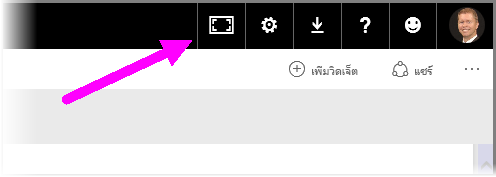
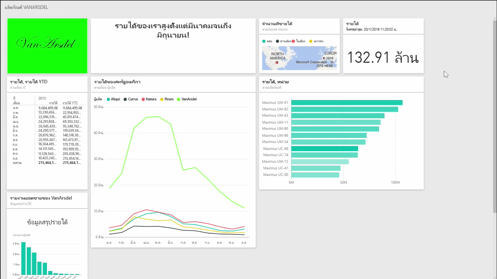
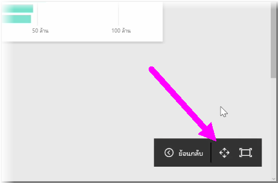
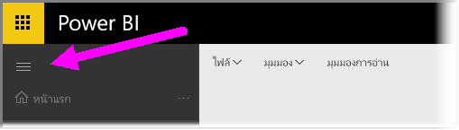

คุณอาจพบว่าบางครั้งเมื่อคุณสร้างแดชบอร์ดของคุณ คุณมีเนื้อหามากเกินกว่าจะสามารถใส่ลงในพื้นที่ทำงานได้หมดYou may find that occasionally when you create your dashboards, you have more content than what can fit on your canvas. มีโซลูชันสองสามอย่างที่จะช่วยคุณจัดการวิธีแสดงพื้นที่แดชบอร์ดของคุณเพื่อให้คุณสามารถดูเนื้อหาแดชบอร์ดทั้งหมดได้There are a few solutions that help you manage how your dashboard space is displayed, so you can get a full view of your dashboard content.

วิธีการแสดงทั้งแดชบอร์ดในหน้าจอเดียวที่ง่ายที่สุดคือการเลือกปุ่ม **โหมดเต็มหน้าจอ** ที่มุมบนขวาของแดชบอร์ดThe easiest method to display your entire dashboard in one screen is selecting the **Full Screen Mode** button in the top right-hand corner of the dashboard.

การเลือกปุ่ม **โหมดเต็มหน้าจอ** จะทำให้เบราว์เซอร์ของคุณเข้าสู่โหมดเต็มหน้าจอ โดยนำองค์ประกอบของกรอบทั้งหมดออกจากรอบแดชบอร์ด และเพิ่มจำนวนพื้นที่รับชมภายในแดชบอร์ดSelecting the **Full Screen Mode** button puts your browser into full screen mode, removing all chrome elements from around the dashboard, and thereby increasing the amount of viewable space.

จากภายใน **โหมดเต็มหน้าจอ** คุณสามารถเลือกตัวเลือก **พอดีหน้าจอ** เพื่อย่อไทล์ทั้งหมดให้พอดีในหน้าจอเดียวได้ โดยไม่จำเป็นต้องใช้แถบเลื่อนFrom within **Full-Screen Mode**, you can select the **Fit to Screen** option to shrink all of your tiles so they fit on a single screen, without the need for scrollbars. โดยทั่วไปเรียกว่า *โหมดทีวี* และเป็นประโยชน์สำหรับการนำเสนอด้วยแดชบอร์ด หรือแสดงแดชบอร์ดบนหน้าจอแสดงผลของห้องโถงThis is commonly called *TV mode*, and is useful for giving presentations with dashboards, or displaying a dashboard on hallway monitors.

อีกวิธีหนึ่งในการจัดการพื้นที่แดชบอร์ดคือการยุบบานหน้าต่างนำทางที่อยู่ด้านซ้ายของหน้า โดยเลือกไอคอนรูปแฮมเบอร์เกอร์Another way to manage dashboard space is collapsing the Navigation pane on the left-hand side of the page, by selecting the hamburger icon. เมื่อต้องการขยายบานหน้าต่างนำทาง ให้คลิกไอคอนอีกครั้งTo expand the navigation pane, click the icon again.

คุณสามารถมั่นใจได้ว่าแดชบอร์ดจะยุบแถบนำทางอยู่เสมอโดยผนวกสิ่งต่อไปนี้เข้ากับส่วนท้ายของ URL:You can ensure that a dashboard will always have a collapsed navigation bar by appending the following to the end of the URL:

> ?collapseNavigation=true?collapseNavigation=true
> 
> 

ผู้ใช้ที่ติดตามลิงก์นั้นจะเปิดแดชบอร์ดที่มีแถบนำทางแบบยุบUsers who follow that link will open the dashboard with a collapsed navigation bar.

