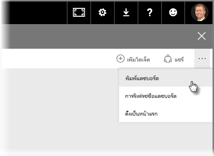
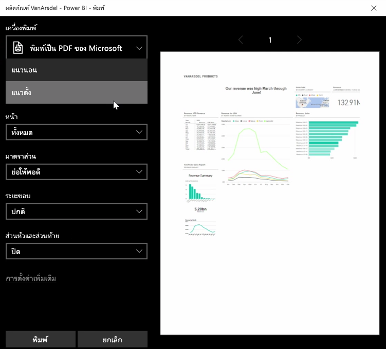
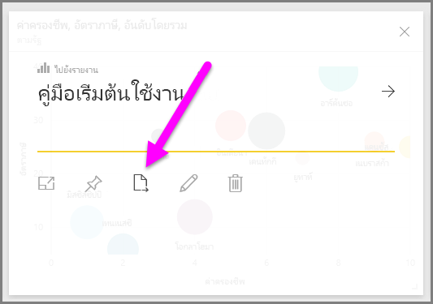
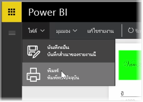

บางครั้ง คุณอาจต้องการนำรายงานหรือแดชบอร์ดที่พิมพ์ออกมาเข้าร่วมประชุม หรือคุณจึงสามารถแชร์กับบุคคลอื่นได้Sometimes you may want to bring a printed report or dashboard to a meeting, or so you can share it with others. ด้วย Power BI คุณสามารถพิมพ์ภาพออกมาได้หลายวิธีWith Power BI, there are a few ways you can make printouts of your visuals.

ในบริการของ Power BI ให้เลือกจุดไข่ปลา (จุดสามจุด) ที่มุมบนขวาของบริการ แล้วเลือก **พิมพ์แดชบอร์ด**In the Power BI service, select the ellipses (three dots) in the top-right side of the service, and select **Print dashboard**.

กล่องโต้ตอบ **พิมพ์** จะปรากฏขึ้น ซึ่งคุณสามารถเลือกเครื่องพิมพ์ที่คุณต้องการส่งแดชบอร์ดได้ รวมถึงตัวเลือกการพิมพ์มาตรฐาน เช่น การวางแนว *แนวตั้ง* หรือ *แนวนอน*A **Print** dialog appears, where you can select the printer to which you want to send the dashboard, as well as standard print options such as *portrait* or *landscape* orientation.

## ส่งออกข้อมูลจากการแสดงผลด้วยภาพExport data from a visual
คุณยังสามารถส่งออกข้อมูลจากการแสดงผลด้วยภาพใดๆ ในบริการของ Power BIYou can also export the data from any visual in the Power BI service. แค่เลือกจุดไข่ปลาในทุกการแสดงผลด้วยภาพ แล้วเลือกปุ่ม **ส่งออกข้อมูล** (ปุ่มกลาง)Just select the ellipses on any visual, and then select the **Export data** button (the middle button). เมื่อคุณทำเช่นนั้น ไฟล์ CSV จะถูกสร้างขึ้นและถูกดาวน์โหลดลงในคอมพิวเตอร์ของคุณ และข้อความจะปรากฏขึ้นบนเบราว์เซอร์ (เหมือนกับการดาวน์โหลดที่เริ่มต้นในเบราว์เซอร์อื่น) ซึ่งแจ้งให้คุณทราบว่าการดาวน์โหลดเสร็จสมบูรณ์แล้วWhen you do so, a .CSV file is created and downloaded to your local computer, and a message appears on your browser (just like any other browser-initiated download) letting you know the download is complete.

คุณยังสามารถพิมพ์หรือส่งออกได้โดยตรงจากรายงานYou can also print or export directly from a report. เมื่อดูรายงานในบริการของ Power BI ให้เลือก **ไฟล์ > พิมพ์** เพื่อเปิดกล่องโต้ตอบการพิมพ์When viewing a report in the Power BI service, select **File > Print** to open the print dialog.

และเหมือนกับแดชบอร์ด คุณสามารถส่งออกข้อมูลจากการแสดงผลด้วยภาพภายในรายงานได้เช่นกัน โดยเลือกปุ่มส่งออกในการแสดงผลด้วยภาพAnd just like with a dashboard, you can export data from a visual within a report, too, by selecting the export button on a visual.

