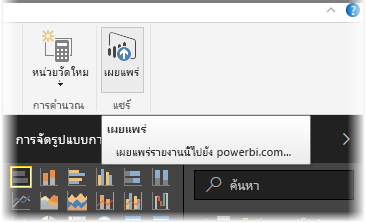
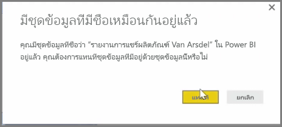
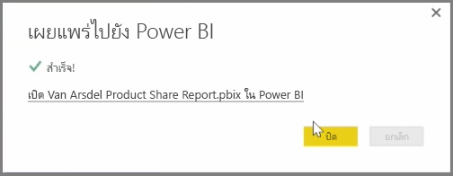

คุณสามารถอัปเดตรายงานและชุดข้อมูลที่คุณเผยแพร่แล้วจาก Power BI Desktop ไปยังบริการของ Power BI ได้You can update reports and datasets that you've already published from Power BI Desktop to the Power BI service. เมื่อต้องการดำเนินการขั้นตอนดังกล่าว ให้เลือก **เผยแพร่** จากแท็บ **หน้าแรก** ใน RibbonTo do so, select **Publish** from the **Home** tab in the ribbon.

เมื่อคุณเผยแพร่รายงานที่มีอยู่แล้วในบริการของ Power BI คุณจะได้รับพร้อมท์ให้ยืนยันว่าคุณต้องการแทนที่ชุดข้อมูลและรายงานก่อนหน้าด้วยเวอร์ชันที่แก้ไขแล้วที่คุณเพิ่งเลือกให้อัปเดตWhen you publish a report that already exists in the Power BI service, you're prompted to confirm that you want to replace the previous dataset and reports with the edited version you just chose to update.

เมื่อคุณเลือก **แทนที่** ชุดข้อมูลและรายงานในบริการของ Power BI จะถูกเขียนทับด้วยชุดข้อมูลและรายงานในไฟล์ Power BI Desktop เวอร์ชันล่าสุดWhen you select **Replace**, the datasets and reports in the Power BI service are overwritten with the datasets and reports in the most recent Power BI Desktop version of the file.

และเหมือนกับเหตุการณ์ **เผยแพร่** อื่นๆ จาก Power BI Desktop คุณจะเห็นกล่องโต้ตอบที่บอกคุณว่าเหตุการณ์เผยแพร่เสร็จสมบูรณ์แล้ว และคุณจะได้รับลิงก์ไปยังรายงานในบริการของ Power BIAnd just like any other **Publish** event from Power BI Desktop, you see a dialog that tells you the publish event was successful, and you get a link to the report in the Power BI service.

นี่คือวิธีการรีเฟรชข้อมูลด้วยตนเองThis is a way to manually refresh your data. คุณยังสามารถอัปเดตชุดข้อมูลและรายงานได้โดยอัตโนมัติ ซึ่งกระบวนการดังกล่าวจะถูกพูดถึงในหัวข้อการเรียนรู้อื่นYou can also automatically update datasets and reports; that process is covered in another learning topic.

