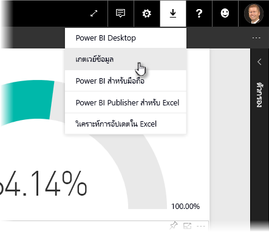
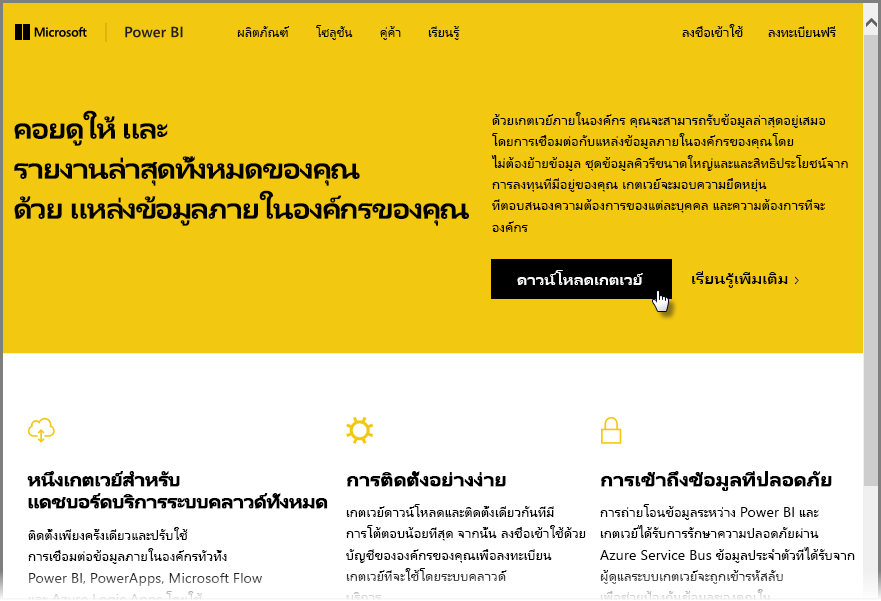
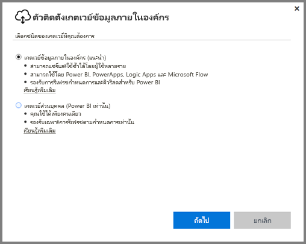
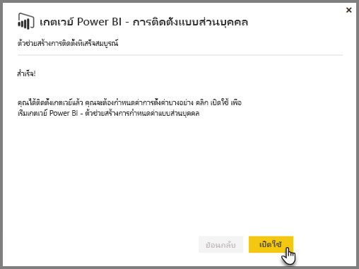
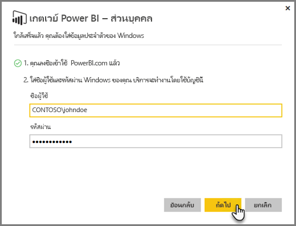
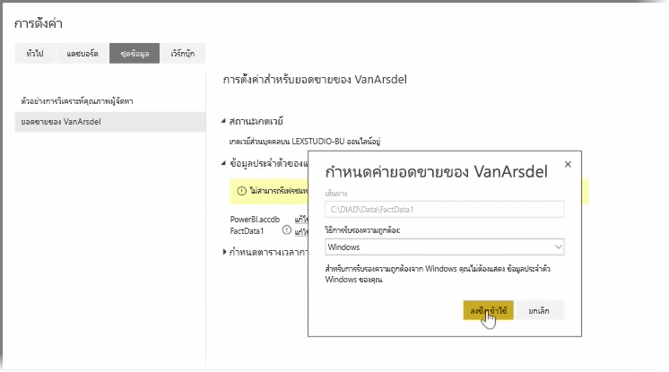
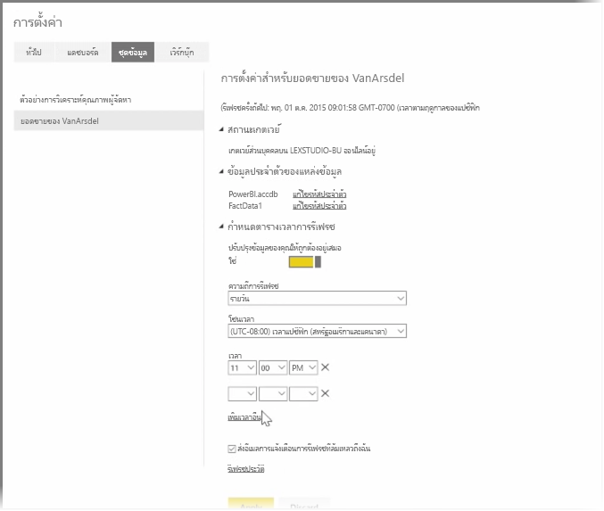

ในหัวข้อก่อนหน้า เราได้ดูเกี่ยวกับวิธีที่คุณสามารถใช้ Power BI ในการเชื่อมต่อแหล่งข้อมูล และวิธีรีเฟรชชุดข้อมูลด้วยตนเองในบริการของ Power BIIn previous topics we've looked at how you can use Power BI to connect to data sources, and how to manually refresh your datasets on the Power BI service. อย่างไรก็ตาม คุณไม่จำเป็นต้องรีเฟรชด้วยตนเองทุกครั้งที่มีการเปลี่ยนแปลงข้อมูลของคุณ ดังนั้นคุณจึงสามารถใช้ Power BI ในการตั้งค่าการรีเฟรชตามกำหนดการซึ่งจะเชื่อมต่อกับแหล่งข้อมูลของคุณ และเผยแพร่ลงในบริการของ Power BI โดยอัตโนมัติHowever, you're not going to want to manually refresh things every time your data changes, so you can use Power BI to set up a scheduled refresh that will connect to your data sources and publish them into the Power BI Service automatically. นอกจากนี้ยังช่วยให้คุณสามารถเชื่อมต่อบริการกับแหล่งข้อมูลในองค์กร รวมถึงไฟล์ Excel, ฐานข้อมูล Access, ฐานข้อมูล SQL และอื่นๆThis also gives you a way to connect the service with any on-premises data sources, including Excel files, Access databases, SQL databases, and more.

ระบบที่ช่วยให้คุณสามารถเชื่อมต่อแหล่งข้อมูลในองค์กรของคุณกับบริการของ Power BI ได้เรียกว่า **เกตเวย์ข้อมูล**The system that lets you connect your on-premises data sources to the Power BI service is called the **data gateway**. ซึ่งเป็นแอปพลิเคชันขนาดเล็กที่ทำงานบนคอมพิวเตอร์ของคุณ และใช้กำหนดการที่จัดเรียงไว้ล่วงหน้าในการเชื่อมต่อกับข้อมูลของคุณ รวบรวมการอัปเดต และนำไปไว้ในบริการของ Power BIIt's a small application that runs on your computer, and uses a pre-arranged schedule to connect to your data, gather any updates, and push them up to the Power BI service. **Personal Gateway** คือ**เกตเวย์ข้อมูล**เวอร์ชันที่สามารถใช้โดยไม่ต้องมีการกำหนดค่าของผู้ดูแลThe **personal gateway** is a version of the **data gateway** that can be used without any administrator configuration.

>[!NOTE]
>คอมพิวเตอร์ที่เรียกใช้ Power BI Personal Gateway *ต้อง*เปิดใช้งาน และเชื่อมต่อกับอินเทอร์เน็ตเพื่อให้ **Personal Gateway** ทำงานได้อย่างถูกต้องThe computer  that is running the Power BI personal gateway *must* be on and connected to the Internet for **personal gateway** to work properly.
> 

เมื่อต้องการตั้งค่า**เกตเวย์ส่วนบุคคล** ก่อนอื่นให้ลงชื่อเข้าใช้บริการของ Power BITo set up your **personal gateway**, first sign in to the Power BI service. เลือกไอคอน **ดาวน์โหลด** ที่มุมบนขวาของหน้าจอ แล้วเลือก **เกตเวย์ข้อมูล** จากเมนูSelect the **Download** icon in the top right-hand corner of the screen, and then select **Data Gateways** from the menu.

จากนั้นคุณจะถูกนำไปยังเว็บเพจที่คุณสามารถเลือก **Power BI Gateway - Personal** ได้ ตามที่แสดงอยู่ด้านล่างFrom there you'll be taken to a web page where you can select the **Power BI Gateway - Personal**, as shown below.

เรียกใช้แอปพลิเคชันเมื่อเสร็จสิ้นการดาวน์โหลด และดำเนินตัวช่วยสร้างการติดตั้งให้แล้วเสร็จRun the application once it finishes downloading, and complete the installation wizard.

จากนั้นคุณจะได้รับพร้อมท์ให้เปิดใช้งานตัวช่วยสร้างการกำหนดค่าเพื่อตั้งค่าเกตเวย์ของคุณYou'll then be prompted to launch the configuration wizard to set up your gateway.

ระบบจะขอให้คุณลงชื่อเข้าใช้บัญชีบริการของ Power BI ก่อน จากนั้นให้ลงชื่อเข้าใช้บัญชี Windows ของเครื่อง เนื่องจากบริการเกตเวย์จะทำงานภายใต้บัญชีของคุณYou'll be asked first to sign in to your Power BI service account, and then to sign in to the machine's Windows account, since the gateway service runs under your account.

กลับไปยังบริการของ Power BIReturn to the Power BI service. เลือกเมนูจุดไข่ปลา (สามจุด) ถัดจากชุดข้อมูลที่คุณต้องการรีเฟรช จากนั้นเลือก **จัดกำหนดการรีเฟรช**Select the ellipsis (three dots) menu next to the dataset you want to refresh, and then select **Schedule Refresh**. ซึ่งจะเปิดหน้า **การตั้งค่าการรีเฟรช**This opens the **Refresh Settings** page. Power BI ตรวจพบว่าคุณได้ติดตั้ง **Personal Gateway** และบอกสถานะให้คุณทราบPower BI detects that you've installed a **personal gateway**, and lets you know its status.

เลือก **แก้ไขข้อมูลประจำตัว** ถัดจากแต่ละแหล่งข้อมูล และตั้งค่าการรับรองความถูกต้องSelect **Edit credentials** next to each applicable data source and set up authentication.

สุดท้าย ให้ตั้งค่าตัวเลือกภายใต้ **กำหนดตารางเวลาการรีเฟรช** เพื่อเปิดการใช้งานการอัปเดตอัตโนมัติ และตั้งค่าเวลาและความถี่ในการอัปเดตFinally, set the options under **Schedule Refresh** to activate automatic updates and set when and how frequently they occur.

เท่านี้ก็เรียบร้อยAnd that's it. ตามเวลาที่กำหนดไว้ Power BI จะไปยังแหล่งข้อมูลเหล่านั้น โดยใช้ข้อมูลประจำตัวที่คุณให้และการเชื่อมต่อกับคอมพิวเตอร์ที่เรียกใช้ **Personal Gateway** ของคุณ และอัปเดตรายงานและชุดข้อมูลตามกำหนดการของคุณOn the scheduled times, Power BI will go out to those data sources, using the credentials you provided and the connection to the computer that has your **personal gateway** running, and update the reports and datasets according to your schedule. ในครั้งถัดไปที่คุณไปที่ Power BI แดชบอร์ด รายงาน และชุดข้อมูลเหล่านั้นจะแสดงข้อมูลตามการรีเฟรชตามกำหนดการล่าสุดThe next time you go to Power BI, those dashboards, reports, and datasets will reflect data as of the most recent scheduled refresh.

## ขั้นตอนถัดไปNext steps
**ยินดีด้วย!****Congratulations!** คุณได้ทำส่วน **การสำรวจข้อมูล** ของหลักสูตร **การเรียนรู้พร้อมคำแนะนำ** สำหรับ Power BI เสร็จเรียบร้อยแล้วYou've completed this **Exploring Data** section of the **Guided Learning** course for Power BI. บริการของ Power BI เต็มไปด้วยวิธีที่น่าสนใจในการสำรวจข้อมูล แชร์ข้อมูลเชิงลึก และโต้ตอบกับภาพThe Power BI service is full of interesting ways to explore data, share insights, and interact with visuals. และทั้งหมดนั้นสามารถเข้าถึงได้จากเบราว์เซอร์ จากบริการที่คุณเชื่อมต่อได้จากทุกที่ที่คุณไปAnd it's all accessible from a browser, from a service that you can connect to wherever you are.

คู่หูที่มีประสิทธิภาพและเป็นที่รู้จักของ Power BI คือ **Excel**One powerful and well-known partner of Power BI is **Excel**. Power BI และ Excel ได้รับการออกแบบให้ทำงานร่วมกันได้ดี เวิร์กบุ๊กของคุณจะมีลักษณะเหมือนเดิมใน Power BI และสามารถนำเวิร์กบุ๊กไปที่นั่นได้อย่างง่ายดายPower BI and Excel are designed to work well together; your workbooks will feel at home in Power BI, and it's easy to get them there.

ง่ายดายเพียงใดหรือHow easy? คุณจะได้คำตอบนั้นในส่วนถัดไป **Power BI และ Excel**In the next section, **Power BI and Excel** you learn exactly that.

เจอกันในส่วนถัดไป!See you in the next section!

