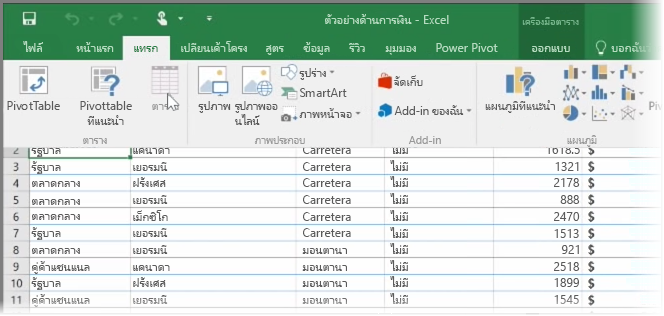
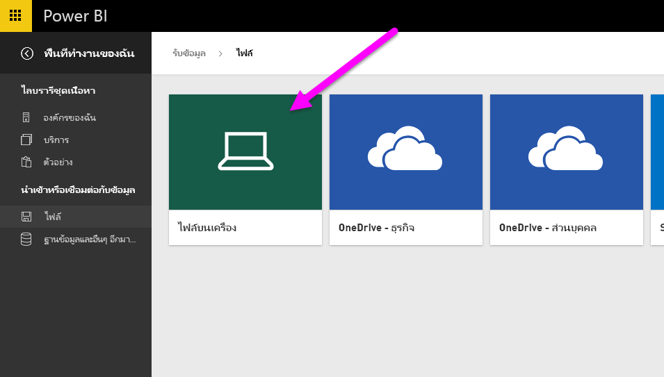
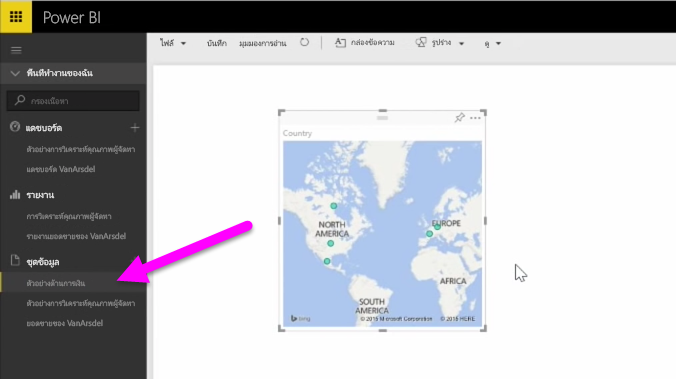

ในหัวข้อนี้ ก่อนอื่นเราจะมาดูวิธีที่คุณสามารถนำเข้าไฟล์เวิร์กบุ๊ก Excel ซึ่งมี**ตาราง**แบบง่ายๆ จากไดรฟ์ภายในลงใน Power BIIn this topic, we'll first take a look at how you can import an Excel workbook file containing a simple **table** from a local drive into Power BI. จากนั้นคุณจะได้เรียนรู้วิธีที่คุณสามารถเริ่มสำรวจข้อมูลของตารางใน Power BI ด้วยการสร้างรายงานYou'll then learn how you can begin exploring that table's data in Power BI by creating a report.

## ตรวจสอบให้แน่ใจว่าข้อมูลของคุณได้รับการจัดรูปแบบเป็นตารางแล้วMake sure your data is formatted as a table
เพื่อให้ Power BI นำเข้าข้อมูลจากเวิร์กบุ๊กของคุณได้ ข้อมูลดังกล่าวต้องได้รับการ**จัดรูปแบบเป็นตาราง**In order for Power BI to import data from your workbook, that data needs to be  **formatted as a table**. ง่ายมากๆIt's easy. ใน Excel คุณสามารถเน้นช่วงของเซลล์ จากนั้นบนแท็บ **แทรก** ของ Ribbon ของ Excel ให้คลิก **ตาราง**In Excel, you can highlight a range of cells, then on the **Insert** tab of the Excel ribbon, click **Table**.

คุณจะต้องแน่ใจว่าแต่ละคอลัมน์มีชื่อที่ดีYou'll want to make sure each column has a good name. ซึ่งจะทำให้ง่ายต่อการค้นหาข้อมูลที่คุณต้องการเมื่อสร้างรายงานของคุณใน Power BIIt will make it easier to find the data you want when creating your reports in Power BI.

## นำเข้าข้อมูลจากไดรฟ์ภายในเครื่องImport from a local drive
ไม่ว่าคุณจะเก็บไฟล์ไว้ที่ใด Power BI จะทำให้การนำเข้าเป็นเรื่องง่ายWherever you keep your files, Power BI makes it easy to import them. ใน Power BI คุณสามารถใช้ **รับข้อมูล** > **ไฟล์** > **ไฟล์บนเครื่อง** เพื่อค้นหาและเลือกไฟล์ Excel ที่เราต้องการIn Power BI, you can use **Get Data** > **Files** > **Local File**, to find and select the Excel file we want.

เมื่อนำเข้าไฟล์ลงใน Power BI แล้ว คุณสามารถเริ่มสร้างรายงานได้Once imported into Power BI, you can begin creating reports.

แน่นอนว่าไฟล์ของคุณจะไม่จำเป็นต้องอยู่บนไดรฟ์ภายในเครื่องYour files don't have to be on a local drive, of course. ถ้าคุณบันทึกไฟล์ของคุณบน OneDrive หรือทีมไซต์ SharePoint ได้ก็จะดียิ่งกว่าIf you save your files on OneDrive or SharePoint Team Site, that's even better. เราจะอธิบายรายละเอียดเพิ่มเติมเกี่ยวกับหัวข้อนี้ในภายหลังWe'll go into more details about that in a later topic.

## เริ่มสร้างรายงานStart creating reports
เมื่อนำเข้าข้อมูลของเวิร์กบุ๊กของคุณแล้ว ชุดข้อมูลจะถูกสร้างใน Power BIOnce your workbook's data has been imported, a dataset is created in Power BI. ซึ่งจะปรากฏขึ้นภายใต้ **ชุดข้อมูล**It appears under **Datasets**. ขณะนี้คุณสามารถเริ่มสำรวจข้อมูลของคุณโดยการสร้างรายงานและแดชบอร์ดNow you can begin exploring your data by creating reports and dashboards. เพียงแค่คลิกบนไอคอน **เปิดเมนู** ถัดจากชุดข้อมูล จากนั้นคลิก **สำรวจ**Just click on the **Open menu** icon next to the dataset and then click **Explore**. พื้นที่รายงานเปล่าอันใหม่จะปรากฏขึ้นA new blank report canvas appears. ทางด้านขวา ภายใต้ **เขตข้อมูล** คุณจะเห็นตารางและคอลัมน์ของคุณOver on the right, under **Fields**, you'll see your tables and columns. เพียงแค่เลือกเขตขอมูลที่คุณต้องการสร้างการจัดรูปแบบการแสดงข้อมูลใหม่บนผืนผ้าใบJust select the fields you want to create a new visualization on the canvas.

คุณสามารถเปลี่ยนชนิดของการจัดรูปแบบการแสดงข้อมูล และใช้ **ตัวกรอง** และคุณสมบัติอื่นภายใต้ **การจัดรูปแบบการแสดงข้อมูล**You can change the type of visualization and apply **filters** and other properties under **Visualizations**.

