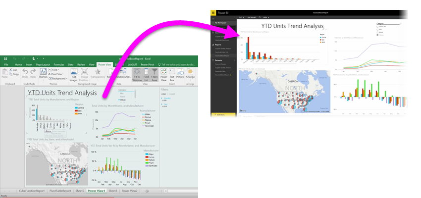

ถ้าคุณใช้ฟีเจอร์ BI ขั้นสูงของ Excel เช่น **Power Query** (ที่เรียกว่า **รับและแปลง** ใน Excel 2016) เพื่อทำคิวรีและโหลดข้อมูล, **Power Pivot** เพื่อสร้างรูปแบบข้อมูลที่มีประสิทธิภาพ และ **Power View** เพื่อสร้างรายงานแบบไดนามิก คุณสามารถนำเข้าลงใน Power BI ได้เช่นกันIf you use any of Excel's advanced BI features like **Power Query** (called **Get & Transform** in Excel 2016), to query and load data, **Power Pivot** to create powerful data models, and **Power View** to create dynamic reports, you can import those into Power BI, too.

ถ้าคุณใช้ **Power Pivot** เพื่อสร้างรูปแบบข้อมูลขั้นสูง เช่นเดียวกับข้อมูลที่มีตาราง หน่วยวัด คอลัมน์จากการคำนวณ และลำดับชั้นที่เกี่ยวข้องหลายรายการ Power BI จะนำเข้าข้อมูลทั้งหมดเช่นกันIf you use **Power Pivot** to create advanced data models, like those with multiple related tables, measures, calculated columns, and hierarchies, Power BI will import all of that as well.

ถ้าเวิร์กบุ๊กของคุณมี **แผ่นงาน Power View** ก็ไม่มีปัญหาIf your workbook has **Power View sheets**, no problem. Power BI จะสร้างเป็น**รายงาน**ใหม่อีกครั้งใน Power BIPower BI will re-create them as new **Reports** in Power BI. คุณสามารถเริ่มปักหมุดการจัดรูปแบบการแสดงข้อมูลกับแดชบอร์ดได้ทันทีYou can start pinning visualizations to dashboards right away.

และนี่เป็นหนึ่งฟีเจอร์ที่ยอดเยี่ยมของ Power BI: ถ้าคุณใช้ Power Query หรือ Power Pivot เพื่อเชื่อมต่อ ทำคิวรี และโหลดข้อมูลจากแหล่งข้อมูลภายนอก เมื่อคุณนำเข้าเวิร์กบุ๊กของคุณลงใน Power BI แล้ว คุณสามารถตั้งค่า **การรีเฟรชตามกำหนดการ** ได้And here's one of the great features of Power BI: If you use Power Query or Power Pivot to connect to, query, and load data from an external data source, once you've imported your workbook into Power BI, you can setup **scheduled refresh**. เมื่อใช้การรีเฟรชตามกำหนดการ Power BI จะใช้ข้อมูลการเชื่อมต่อจากเวิร์กบุ๊กของคุณเพื่อเชื่อมต่อโดยตรงกับแหล่งข้อมูล และทำคิวรีและโหลดข้อมูลที่มีการเปลี่ยนแปลงBy using scheduled refresh, Power BI will use the connection information from your workbook to connect directly to the datasource and query and load any data that has changed. การจัดรูปแบบการแสดงข้อมูลในรายงานจะอัปเดตโดยอัตโนมัติเช่นกันAny visualizations in reports will automatically be updated, too.

