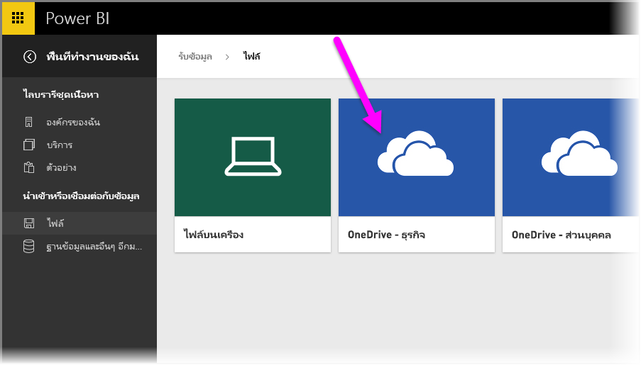
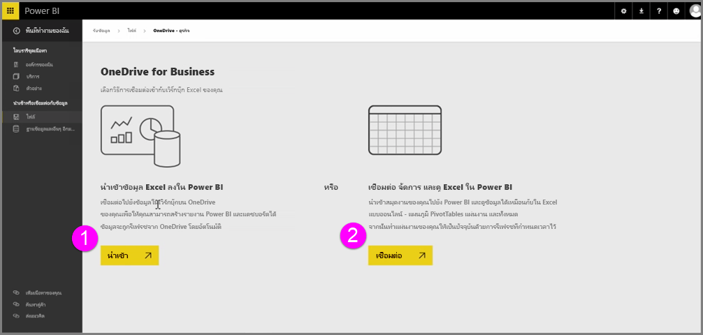
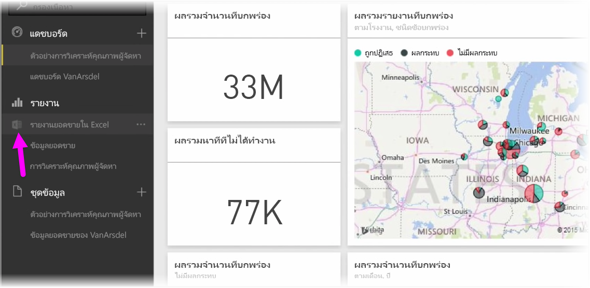
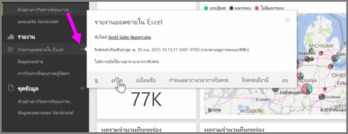

รับการรวมที่ราบรื่นระหว่าง Power BI และ Excel เมื่อคุณบันทึกเวิร์กบุ๊ก Excel ของคุณไปยัง OneDriveGet seamless integration between Power BI and Excel when you save your Excel workbooks to OneDrive.

เนื่องจาก OneDrive อยู่ในระบบคลาวด์ เช่นเดียวกับ Power BI การเชื่อมต่อสดจะถูกสร้างขึ้นระหว่าง Power BI และ OneDriveBecause OneDrive is in the cloud, just like Power BI, a live connection is made between Power BI and OneDrive. ถ้าคุณเปลี่ยนแปลงบางสิ่งในเวิร์กบุ๊กของคุณบน OneDrive การเปลี่ยนแปลงเหล่านั้นจะ *ซิงโครไนซ์โดยอัตโนมัติ* กับ Power BIIf you make changes to your workbook on OneDrive, those changes are *automatically synchronized* with Power BI. การจัดรูปแบบการแสดงข้อมูลในรายงานและแดชบอร์ดจะได้รับการอัปเดตอยู่เสมอYour visualizations in reports and dashboards are kept up-to-date. ถ้าเวิร์กบุ๊กของคุณเชื่อมต่อกับแหล่งข้อมูลภายนอก เช่น ฐานข้อมูล หรือตัวดึงข้อมูล OData คุณสามารถใช้ฟีเจอร์ **กำหนดตารางเวลาการรีเฟรช** ของ Power BI เพื่อตรวจสอบการอัปเดตIf your workbook connects to external data sources like a database or an OData feed, you can use Power BI's **Schedule refresh** features to check for updates. ต้องการถามคำถามเกี่ยวกับข้อมูลในเวิร์กบุ๊กของคุณหรือไม่Need to ask questions about data in your workbook? ไม่มีปัญหาNo problem. คุณสามารถใช้ฟีเจอร์ **ถามและตอบ** ของ Power BI เพื่อทำเช่นนั้นได้You can use Power BI's **Q & A** features to do just that.

มีสองวิธีในการเชื่อมต่อกับไฟล์ Excel ของคุณบน OneDrive for Business:There are two ways to connect to your Excel files on OneDrive for Business:

1. นำเข้าข้อมูล Excel ลงใน Power BIImport Excel data into Power BI
2. เชื่อมต่อ จัดการ และดู Excel ใน Power BIConnect, manage, and view Excel in Power BI

### นำเข้าข้อมูล Excel ลงใน Power BIImport Excel data into Power BI
เมื่อคุณเลือกที่จะนำเข้าข้อมูล Excel ลงใน Power BI ข้อมูลตารางจากเวิร์กบุ๊กของคุณจะถูกโหลดลงในชุดข้อมูลใหม่ใน Power BIWhen you choose to import Excel data into Power BI, table data from your workbook is loaded into a new dataset in Power BI. ถ้าคุณมีแผ่นงาน **Power View** ในเวิร์กบุ๊กของคุณ ข้อมูลเหล่านั้นจะถูกนำเข้า และรายงานใหม่จะถูกสร้างใน Power BI โดยอัตโนมัติเช่นกันIf you have any **Power View** sheets in your workbook, those are imported and new reports are automatically created in Power BI, too.

Power BI จะรักษาการเชื่อมต่อระหว่างตนเองกับไฟล์เวิร์กบุ๊กบน OneDrive for Business ของคุณPower BI will maintain the connection between it and the workbook file on your OneDrive for Business. ถ้าคุณเปลี่ยนแปลงบางสิ่งในเวิร์กบุ๊กของคุณ เมื่อคุณบันทึก การเปลี่ยนแปลงเหล่านั้นจะ *ซิงโครไนซ์โดยอัตโนมัติ*\* กับ Power BI ซึ่งโดยปกติจะภายในหนึ่งชั่วโมงIf you make any changes to your workbook, when you save, those changes will be *automatically synchronized*\* with Power BI, usually within an hour. ถ้าเวิร์กบุ๊กของคุณเชื่อมต่อกับแหล่งข้อมูลภายนอก คุณสามารถตั้งค่าการรีเฟรชตามกำหนดการ เพื่อให้ชุดข้อมูลใน Power BI ได้รับการอัปเดตอยู่เสมอIf your workbook connects to external data sources, you can setup scheduled refresh so the dataset in Power BI is kept up-to-date. เนื่องจากการจัดรูปแบบการแสดงข้อมูลในรายงานและแดชบอร์ดใน Power BI จะใช้ข้อมูลจากชุดข้อมูล เมื่อคุณสำรวจ คิวรีของคุณจะทำงานอย่างรวดเร็วBecause visualizations in reports and dashboard in Power BI will use the data from the dataset, as you explore, your queries are lightning fast.

### เชื่อมต่อ จัดการ และดู Excel ใน Power BIConnect, manage and view Excel in Power BI
เมื่อคุณเลือกที่จะเชื่อมต่อกับเวิร์กบุ๊ก Excel คุณจะได้รับประสบการณ์ที่ราบรื่นในการทำงานกับเวิร์กบุ๊กของคุณใน Excel และ Power BIWhen you choose to connect to the Excel workbook, you'll get a seamless experience of working with your workbook in Excel and Power BI. เมื่อคุณเชื่อมต่อด้วยวิธีนี้ รายงานของเวิร์กบุ๊กจะมีไอคอน Excel ขนาดเล็กอยู่ข้างๆWhen you connect this way, the workbook's report has a small Excel icon next to it.

ในรายงาน คุณจะเห็นเวิร์กบุ๊ก Excel ของคุณใน Power BI แบบเดียวกับที่คุณเห็นใน **Excel Online**In the report, you see your Excel workbook in Power BI just as you would in **Excel Online**. คุณสามารถสำรวจและแก้ไขเวิร์กชีตของคุณใน Excel Online ด้วยการเลือก แก้ไข จากเมนูจุดไข่ปลาYou can explore and edit your worksheets in Excel Online by selecting Edit from the ellipses menu. เมื่อคุณเปลี่ยนแปลงบางสิ่ง การจัดรูปแบบการแสดงข้อมูลที่คุณปักหมุดกับแดชบอร์ดจะได้รับการอัปเดตโดยอัตโนมัติWhen you make changes, any visualizations you've pinned to dashboards are updated automatically.

จะไม่มีชุดข้อมูลถูกสร้างใน Power BINo dataset is created in Power BI. ข้อมูลทั้งหมดจะอยู่ในเวิร์กบุ๊กบน OneDriveAll of the data remains in the workbook on OneDrive. หนึ่งในสิทธิประโยชน์หลายประการของวิธีนี้คือ คุณสามารถตั้งค่า **การรีเฟรชตามกำหนดการ** ถ้าเวิร์กบุ๊กของคุณเชื่อมต่อกับแหล่งข้อมูลภายนอกOne of the many advantages to this approach is that you can setup **scheduled refresh** if your workbook connects to external data sources. คุณสามารถเลือกองค์ประกอบ เช่น PivotTable และแผนภูมิ และ **ปักหมุด** ข้อมูลเหล่านั้นกับแดชบอร์ดใน Power BIYou can select elements such as PivotTables and charts and **pin** them right to dashboards in Power BI. ถ้าคุณเปลี่ยนแปลงบางสิ่ง ข้อมูลเหล่านั้นจะแสดงใน Power BI โดยอัตโนมัติIf you make any changes, they're automatically reflected in Power BI. นอกจากนี้ คุณสามารถใช้ฟีเจอร์ **ถามและตอบ** ที่ยอดเยี่ยมของ Power BI เพื่อถามคำถามเกี่ยวกับข้อมูลในเวิร์กบุ๊กของคุณAnd, you can use Power BI's awesome **Q & A** features to ask questions about the data in your workbook.  

