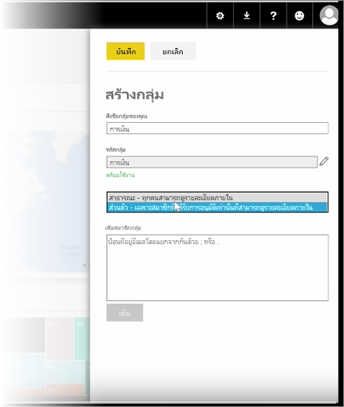
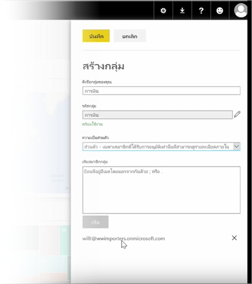

ในบทเรียนนี้ เราจะเริ่มโดยการสร้าง *กลุ่ม*In this lesson, we start by creating a *group*. **กลุ่ม** จะกำหนดเซตของผู้ใช้ที่มีสิทธิ์เข้าถึงแดชบอร์ด รายงาน และข้อมูลที่ระบุA **group** defines a set of users who have access to specific dashboards, reports, and data.

กลุ่มใน Power BI จะขึ้นอยู่กับกลุ่มใน Office 365 ดังนั้นถ้าคุณใช้กลุ่ม Office 365 เพื่อจัดการอีเมล ปฏิทิน และเอกสารของกลุ่มของคุณ คุณจะเห็นว่า Power BI มีฟีเจอร์เหมือนกัน และอื่นๆGroups in Power BI are based on groups in Office 365, so if you've been using Office 365 groups to manage your group's email, calendar, and documents, you'll see that Power BI offers the same features, and more. เมื่อคุณสร้างกลุ่มใน Power BI จริงๆ แล้วคุณจะสร้างกลุ่ม Office 365 ขึ้นมาWhen you create a group in Power BI, you're actually creating an Office 365 group.

โมดูลนี้ใช้สถานการณ์สมมติในการจัดตั้งกลุ่มการเงินใหม่This module uses the scenario of setting up a new finance group. เราจะแสดงวิธีการตั้งค่ากลุ่ม แชร์แดชบอร์ด รายงาน และชุดข้อมูลลงในกลุ่ม และเพิ่มสมาชิกที่มีสิทธิ์เข้าถึงรายการในกลุ่มWe'll show how to set up the group, share dashboards, reports, and datasets into the group, and add members who'll have access to the items in the group.

ฉันเริ่มต้นที่นี่ในพื้นที่ทำงานของฉันI start here in My Workspace. นี่คือแดชบอร์ด รายงาน และชุดข้อมูลที่ฉันสร้าง หรือบุคคลอื่นแชร์กับฉันThese are the dashboards, reports, and datasets that I've created or that someone shared with me.

ถ้าฉันจะขยายพื้นที่ทำงานของฉัน ฉันสามารถเลือก **สร้างกลุ่ม**If I expand My Workspace, I can select **Create a group**.

ในตอนนี้ฉันสามารถตั้งชื่อกลุ่มได้Here I can give it a name. เรากำลังใช้สถานการณ์สมมติหรือก็คือกลุ่มการเงิน ดังนั้นฉันจะเรียกว่า การเงินWe're using the scenario or a finance group, so I'll call it Finance. Power BI ตรวจสอบให้แน่ใจว่าไม่มีชื่ออยู่บนโดเมนอยู่แล้วPower BI makes sure the name doesn't exist on the domain.

ฉันสามารถตั้งค่าระดับความเป็นส่วนตัวด้วยการกำหนดว่า บุคคลในองค์กรของฉันสามารถดูเนื้อหาของกลุ่มได้หรือไม่ หรือเฉพาะสมาชิกเท่านั้นI can set the privacy level by deciding whether anyone in my organization can see the contents of the group, or only its members.

ฉันพิมพ์ที่อยู่อีเมล กลุ่มความปลอดภัย และรายชื่อการแจกจ่ายที่นี่I type email addresses, security groups, and distribution lists here. ฉันเลือก **เพิ่ม** เพื่อทำให้พวกเขาเป็นสมาชิกของกลุ่ม และบันทึกกลุ่มI select **Add** to make them members of the group, and save the group.

ไปต่อสู่บทเรียนถัดไป!On to the next lesson!

