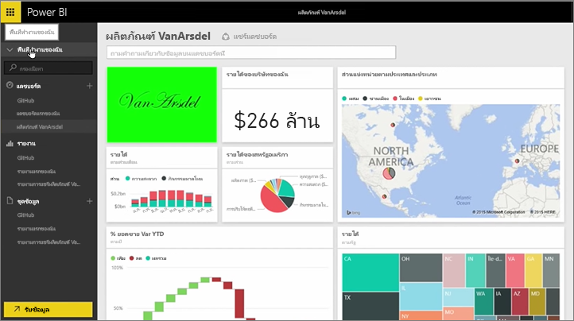
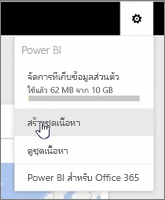
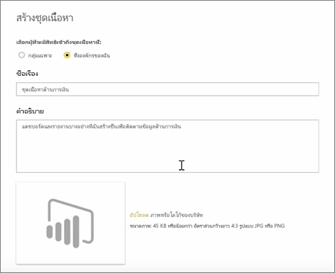
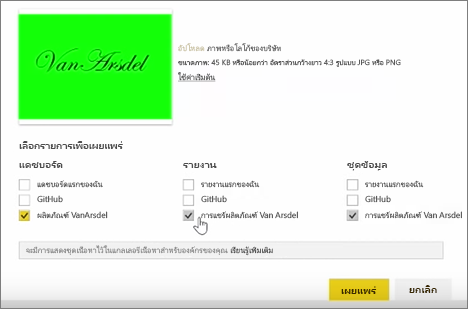

ในบทเรียนนี้ เราสร้าง*ชุดเนื้อหา*ด้วยอาร์ทิแฟกต์ที่มีอยู่แล้วใน Power BI จากนั้นแชร์ชุดเนื้อหากับเพื่อนร่วมงานIn this lesson, we create a *content pack* with existing artifacts we already have in Power BI, and then share those with colleagues. 

ใน **พื้นที่ทำงานของฉัน** ฉันมีแดชบอร์ด รายงานด้านล่าง และชุดข้อมูลIn **My Workspace** I have a dashboard, the report underneath, and the dataset. ฉันต้องการแชร์สิ่งเหล่านั้นเป็นแพคเกจกับผู้คนในองค์กรของฉัน เพื่อให้พวกเขานำไปใช้ใหม่อีกครั้งI want to share them as a package with people in my organization, so they can reuse them.

เมื่อฉันเลือกคำ**ตั้งค่า**ไอคอน (เกียร์ด้านบนขวาของบริการ), ฉันสามารถดูปริมาณพื้นที่เก็บข้อมูลที่ฉันใช้ และฉันสามารถสร้างแอป (ก่อนหน้านี้เรียกว่าชุดเนื้อหา)When I select the **Settings** icon (the gear in the top-right of the service), I can see how much storage I've used, and I can create an app (previously called content packs).

ในกล่องโต้ตอบที่ปรากฏขึ้น ฉันสามารถเลือกว่าจะแจกจ่ายให้บุคคลหรือกลุ่มที่ระบุ และสามารถตั้งชื่อได้เช่นกันIn the dialog that appears, I can choose whether to distribute it to specific people or groups, and also give it a title. จะแนะนำให้ใส่คำอธิบายโดยละเอียดในการ**คำอธิบาย**กล่อง บุคคลเรียกดูสำหรับแอปเมื่อต้องทราบว่าประกอบด้วยอะไรหรือมีอะไรIt's also a good idea to provide a detailed description in the **Description** box, to people browsing for an app to know what it contains or what it provides.

ที่ด้านล่างของกล่องโต้ตอบ ฉันมีโอกาสในการอัปโหลดรูปภาพสำหรับแอป และขั้นตอนที่สำคัญที่สุด: ฉันเลือกแดชบอร์ดฉันต้องการรวมในแอป และเมื่อฉันทำเช่นนั้น Power BI โดยอัตโนมัติเลือกรายงานและชุดข้อมูลที่ใช้ในแดชบอร์ดOn the bottom of the dialog, I have an opportunity to upload an image for the app, and then the most important step: I select the dashboard I want to include in the app, and when I do so, Power BI automatically selects the report and dataset that are used in the dashboard. ฉันไม่สามารถยกเลิกเลือกรายงานหรือชุดข้อมูล เนื่องจากแดชบอร์ดที่ฉันต้องการรวมในแอปจำI cannot unselect the report or dataset, because the dashboard I want to include in the app requires them.

ฉันสามารถเลือกแดชบอร์ด รายงาน และชุดข้อมูลอื่นได้ แต่ฉันยังไม่ทำเช่นนั้นในตอนนี้I could also select other dashboards, reports, and datasets, but I won't now.

เมื่อฉันเผยแพร่ แอจะถูกเพิ่มไปแกลเลอรีเนื้อหาขององค์กรWhen I publish, the app is added to the organization's content gallery.

ไปต่อสู่บทเรียนถัดไป!On to the next lesson!

