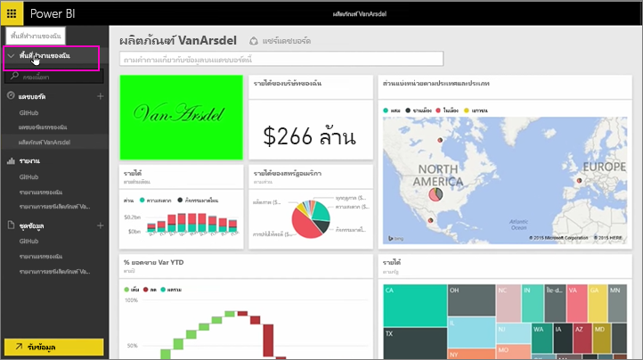
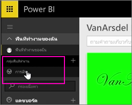
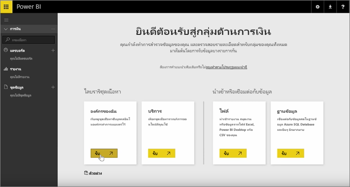
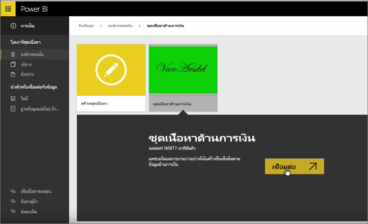
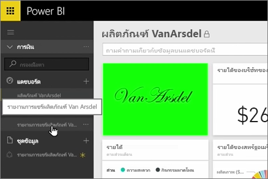
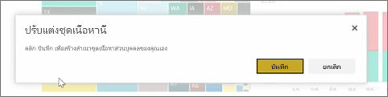
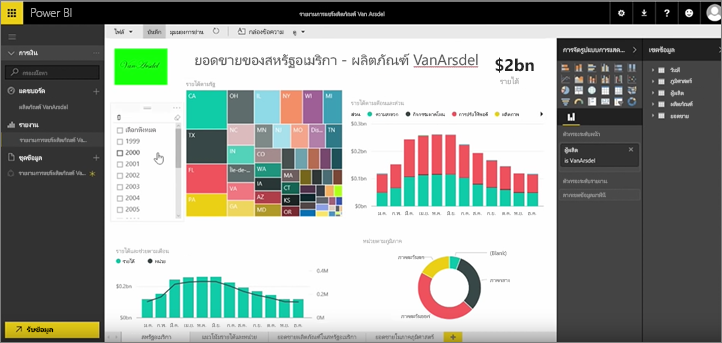

ในบทเรียนที่แล้ว เราได้สร้างชุดเนื้อหาและกลุ่มไปแล้วIn previous lessons, we already created a content pack and a group. ในบทเรียนนี้ เราจะสร้างอินสแตนซ์ของชุดเนื้อหาสำหรับทุกคนในกลุ่มIn this lesson, we're going to create an instance of the content pack for everyone in the group.

ฉันเริ่มต้นในพื้นที่ทำงานของฉัน...I start in My Workspace, ...

...และสลับกลับไปยังกลุ่มการเงินที่ฉันสร้างในบทเรียนก่อนหน้านี้... and switch back to the Finance group I created in the earlier lesson.

กลุ่มนี้ยังไม่มีแดชบอร์ด รายงาน หรือชุดข้อมูลThe group doesn't have any dashboards, reports, or datasets yet. ฉันจะใช้แอที่ฉันสร้างขึ้นI'm going to use the app I created. ฉันสามารถเรียกดูแอปจากองค์กรของฉันแทนที่มีอยู่จากบริการของบริษัทI browse apps from my organization rather than those from third-party services.

ฉันค้นหาแอที่ฉันสร้างนาทีที่ผ่านมาI find the app I created a minute ago. ฉันสังเกตว่าเพราะเหตุใดการใส่ชื่อ คำอธิบาย และรูปที่ดีให้ชุดเนื้อหาจึงเป็นสิ่งสำคัญ นั่นก็เพื่อให้ผู้คนค้นหาเจอI see why it's important to give it a good title, description, and image, so people can find it. ฉันเชื่อมต่อกับชุดเนื้อหาI connect to it.

Power BI นำเข้าแดชบอร์ด รายงาน และชุดข้อมูลที่อยู่ในแอปPower BI imports the dashboards, reports, and datasets that are in the app.

เมื่อฉันเลือกชุดข้อมูล Power BI ถามว่า ฉันต้องการปรับแต่งแอWhen I select the dataset, Power BI asks if I want to personalize the app.

ฉันสร้างสำเนาของแอปที่ฉันสามารถทำการเปลี่ยนแปลง และตัดการเชื่อมต่อจากแอเวอร์ชันที่เผยแพร่I'm creating a copy of the app that I can make changes to, and disconnecting it from the published version of the app. ถ้าผู้สร้างแอปทำการเปลี่ยนแปลงรุ่นเผยแพร่ ฉันจะรับอัปเดตเหล่านั้นโดยอัตโนมัติIf the app creator makes changes to the published version, I won't automatically get those updates.

แต่ฉันสามารถแก้ไขแดชบอร์ด รายงาน และแม้แต่ชุดข้อมูลได้ถ้าฉันต้องการBut I can edit the dashboard, the report, and even the dataset, if I want.

ดังนั้น ปเป็นวิธีง่าย ๆ ในการนำเนื้อหาที่สร้าง โดยบุคคลอื่นในองค์กรของคุณSo app are a simple way to reuse content created by other people in your organization.

ไปต่อสู่บทเรียนถัดไป!On to the next lesson!

