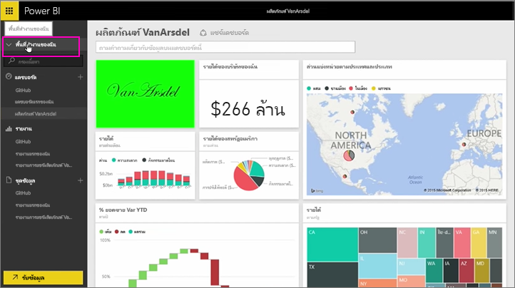

ในบทเรียนนี้ เราจะแก้ไขแอเดิมที่เราสร้างขึ้นก่อนหน้านี้ และดูวิธีที่อัปเดตของบุคคลอื่นที่เชื่อมต่อไปIn this lesson, we're going to edit the original app we created previously, and see how that updates the other people who've connected to it.

ฉันกลับมาที่พื้นที่ทำงานของฉันอีกครั้ง และแก้ไขแดชบอร์ดเดิมของฉันI'm back in My Workspace, editing my original dashboard.

เมื่อใดก็ ตามที่ฉันทำการเปลี่ยนแปลงใด ๆ ไปยังแดชบอร์ด ฉันได้รับตัวเตือนนี้ฉันได้เปลี่ยนแปลงบางอย่างที่ฉันแชร์กับผู้อื่นในแอ และพร้อมท์ให้ฉันอัปเดตเวอร์ชันที่ใช้ร่วมกันAnytime I make any change to the dashboard, I get this reminder that I've changed something that I've shared with others in a app, and prompting me to update the shared version.

ฉันกลับไปยังไอคอน แล้วเลือก**มุมมองแอ**เพื่อดูแอฉันได้ประกาศแล้วI go back to the settings icon and select **View app** to see the apps I've already published.

ฉันเห็นแอฉันทำI see the app I made. ไอคอนขนาดเล็กนี้บอกว่า ฉันได้เปลี่ยนแปลงบางอย่างในแอป และฉันจำเป็นต้องแก้ไขแอปเพื่อให้ผู้อื่นสามารถดูการเปลี่ยนแปลงของฉันThis little icon tells me I've changed something in the app, and I need to edit the app so others can see my changes.

เมื่อฉันเลือก **แก้ไข** ฉันกลับไปที่หน้าจอที่ฉันสามารถแก้ไขชื่อและคำอธิบายได้ แต่คราวนี้หน้าจอนี้มีปุ่ม **อัปเดต** ฉันจึงเลือกปุ่มนั้นWhen I select **Edit**, I'm back at the screen where I can edit the title and description, but this time it has an **Update** button, so I select that.

Power BI นำการเปลี่ยนแปลงเหล่านั้น และเผยแพร่แอปที่ปรับปรุงไปยังแกลเลอรีแอปPower BI takes those changes and publishes the updated app to the app gallery.

ทุกคนที่มีการเชื่อมต่อกับแอปของฉันได้รับข้อความที่แอมีการเปลี่ยนแปลง และถามว่า พวกเขาต้องการยอมรับการเปลี่ยนแปลง หรือเก็บเวอร์ชันเก่ากว่าAnybody who has connected to my app gets a message that the app has changed, and asks if they want to accept the changes or keep the older version.

เพื่อให้เป็นเจ้าของแอป คุณสามารถจัดการเวอร์ชันที่เพื่อนร่วมงานของคุณกำลังใช้So as the app owner, you can manage the versions that your colleagues are using.

