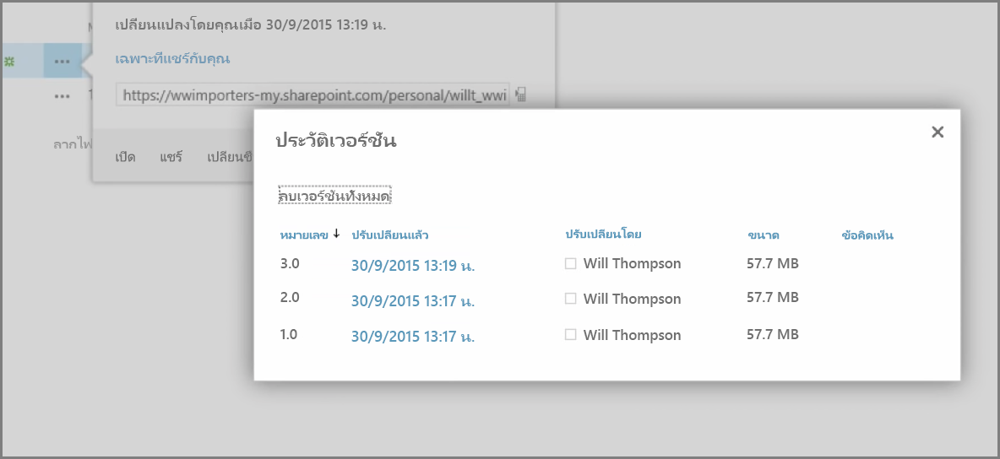
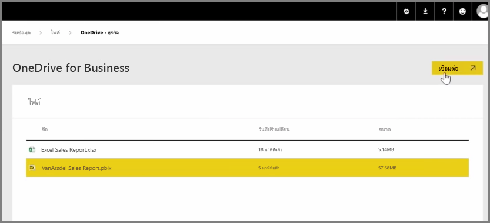
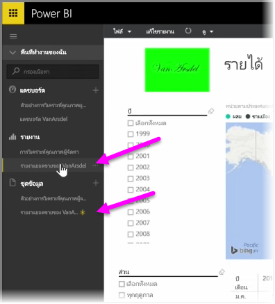

ในบทความก่อนหน้านี้ เราได้รีวิวการสร้างกลุ่มเพื่อช่วยให้องค์กรของคุณจัดการและทำงานร่วมกันในเนื้อหาที่อยู่ใน Power BI ได้In an earlier article we reviewed creating groups to help your organization manage and collaborate on content that's in Power BI. คุณสามารถใช้กลุ่ม Power BI / Office 365 เพื่อทำงานร่วมกันและแชร์โดยใช้ **OneDrive for Business** ได้เช่นกันYou can also use your Power BI / Office365 groups to collaborate and share by using **OneDrive for Business**.

การใช้ OneDrive for Business เป็นแหล่งสำหรับเนื้อหาของ Power BI ทำให้คุณสามารถเข้าถึงเครื่องมือที่มีประโยชน์จำนวนหนึ่งได้ เช่น ประวัติรุ่นUsing OneDrive for Business as a source for your Power BI content gives you access to a number of helpful tools, such as version history. คุณสามารถแชร์ไฟล์ของคุณด้วยกลุ่ม Office 365 จากภายใน OneDrive for Business เพื่อทำให้หลายคนสามารถเข้าถึงและทำงานใน Power BI หรือไฟล์ Excel เดียวกันได้You can also share your files with an Office365 group from within OneDrive for Business to give access and allow many people to work on the same Power BI or Excel files.

เมื่อต้องการเชื่อมต่อกับไฟล์ PBIX (Power BI Desktop) บน OneDrive for Business ให้ลงชื่อเข้าใช้ในบริการของ Power BI แล้วเลือก**รับข้อมูล**To connect to a PBIX (Power BI Desktop) file on OneDrive for Business, sign in to the Power BI service and select **Get Data**. เลือก **ไฟล์** ภายใต้ นำเข้าหรือเชื่อมต่อกับข้อมูล จากนั้นเลือก **OneDrive for Business**Choose **Files** under Import or Connect to Data, and then select **OneDrive - Business**. เน้นไฟล์ที่ต้องการ แล้วเลือก **เชื่อมต่อ**Highlight the desired file, and select **Connect**.

เนื้อหาของคุณจะปรากฏในแถบนำทางด้านซ้ายYour content appears in the left-hand side navigation bar.

ทีนี้ การเปลี่ยนแปลงใดๆ ที่เกิดขึ้นกับไฟล์บน **OneDrive for Business** จะถูกแสดงในสภาพแวดล้อม Power BI โดยอัตโนมัติเช่นกัน และถูกบันทึกในประวัติรุ่นNow, any changes made to the file on **OneDrive for Business** will be automatically reflected in the Power BI environment as well, and recorded in the version history.

