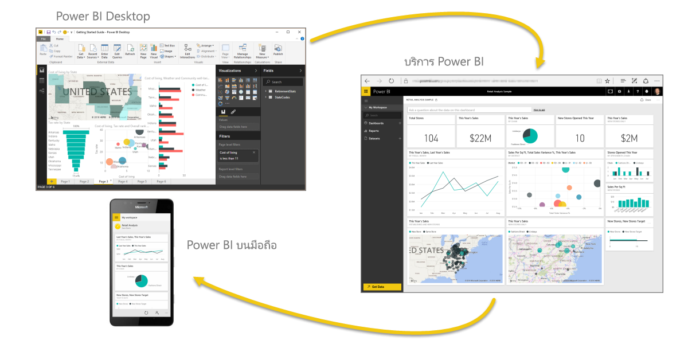
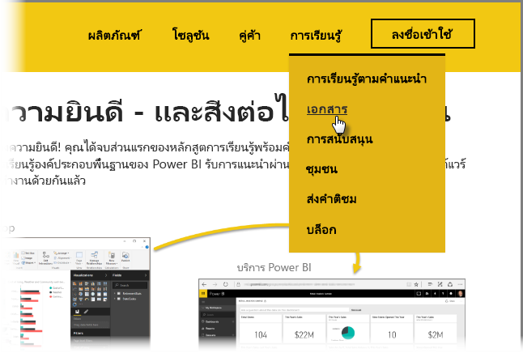

คุณทำสำเร็จแล้ว!You did it! **ยินดีด้วย!****Congratulations!** คุณได้จบส่วนแรกของหลักสูตร **การเรียนรู้พร้อมคำแนะนำ** สำหรับ Power BI แล้วYou've completed the **Guided Learning** course for Power BI. คุณได้วนครบรอบจากการเรียนรู้องค์ประกอบพื้นฐานของ Power BI รับการแนะนำผ่านฟีเจอร์และองค์ประกอบของซอฟต์แวร์ และเรียนรู้วิธีที่สิ่งเหล่านั้นทำงานด้วยกันแล้วYou've come full circle from learning the basic elements of Power BI, taken a tour through its software features and elements, and learned how they all work together.

นี่คือส่วนสุดท้าย (และหัวข้อสุดท้าย เว้นแต่ว่าคุณต้องการเรียนรู้ DAX) ของบทเรียน ดังนั้นถ้าคุณผ่านส่วนต่างๆ เหล่านั้นมาตามลำดับ ให้หยุดสักครู่เพื่อให้กำลังใจตนเองก่อนThis is the last section (and the final topic, unless you want to learn DAX) in the course, so if you went through all of these sections in order, take a moment to pat yourself on the back. ทำได้ดีมาก!Good job! ตอนนี้คุณเข้าใจ**แนวคิดที่สำคัญ**เหล่านี้อย่างถี่ถ้วนแล้ว:You're now well versed in all these **important concepts**:

* อะไรคือ [Power BI](../gettingstarted.yml?tutorial-step=1)What [Power BI is](../gettingstarted.yml?tutorial-step=1)
* [โครงสร้างพื้นฐาน](../gettingstarted.yml?tutorial-step=3)ของ Power BIThe [building blocks](../gettingstarted.yml?tutorial-step=3) of Power BI
* [การรับ](../gettingdata.yml?tutorial-step=3)และ[การวางรูปแบบ](../modeling.yml?tutorial-step=1)ข้อมูล[Getting](../gettingdata.yml?tutorial-step=3) and [modeling](../modeling.yml?tutorial-step=1) data
* [การแสดงภาพของข้อมูลVisualizations](../visualizations.yml?tutorial-step=1)
* [การสำรวจข้อมูล](../exploringdata.yml?tutorial-step=1)ในบริการ Power BI[Exploring data](../exploringdata.yml?tutorial-step=1) in the Power BI service
* การใช้ [Excel และ Power BI](../powerbiandexcel.yml?tutorial-step=1) ร่วมกันUsing [Excel and Power BI](../powerbiandexcel.yml?tutorial-step=1) together
* และ[การเผยแพร่และการแชร์](../publishingandsharing.yml?tutorial-step=1)งานของคุณAnd [publishing and sharing](../publishingandsharing.yml?tutorial-step=1) your work

นั่นคือความรู้จำนวนมาก และในเมื่อคุณจำสิ่งเหล่านั้นได้ทั้งหมดแล้ว คุณก็พร้อมที่จะจำสิ่งเหล่านั้นไปใช้!That's a lot of knowledge, and now that you have all this in your head, you're ready to go put it to use! ต่อไปนี้คือ**ลิงก์เพื่อดาวน์โหลด**หรือเพื่อทำให้เบราว์เซอร์ของคุณ**เชื่อมต่อกับบริการ Power BI**:Here are some **links to downloads** or to get your browser **connected to the Power BI service**:

* คุณสามารถ[รับ Power BI Desktop รุ่นล่าสุด](https://powerbi.microsoft.com/desktop)ได้ตลอดเวลาYou can always [get the latest Power BI Desktop](https://powerbi.microsoft.com/desktop)
* การไปยัง[บริการ Power BI](https://powerbi.microsoft.com/) นั้นเป็นเรื่องง่ายHeading to the [Power BI service](https://powerbi.microsoft.com/) is easy
* การรับ[แอปสำหรับอุปกรณ์เคลื่อนที่สำหรับ Power BI](https://powerbi.microsoft.com/mobile/) นั้นง่ายเพียงแตะครั้งเดียวGetting [mobile apps for Power BI](https://powerbi.microsoft.com/mobile/) is a tap away

และยังมีเนื้อหา**วิธีใช้และการอ้างอิง**พร้อมให้ใช้งานเช่นกันThere's more **help and reference** content available, too. เพียงไปที่ด้านบนของหน้านี้แล้วเลือก **การเรียนรู้ > คู่มือ** เพื่อดูเนื้อหาอ้างอิงเพิ่มเติมของ Power BI ของเราJust go to the top of this page, and select **Learning > Documentation** to see our extensive set of Power BI reference content.

เราหวังว่าคุณจะเพลิดเพลินกับประสบการณ์ของคุณใน**การเรียนรู้พร้อมคำแนะนำของ Power BI** นี้We hope you've enjoyed your journey through this **Power BI Guided Learning** experience. ขอให้คุณโชคดี และขอให้ภาพของ Power BI ของคุณน่าดึงดูดและน่าสนใจอยู่เสมอBest of luck to you, and may your Power BI visuals always be immersive and compelling.

## อีกส่วนหนึ่งที่เหลือสำหรับผู้ใช้ DAXOne more section for DAX users
ต้องการเพิ่มอีกใช่ไหมStill want more? สนใจการใช้งาน **DAX (นิพจน์การวิเคราะห์ข้อมูล)** เพื่อสร้าง กรอง หรือใช้คอลัมน์และตารางที่กำหนดเองใน Power BI ใช่ไหมInterested in using **DAX (Data Analysis Expressions)** to create, filter, or use custom columns and tables in Power BI? ยังเหลืออีกส่วนที่มีไว้สำหรับคนที่สนใจการเขียนโค้ดใน Power BI และส่วนนั้นเรียกว่า **บทนำสู่ DAX**There's one more section targeted at people inclined to do some code work in Power BI, and it's called **Introduction to DAX**. ลองดูหากคุณสนใจ ส่วนนี้ใช้วิธีการอธิบายอย่างง่ายเช่นเดียวกับส่วนอื่นของการเรียนรู้พร้อมคำแนะนำTake a look if you're interested - it uses the same friendly approach as the rest of Guided Learning.

