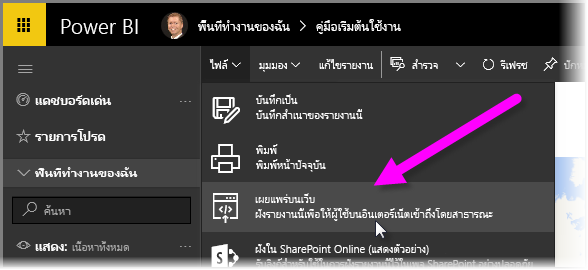
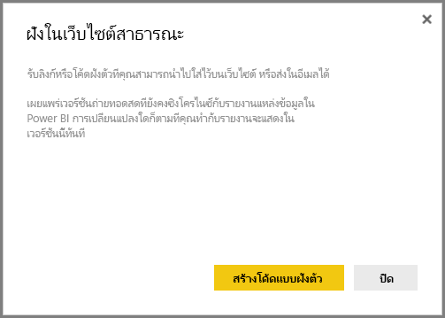
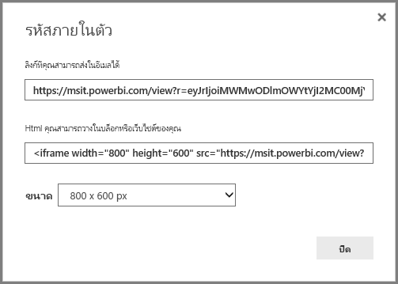
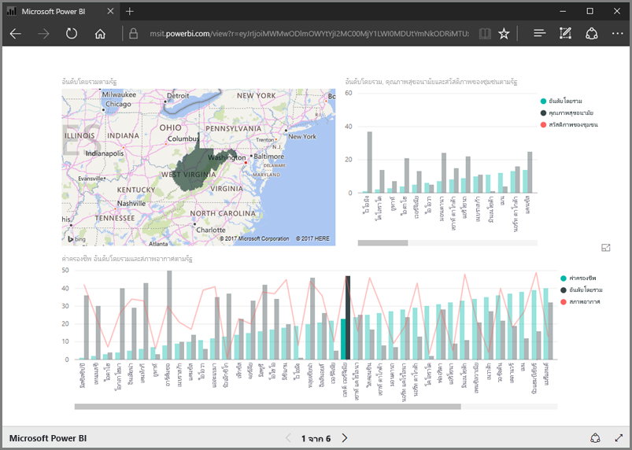
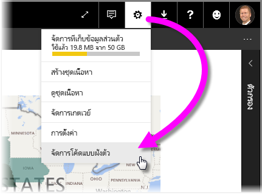
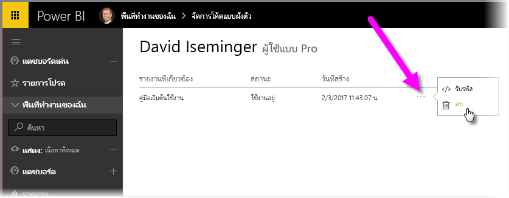

ในบทเรียนนี้ เราเรียนรู้วิธีแชร์รายงาน Power BI บนเว็บเพจ หรือแชร์ผ่านอีเมลในขั้นตอนง่ายๆ เพียงไม่กี่ขั้นตอนIn this lesson, we learn how to share a Power BI report on a web page, or share it through email, in just a few simple steps. ฟีเจอร์นี้ของ Power BI มักถูกเรียกว่า **เผยแพร่ไปยังเว็บ** และใช้งานและจัดการได้ง่ายThis feature of Power BI is often referred to as **Publish to web**, and it's easy to use and to manage.

ใน Power BI ให้เลือกรายงานที่คุณต้องการแชร์ เพื่อให้รายงานแสดงขึ้นมาบนพื้นที่ทำงานIn Power BI, select the report you want to share, so it's displayed on the canvas. แล้วจากเมนู ให้เลือก **ไฟล์ > เผยแพร่ไปยังเว็บ**Then from the menu, select **File > Publish to web**.

จากนั้นคุณจะเห็นกล่องโต้ตอบที่อธิบายว่าคุณจะได้รับ*โค้ดฝังตัว*ที่ให้คุณใส่รายงานลงในเว็บไซต์หรือในจดหมายได้From there, you see a dialog that explains you'll get an *embed code* that lets you include the report on a website or in mail.

เมื่อคุณเลือก **สร้างโค้ดฝังตัว** Power BI จะแสดงกล่องโต้ตอบอีกกล่องที่บอกคุณอีกครั้งว่าคุณกำลังจะแชร์ข้อมูลของคุณกับผู้อื่นบนอินเทอร์เน็ตWhen you select **Create embed code**, Power BI presents another dialog, telling you again that you're about to share your data with everyone on the Internet. ตรวจสอบให้มั่นใจว่าข้อมูลนั้นสามารถแชร์ได้!Make sure that's okay!

Power BI จะแสดงกล่องโต้ตอบที่มีสองลิงก์:Power BI presents a dialog with two links:

* ลิงก์หนึ่งคุณสามารถแชร์ในอีเมล ซึ่งจะแสดงรายงานเป็นเว็บเพจA link you can share in email, which show the report as a web page
* โค้ด HTML (ลิงก์ที่มี IFrame) เพื่อให้คุณสามารถฝังรายงานลงในเว็บเพจได้โดยตรงHTML code (a link plus within an iframe) so you can embed the report directly into a web page

สำหรับลิงก์ HTML คุณสามารถเลือกรายงานที่ฝังตัวเป็นขนาดที่กำหนดไว้ล่วงหน้า หรือคุณสามารถปรับเปลี่ยนโค้ด IFrame ด้วยตัวเองและปรับขนาดของรายงานได้For the HTML link, you can choose from predefined sizes for the embedded report, or you can modify the iframe code yourself and customize its size.

คุณเพียงวางลิงก์อีเมลลงในเบราว์เซอร์ และดูรายงานของคุณเป็นเว็บYou can simply paste the email link into a browser, and see your report as a web. คุณสามารถโต้ตอบกับเว็บเพจนั้นได้เช่นเดียวกับเวลาที่คุณดูรายงานนั้นใน Power BIYou can interact with that web page just as you would if you were viewing the report in Power BI. รูปต่อไปนี้แสดงหน้า **เผยแพร่ไปยังเว็บ** เมื่อลิงก์ถูกคัดลอกจากกล่องโต้ตอบลงในเบราว์เซอร์โดยตรง:The following images shows a **Publish to web** page, when its link was copied directly from that dialog into a browser:

คุณยังสามารถฝังลิงก์ IFrame นั้นลงในบล็อกโพสต์หรือเว็บไซต์ หรือลงใน Sway ได้เช่นกันYou can also embed that iframe link into a blog post or website, or into Sway, too.

ต้องการลบโค้ดฝังตัวที่คุณสร้างขึ้นใช่ไหมWant to delete an embed code you created? ไม่มีปัญหาNo problem. ใน Power BI ให้เลือกไอคอน**เกียร์**ที่มุมขวาบน จากนั้นเลือก **จัดการโค้ดฝังตัว**In Power BI, select the **gear** icon in the upper right corner, then select **Manage embed codes**.

พื้นที่ทำงาน Power BI แสดงโค้ดฝังตัวที่คุณสร้าง (ในรูปด้านล่างมีเพียงโค้ดเดียว)The Power BI workspace shows the embed codes you've created (in the image below, there's just one). เมื่อคุณคลิกที่วงรี คุณสามารถเลือกได้ว่าจะรับโค้ดสำหรับโค้ดฝังตัว หรือลบโค้ดฝังตัวทิ้งไปWhen you click the ellipses, you can then select to get the code for the embed code, or delete the embed code entirely.

และนั่นคือทั้งหมดในการเผยแพร่รายงาน Power BI ของคุณไปยังเว็บ และแชร์รายงานนั้นกับคนทั่วโลกAnd that's all there is to publishing your Power BI report to the web, and sharing it with the world. ง่ายมากๆIt's easy!

