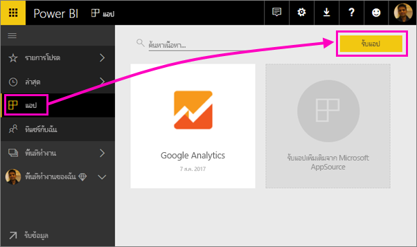
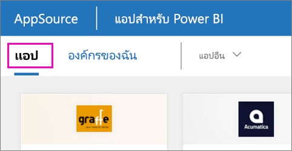

1. เลือก**แอป**ในบานหน้าต่างนำทาง > เลือก**รับแอป**ในมุมบนขวาSelect **Apps** in the nav pane > select **Get apps** in the upper-right corner.
   
     
2. ใน AppSource เลือกแท็บ**แอป** และค้นหาบริการที่คุณต้องการIn AppSource, select the **Apps** tab, and search for the service you want.
   
    

